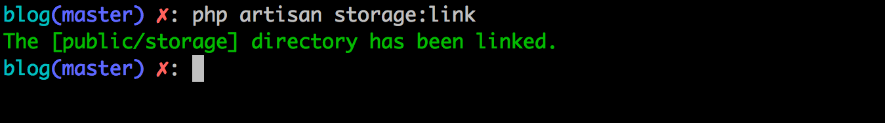
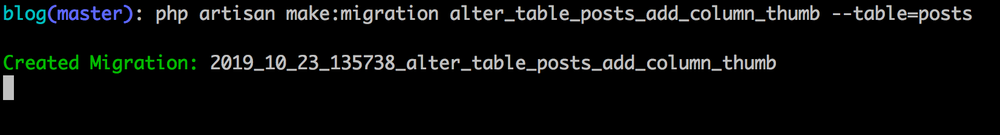

# Upload de Arquivos

Vamos entender como funciona o upload de arquivos no Laravel, criando o upload da foto e avatar do perfil e uma capa da postagem. Primeiramente vamos entender um pouco do funcionamento geral e configurações de upload no Laravel.

## Conhecendo Upload no Laravel

Primeiramente podemos recuperar um arquivo, vindo de um input do tipo `file`, usando o método do request chamado de `file`. Por exemplo, quando enviarmos lá da tela do perfil do usuário o campo avatar:

```
$avatar = $request->file('avatar');
```

Este método irá retornar um objeto com as informações do aquivo do tipo `Illuminate\Http\UploadedFile`. Onde poderemos recuperar diversas informações como por exemplo o nome real do arquivo enviado:

```
$avatar->getClientOriginalName();
```

Ou mesmo a extensão do arquivo:

```
$avatar->extension();
```

Podemos de cara já realizar o upload  deste arquivo, sem muito esforço, simplemente chamando o método `store`:

```
$path = $avatar->store('avatars');
```

O método `store` por default pegará o caminho do drive default configurado lá no `filesystems.php` dentro da pasta `config` do projeto. E moverá a imagem para esta pasta, criando a pasta `avatars` caso não exista e o melhor de tudo, ele já manda o arquivo com um nome aplicando um hash para evitar conflitos de mesmo nome para arquivos. O caminho padrão é `storage/app`, se você quiser salvar em outro caminho precisa informar o segundo parâmetro.

Por exemplo, onde vamos salvar as imagens será no public do storage onde futuramente linkaremos com a pasta public do projeto. O drive que representa este caminho é chamado de `public` que aponta para `storage/app/public` e se quisermos referenciar ele temos que chamar como abaixo:

```
$path = $avatar->store('avatars', 'public');
```

O retorno do método `store` é o nome da imagem mas a pasta, por exemplo:

```
avatars/loWy0OYzb5CDoyMEN1QGQ86jlyMCvJJmOfEDa5Ue.jpeg
```

Essa referência que salvaremos na coluna do avatar por exemplo ou da imagem capa da postagem quando criarmos. Agora vamos conhecer as configurações de armazenamento do `filesystems.php`.

Vamos ver o conteúdo do arquivo `filesystems.php` lá da pasta `config`:

```
<?php

return [

    /*
    |--------------------------------------------------------------------------
    | Default Filesystem Disk
    |--------------------------------------------------------------------------
    |
    | Here you may specify the default filesystem disk that should be used
    | by the framework. The "local" disk, as well as a variety of cloud
    | based disks are available to your application. Just store away!
    |
    */

    'default' => env('FILESYSTEM_DRIVER', 'local'),

    /*
    |--------------------------------------------------------------------------
    | Default Cloud Filesystem Disk
    |--------------------------------------------------------------------------
    |
    | Many applications store files both locally and in the cloud. For this
    | reason, you may specify a default "cloud" driver here. This driver
    | will be bound as the Cloud disk implementation in the container.
    |
    */

    'cloud' => env('FILESYSTEM_CLOUD', 's3'),

    /*
    |--------------------------------------------------------------------------
    | Filesystem Disks
    |--------------------------------------------------------------------------
    |
    | Here you may configure as many filesystem "disks" as you wish, and you
    | may even configure multiple disks of the same driver. Defaults have
    | been setup for each driver as an example of the required options.
    |
    | Supported Drivers: "local", "ftp", "sftp", "s3"
    |
    */

    'disks' => [

        'local' => [
            'driver' => 'local',
            'root' => storage_path('app'),
        ],

        'public' => [
            'driver' => 'local',
            'root' => storage_path('app/public'),
            'url' => env('APP_URL').'/storage',
            'visibility' => 'public',
        ],

        's3' => [
            'driver' => 's3',
            'key' => env('AWS_ACCESS_KEY_ID'),
            'secret' => env('AWS_SECRET_ACCESS_KEY'),
            'region' => env('AWS_DEFAULT_REGION'),
            'bucket' => env('AWS_BUCKET'),
            'url' => env('AWS_URL'),
        ],

    ],

];

```

Perceba que temos a chave default logo de cara, que espera o valor vindo lá do .env na variável `FILESYSTEM_DRIVER`, se ela não existir lá, teremos por padrão o valor `local` como disco para salvarmos nossos arquivos.

Veja:

```
'default' => env('FILESYSTEM_DRIVER', 'local'),
```

Temos também o mesmo pensamento mas para o arquivo que pode ser salvo na nuvem, neste caso no S3 da Amazon (AWS). Veja:

```
'cloud' => env('FILESYSTEM_CLOUD', 's3'),
```

Obs.: O Laravel já vêm praticamente pronto para que você possa realizar upload no serviço de storage da Aamazon, o S3.

Logo, seguindo pelo arquivo, temos os discos (disks) disponíveis e configurados para armazenamento de arquivos. São eles:

- local: pasta `app` dentro de `storage`;
- public: pasta `app/public` dentro de storage;
- s3: configurações do bucket S3 serão necessárias para armazenamento na nuvem.

Veja eles abaixo:

```
'disks' => [

    'local' => [
        'driver' => 'local',
        'root' => storage_path('app'),
    ],

    'public' => [
        'driver' => 'local',
        'root' => storage_path('app/public'),
        'url' => env('APP_URL').'/storage',
        'visibility' => 'public',
    ],

    's3' => [
        'driver' => 's3',
        'key' => env('AWS_ACCESS_KEY_ID'),
        'secret' => env('AWS_SECRET_ACCESS_KEY'),
        'region' => env('AWS_DEFAULT_REGION'),
        'bucket' => env('AWS_BUCKET'),
        'url' => env('AWS_URL'),
    ],

],

```
Cada um têm o nome do driver, o caminho, url e a visibilidade, entretanto, o S3 como é um servidor e serviço remoto e privado necessita de configurações extras para que você possa realizar o upload neste disco.

Conhecendo estes pontos vamos adicionar o upload de arquivos em nosso perfil do usuário e depois em posts.

## Upload de Foto Perfil do Usuário

Primeiramente adicione o input do tipo file lá no formulário do perfil em `resources/views/profile/index.blade.php`:

```
<div class="form-group">
    <label>Avatar</label>
    <input type="file" name="avatar">
</div>
```

PS.: coloquei logo após o campo sobre.

Adicionado o campo, precisamo permitir que nossa requisição envie esta imagem para nosso controller adicionando o enctype `multipart/form-data` que diz para nossa requisição não mexer ou codificar os dados do nosso form mantendo assim nossa imagem.

Adicione o trecho na tag de abertura do formulário:

```
enctype="multipart/form-data"
```

ficando assim:

```
<form action="{{route('profile.update')}}" method="post" enctype="multipart/form-data">
```

Lá no controller `ProfileController`, logo após a recuperação do usuário da sessão no método `update` adicione o trecho abaixo:

```
if($request->hasFile('avatar')) {

    $profileData['avatar'] = $request->file('avatar')->store('avatars', 'public');
    
} else {
	unset($profileData['avatar']);
}

```

Primeiramente verifico se a request possui o arquivo da imagem usando o método `hasFile` e informando o nome do input, existindo, eu crio a chave `avatar` no array dentro de `$profileData` e uso os métodos `file` para recuperar a imagem enviada e o método `store` logo em seguinda. Passando o nome da pasta `avatars` e o disco `public`, que resultará em nossa imagem salva dentro de `storage/app/public/avatars`.

O retorno deste upload eu mando para a chave avatar recém criada, que ao atualizarmos o perfil receberá o nome da imagem bem como o nome da pasta `avatars` junto. Agora se formos ao nosso formulário, podemos testar o envio de uma foto para o perfil do usuário.

Antes de testarmos, precisamos realizar mais uma melhoria no upload. Como vamos atualizar a foto do usuário precisamos remover a foto anterior, o arquivo no caso. Para isso precisamos usar o objeto storage para interagirmos com nossa pasta storage. Veja o trecho abaixo:

```
Storage::disk('public')->delete($user->avatar);
```

Acima seleciono o disco `public`, para onde movemos os arquivos do avatar do usuário, usando o método delete e informando o avatar do usuário removemos a foto da pasta `avatars`*.

*Lembra que o nome da pasta é salva junto com o nome do arquivo lá no nosso banco, na tabela do profile.

Agora nosso trecho fica desta maneira:

```
if($request->hasFile('avatar')) {
    
    Storage::disk('public')->delete($user->avatar);

    $profileData['avatar'] = $request->file('avatar')->store('avatars', 'public');
    
} else {
	unset($profileData['avatar']);
}
```
PS.: Não esqueça de importar a classe:

```
use Illuminate\Support\Facades\Storage;
```

## Testando upload de foto do perfil

Para testarmos vamos exibir a foto do usuário logo ao lado do seu nome no menu superior. Onde exibimos o nome do usuário e o menu dropdown para os links sair e profile, adicione a tag imagem como vemos adicionada abaixo no mesmo trecho:

```
<a id="navbarDropdown" class="nav-link dropdown-toggle" href="#" role="button" data-toggle="dropdown" aria-haspopup="true" aria-expanded="false" v-pre>
    {{auth()->user()->name}}

    user()->profile->avatar)}}" alt="Foto de {{auth()->user()->name}}" class="rounded-circle" width="50">

    <span class="caret"></span>
</a>

```

A tag img:

```
user()->profile->avatar)}}" alt="Foto de {{auth()->user()->name}}" class="rounded-circle" width="50">
```
Perceba que pego a imagem do caminho `storage` dentro do `public` do projeto e não lá de storage, concateno o valor vindo do banco para o usuário autenticado: `auth()->user()->profile->avatar`.

Agora como linkar o conteúdo de storage lá para o public do projeto, bem simples, o laravel têm um comando que cria este link simbolico. Execute em seu terminal o comando abaixo:

```
php artisan storage:link
```



Com isso o Laravel criará um link simbolico da pasta `storage/app/public` para a pasta `public/storage`. Sendo que `storage` é o link simbolico. A pasta `avatars` vai está lá como escolhemos no momento do upload no método `store`.

Veja o menu após a exibição da foto:


Vamos ao upload da foto de capa da postagem.

## Upload de Capa Postagem


Primeiramente vamos criar a migration para adição da coluna `thumb` na tabela posts. Execute na raiz do seu projeto o comando abaixo:

```
php artisan make:migration alter_table_posts_add_column_thumb --table=posts
```



Segue na íntegra o conteúdo da migração:

```
<?php

use Illuminate\Support\Facades\Schema;
use Illuminate\Database\Schema\Blueprint;
use Illuminate\Database\Migrations\Migration;

class AlterTablePostsAddColumnThumb extends Migration
{
    /**
     * Run the migrations.
     *
     * @return void
     */
    public function up()
    {
        Schema::table('posts', function (Blueprint $table) {
            $table->string('thumb')->nullable();
        });
    }

    /**
     * Reverse the migrations.
     *
     * @return void
     */
    public function down()
    {
        Schema::table('posts', function (Blueprint $table) {
            $table->dropColumn('thumb');
        });
    }
}

```

Uma adição simples da coluna `thumb` tipo VARCHAR e permintindo valores nulos, o reverso é a remoção desta coluna.

Agora execute a migração na sua base, com o comando: `php artisan migrate` e vamos prosseguir.


Obs.: Não esqueça de adicionar ela, a coluna thumb, lá no model `Post`, no array `$fillable`.

Agora precisamos adicionar os inputs nos forms de criação e edição das postagens e não esqueça do atributo `enctype` na tag form. Veja os forms abaixo:

**resources/views/posts/create.blade.php**:

```
@extends('layouts.app')

@section('content')
    <form action="{{route('posts.store')}}" method="post" enctype="multipart/form-data">

        @csrf

        <div class="form-group">
            <label>Titulo</label>
            <input type="text" name="title" class="form-control" value="{{old('title')}}">
        </div>

        <div class="form-group">
            <label>Descrição</label>
            <input type="text" name="description" class="form-control" value="{{old('description')}}">
        </div>

        <div class="form-group">
            <label>Conteúdo</label>
            <textarea name="content" id="" cols="30" rows="10" class="form-control">{{old('content')}}</textarea>
        </div>

        <div class="form-group">
            <label>Slug</label>
            <input type="text" name="slug" class="form-control" value="{{old('slug')}}">
        </div>

        <div class="form-group">
            <label>Foto de Capa</label>
            <input type="file" name="thumb">
        </div>

        <div class="form-group">
            <label>Categorias</label>
            <div class="row">
                @foreach($categories  as $c)
                    <div class="col-2 checkbox">
                        <label>
                            <input type="checkbox" name="categories[]" value="{{$c->id}}"> {{$c->name}}
                        </label>
                    </div>
                @endforeach
            </div>
        </div>

        <div class="form-group">
            <button class="btn btn-lg btn-success">Criar Postagem</button>
        </div>
    </form>
@endsection
```

**resources/views/posts/edit.blade.php**:

```
@extends('layouts.app')

@section('content')
    <form action="{{route('posts.update', ['post' => $post->id])}}" method="post"  enctype="multipart/form-data">

        @csrf
        @method("PUT")

        <div class="form-group">
            <label>Titulo</label>
            <input type="text" name="title" class="form-control" value="{{$post->title}}">
        </div>

        <div class="form-group">
            <label>Descrição</label>
            <input type="text" name="description" class="form-control" value="{{$post->description}}">
        </div>

        <div class="form-group">
            <label>Conteúdo</label>
            <textarea name="content" id="" cols="30" rows="10" class="form-control">{{$post->content}}</textarea>
        </div>

        <div class="form-group">
            <label>Slug</label>
            <input type="text" name="slug" class="form-control" value="{{$post->slug}}">
        </div>

        <div class="form-group">
            <label>Foto de Capa</label>
            <input type="file" name="thumb">
        </div>

        <div class="form-group">
            <label>Categorias</label>
            <div class="row">
                @foreach($categories  as $c)
                    <div class="col-2 checkbox">
                        <label>
                            <input type="checkbox" name="categories[]" value="{{$c->id}}"
                                @if($post->categories->contains($c)) checked @endif
                            > {{$c->name}}
                        </label>
                    </div>
                @endforeach
            </div>
        </div>

        <div class="form-group">
            <button class="btn btn-lg btn-success">Atualizar Postagem</button>
        </div>

    </form>
    <hr>
    <form action="{{route('posts.destroy', ['post' => $post->id])}}" method="post">
        @csrf
        @method('DELETE')
        <button type="submit" class="btn btn-lg btn-danger">Remover Post</button>
    </form>
@endsection
```

E nos métodos update e store vão receber o trecho abaixo, que já conhecemos com excessão do update:

Trecho a ser adicionado no método `store` do `PostController`:

```
if($request->hasFile('thumb')) {
    $data['thumb'] = $request->file('thumb')->store('thumbs', 'public');
} else {
    unset($data['thumb']);
}
```
E no update:

```
if($request->hasFile('thumb')) {
	//Remove a imagem atual
	Storage::disk('public')->delete($post->thumb);

	$data['thumb'] = $request->file('thumb')->store('thumbs', 'public');

} else {
	unset($data['thumb']);
}
```

Agora basta testarmos o envio da foto da capa, tanto criando um post e depois na atualização.

## Conclusões

Trabalhar com upload de arquivos, em nosso caso específico fotos, é bem simples no Laravel. O Laravel já traz todo o arcabouço pronto para isto, inclusive se precisarmos subir os arquivos no S3 da Amazon.

Por enquanto temos um blog com muitas opções, mas ainda não estamos validando nenhum dos dados enviados para nossos controllers, no próximo capítulo iremos aplicar estas validações e entender como funcionam dentro do Laravel.

Até lá!


