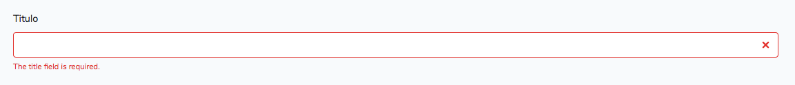

# Validação

Olá tudo bem, estamos quase chegando na reta final do nosso ebook e neste capítulo iremos abordar sobre validações dentro do Laravel. Relembrando, sempre aplicando isso ao nosso projeto!

Podemos usar validação de duas maneiras em nossas aplicações. Uma delas é usando FormRequests e a outra é usando o objeto Validator e criando nossas validações customizadas e sob demanda.

Irei utilizar o FormRequest inicialmente, que cria uma camada extra de validação que não suja nossos controllers e fica totalmente isolada das nossas regras principais, é um forma de utilizar que se encaixa bem com todo o pensamento que estamos trazendo até aqui em nosso projeto.

Então o que é necessário para usar as validações em nossos módulos com Form Request? É isso que irei responder. 

Vamos lá!

## Form Request e Validações

Primeiramente vamos gerar nosso primeiro form request e logo em seguida iremos comentar sobre o códigos disponível nesta classe. Em seu terminal execute o comando abaixo na raiz do seu projeto:

```
php artisan make:request PostRequest
```


Uma pasta será gerada dentro da pasta `Http`, a pasta `Requests`, e lá estará nosso PostRequest. Veja o conteúdo dele abaixo:

```
<?php

namespace App\Http\Requests;

use Illuminate\Foundation\Http\FormRequest;

class PostRequest extends FormRequest
{
    /**
     * Determine if the user is authorized to make this request.
     *
     * @return bool
     */
    public function authorize()
    {
        return false;
    }

    /**
     * Get the validation rules that apply to the request.
     *
     * @return array
     */
    public function rules()
    {
        return [
            //
        ];
    }
}

```

O Form Request trará de cara dois métodos iniciais, o `authorize` e o `rules`. Vamos entender para que servem:

- `authorize`: Este método é disponivel para verificar se determinado acesso está autorizado na sua aplicação, retornando false a requisição é automaticamente bloqueada na rota em que você utilizar este Form Request e retornando true a requisição passará normalmente caindo para as regras de validação em `rules`. No `authorize` você poderia verificar por exemplo se determinado usuário teria a permissão necessária para o acesso requisitado;
- `rules`: No método **rules** você define as regras para validação e assim que a requisição do formulário for enviada o Laravel usa estas regras e valida os dados antes mesmo de chegarem em seu controller e no método correspondente.


Podemos usar o Form Request para substituir o Request em nossos métodos que necessitam dele, isso trará a pitada extra de validação que será executada antes da requisição bater na execução do nosso método.

Vamo entender como montar as regras de nossa validação.

## Montando Regras de Validação

A estrutura para as validações respeitam basicamente o nome dos campos dos inputs do seu formulário e o uso das validações disponiveis, para cada tipo de dado, disponibilizados pelo Laravel. O Laravel possui diversos validadores, como por exemplo, citando alguns e deixando referência para os outros:

- required: para campos obrigatórios;
- email: valida se um e-mail é válido;
- unique: garante que aquele valor é único no seu banco de dados e já testa se existe algum registro com aquele valor passado;
- array: valida se o valor é um array;
- image: valida se o valor é uma imagem válida: jpeg, png, bmp, gif, svg, or webp.
- confirm: faz o match entre dois campos para verificar se os valores digitados são iguais. Excelente para confirmação de senha.

Existem diversos validadores e recomendo que você veja o que se enquadra melhor para a validação dentro da sua aplicação. Para visualizar as opções acesse: [https://laravel.com/docs/6.x/validation#available-validation-rules](https://laravel.com/docs/6.x/validation#available-validation-rules).

Vamos montar nossas regras de validação para os campos do nosso formulário de criação e edição de postagens. Vamos lá.

Primeiramente irei colocar alguns campos como obrigatórios para termos um primeiro contato com as validações, veja o trecho do método `rules` do `PostRequest`:


```
/**
 * Get the validation rules that apply to the request.
 *
 * @return array
 */
public function rules()
{
    return [
        'title'       => 'required',
        'description' => 'required',
        'content'     => 'required',
        'thumb'       => 'required',
        'categories'  => 'required'
    ];
}
```

Acima listei no array de retorno do método `rules` o nome dos nossos campos do formulário e defini para cada campo a validação para campos obrigatórios. Podemos ainda utilizar mais validadores para cada um dos campos, e isso é possivel quando usamos o pipe `|` e informamos outro validador para o campo escolhido. Se esse validador aceitar parâmetros nós informados por meio de um `:`, como por exemplo no validador abaixo.

Por exemplo posso colocar um tamanho minimo ou máximo para nossa descrição(`description`), veja o método alterado:


```
/**
 * Get the validation rules that apply to the request.
 *
 * @return array
 */
public function rules()
{
    return [
        'title'       => 'required',
        'description' => 'required|min:20',
        'content'     => 'required',
        'thumb'       => 'required',
        'categories'  => 'required'
    ];
}
```

Acima digo que nosso campo de descrição além de ser obrigatório, também têm um valor minimo a ser digitado e esse valor minimo, informado depois do `:` é 20 caracteres.


Posso ainda, adicionar mais um validador para nosso campo da thumb do post, para a validação de imagens:

```
/**
 * Get the validation rules that apply to the request.
 *
 * @return array
 */
public function rules()
{
    return [
        'title'       => 'required',
        'description' => 'required|min:20',
        'content'     => 'required',
        'thumb'       => 'required|image',
        'categories'  => 'required'
    ];
}
```

Agora, como utilizar o Form Request e também exibir estas validação em nossas views? 

Vamos por parte, vamos continuando.

## Usando o Form Request

É um processo bem simples, só precisamos trocar a referência nos métodos, trocando o `Request` pelo `PostRequest` nos métodos `store`  e `update`. Que estão assim:

**store**:

```
...
public function store(Request $request)
{
...

```

**update**:

```
...
public function update(Post $post, Request $request)
{
...

```

Ficarão assim:

**store**:

```
...

public function store(PostRequest $request)
{

...

```

**update**:

```
...
public function update(Post $post, PostRequest $request)
{
...

```

Simples, simples assim. Não precisamos alterar mais nada nos controllers, isso se dá por que o Form Request extende do Request por isso não precisamos alterar nada e ainda teremos acesso aos métodos para manipulação do dados vindos da requisição.

Obs.: Como não vamos utilizar regras no método `authorize` do `PostRequest` ao invés de retornar `false` retorne `true`. 

Veja o `PostRequest` na íntegra:

```
<?php

namespace App\Http\Requests;

use Illuminate\Foundation\Http\FormRequest;

class PostRequest extends FormRequest
{
    /**
     * Determine if the user is authorized to make this request.
     *
     * @return bool
     */
    public function authorize()
    {
        return true;
    }

    /**
     * Get the validation rules that apply to the request.
     *
     * @return array
     */
    public function rules()
    {
        return [
	        'title'       => 'required',
	        'description' => 'required|min:20',
	        'content'     => 'required',
	        'thumb'       => 'required|image',
	        'categories'  => 'required'
        ];
    }
}

```

Agora precisamos testar essas validações e exibir pro usuário as mensagens dos validadores retornados pelo Laravel, para cada uma das validações especificadas. Agora sim, vamos exibir as validações e suas mensagens em nossas telas.

## Exibindo validações nas Views Blade

O Laravel disponibiliza uma variável para ser acessada em nossas views chamada de `$errors` que receberá um array com as validações que não passaram durante o envio dos dados do formulário. Mas, temos outras possibilidades dentro do Laravel para tratarmos e exibirmos os erros e ainda prover uma forma de exibição para cada campo do formulário de forma mais direta e simplificada.

Por meio da diretiva `@error` podemos tratar estas exibições de forma bem simples, vamos entender como ela funciona.

Como sabemos, aplicamos as validações com base nos nomes dos campos de nossos formulários pois são esses os identificadores das informações enviadas em nossa requisição. Para recuperarmos erros específicos de cada campo podemos usar a diretiva `@error` como abaixo:

```
@error('title')
	<h1>Existe um erro de validação para o input do titulo do post</h1> 
@enderror
```

A diretiva retornará true caso exista um erro de validação para o campo informado. Assim você pode exibir mensagens de controle para este campo, ou mesmo pegar a mensagem lançada pelo proprio Laravel. Para isso basta exibir o valor da variável `$message` criada pela diretiva e que contêm a mensagem real do erro aplicado pela validação.

Veja:

```
@error('title')
	<h1>{{$message}}</h1> 
@enderror
```

Acima, se existir erros de validação para o campo `title` a mensagem do erro será exibida dentro do `h1`.

Agora vamos entender como usar esta diretiva em nossos formulários com o Bootstrap.

## Exibindo validações nos formulário com Bootstrap

O Twitter Bootstrap possui uma classe chamada de `is-invalid` para exibição de erro em determinado campo do formulário. Essa classe adiciona uma borda vermelha ao seu input e você ainda pode usar uma área abaixo do input dentro de um `p`(parágrafo) por exemplo, para exibição da mensagem customizada, essa mensagem recebe a classe css chamada de `invalid-feedback`.



Veja acima o resultado da combinação das classes `is-invalid` e da área da mensagem do erro que recebe a classe `invalid-feedback`.

O código usado para a exibição acima, você pode ver abaixo:

```
<div class="form-group">
    <label>Titulo</label>
    
    <input type="text" name="title" class="form-control is-invalid" value="{{old('title')}}">
    
    <p class="invalid-feedback">The title field is required.</p>
</div>
```

Agora só precisamos combinar a diretiva `@error` para exibir as classes de validação quando as validações não passarem. Pegando o trecho acima vamos adicionar a diretiva e depois mostro todo o formulário alterado com esse pensamento. Veja o trecho mencionado acima com a diretiva `@error` aplicada abaixo:

```
<div class="form-group">
    <label>Titulo</label>
    <input type="text" name="title" class="form-control @error('title') is-invalid @enderror" value="{{old('title')}}">

    @error('title')
        <p class="invalid-feedback">{{$message}}</p>
    @enderror
</div>
```

Caso existam erros de validação existentes para o campo `title`, a diretiva irá retornar `true`, e com isso podemos adicionar a classe `is-invalid` e ainda exibir o bloco com a mensagem da validação. Conforme já comentamos dentro da diretiva é possivel utilizar a variável `$message` para recuperar o erro real da validação, conforme vamos acima.

Agora é só replicarmos este pensamento para cada um dos inputs. Veja o formulário completo abaixo:

```
@extends('layouts.app')

@section('content')
    <form action="{{route('posts.store')}}" method="post" enctype="multipart/form-data">

        @csrf

        <div class="form-group">
            <label>Titulo</label>
            <input type="text" name="title" class="form-control @error('title') is-invalid @enderror" value="{{old('title')}}">

            @error('title')
                <p class="invalid-feedback">{{$message}}</p>
            @enderror
        </div>

        <div class="form-group">
            <label>Descrição</label>
            <input type="text" name="description" class="form-control @error('description') is-invalid @enderror" value="{{old('description')}}">

            @error('description')
                <p class="invalid-feedback">{{$message}}</p>
            @enderror
        </div>

        <div class="form-group">
            <label>Conteúdo</label>
            <textarea name="content" id="" cols="30" rows="10" class="form-control @error('content') is-invalid @enderror">{{old('content')}}</textarea>
            @error('content')
                <p class="invalid-feedback">{{$message}}</p>
            @enderror
        </div>

        <div class="form-group">
            <label>Slug</label>
            <input type="text" name="slug" class="form-control" value="{{old('slug')}}">
        </div>

        <div class="form-group">
            <label>Foto de Capa</label>
            <input type="file" name="thumb" class="form-control @error('thumb') is-invalid @enderror">
            @error('thumb')
                <p class="invalid-feedback">{{$message}}</p>
            @enderror
        </div>

        <div class="form-group">
            <label>Categorias</label>
            <div class="form-group">
                @foreach($categories  as $c)
                    <div class="col-2 custom-control custom-checkbox">
                        <input type="checkbox" class="custom-control-input @error('categories') is-invalid @enderror" name="categories[]" value="{{$c->id}}">
                        <label class="custom-control-label">
                            {{$c->name}}
                        </label>

                    </div>
                @endforeach
            </div>
        </div>

        <div class="form-group">
            <button class="btn btn-lg btn-success">Criar Postagem</button>
        </div>
    </form>
@endsection
```

O de edição também seguirá o mesmo pensamento, veja o formulário de edição alterado abaixo:

```
@extends('layouts.app')

@section('content')
    <form action="{{route('posts.update', ['post' => $post->id])}}" method="post"  enctype="multipart/form-data">

        @csrf
        @method("PUT")

        <div class="form-group">
            <label>Titulo</label>
            <input type="text" name="title" class="form-control @error('title') is-invalid @enderror" value="{{$post->title}}">
            @error('title')
                <p class="invalid-feedback">{{$message}}</p>
            @enderror
        </div>

        <div class="form-group">
            <label>Descrição</label>
            <input type="text" name="description" class="form-control  @error('description') is-invalid @enderror" value="{{$post->description}}">
            @error('description')
                <p class="invalid-feedback">{{$message}}</p>
            @enderror
        </div>

        <div class="form-group">
            <label>Conteúdo</label>
            <textarea name="content" id="" cols="30" rows="10" class="form-control  @error('content') is-invalid @enderror">{{$post->content}}</textarea>
            @error('content')
                <p class="invalid-feedback">{{$message}}</p>
            @enderror
        </div>

        <div class="form-group">
            <label>Slug</label>
            <input type="text" name="slug" class="form-control" value="{{$post->slug}}">
        </div>

        <div class="form-group">
            <label>Foto de Capa</label>
            <input type="file" name="thumb" class="form-control  @error('thumb') is-invalid @enderror">
            @error('thumb')
                <p class="invalid-feedback">{{$message}}</p>
            @enderror
        </div>

        <div class="form-group">
            <label>Categorias</label>
            <div class="form-group">
                @foreach($categories  as $c)
                    <div class="col-2 custom-control custom-checkbox">
                        <input type="checkbox" class="custom-control-input @error('categories') is-invalid @enderror" name="categories[]" value="{{$c->id}}"
                               @if($post->categories->contains($c)) checked @endif>
                        <label class="custom-control-label">
                            {{$c->name}}
                        </label>

                    </div>
                @endforeach
            </div>
        </div>

        <div class="form-group">
            <button class="btn btn-lg btn-success">Atualizar Postagem</button>
        </div>

    </form>
    <hr>
    <form action="{{route('posts.destroy', ['post' => $post->id])}}" method="post">
        @csrf
        @method('DELETE')
        <button type="submit" class="btn btn-lg btn-danger">Remover Post</button>
    </form>
@endsection
```

OBS.: Eu percebi que não adicionamos a classe `form-control` para o input file do thumb do post. Adicione essa classe no input file dos forms de edição e criação de uma nova postagem.

OBS 2: Fiz algumas alterações no input checkbox que rege a adição das categorias deste post. O código acima já está alterado mas para mostrar, o input checkbox que estava assim:

**create**:

```
<div class="form-group">
    <label>Categorias</label>
    <div class="row">
        @foreach($categories  as $c)
            <div class="col-2 checkbox">
                <label>

                    <input type="checkbox" name="categories[]" value="{{$c->id}}"> {{$c->name}}

                </label>

            </div>
        @endforeach
    </div>
</div>
```

**update**:

```
<div class="form-group">
    <label>Categorias</label>
    <div class="row">
        @foreach($categories  as $c)
            <div class="col-2 checkbox">
                <label>
                    <input type="checkbox" name="categories[]" value="{{$c->id}}"
                        @if($post->categories->contains($c)) checked @endif
                    > {{$c->name}}
                </label>
            </div>
        @endforeach
    </div>
</div>
```

Está assim nos códigos das telas agora:

**create**:

```
<div class="form-group">
    <label>Categorias</label>
    <div class="form-group">
        @foreach($categories  as $c)
            <div class="col-2 custom-control custom-checkbox">
                <input type="checkbox" class="custom-control-input @error('categories') is-invalid @enderror" name="categories[]" value="{{$c->id}}">
                <label class="custom-control-label">
                    {{$c->name}}
                </label>

            </div>
        @endforeach
    </div>
</div>
```

**edit**:

```
<div class="form-group">
    <label>Categorias</label>
    <div class="form-group">
        @foreach($categories  as $c)
            <div class="col-2 custom-control custom-checkbox">
                <input type="checkbox" class="custom-control-input @error('categories') is-invalid @enderror" name="categories[]" value="{{$c->id}}"
                       @if($post->categories->contains($c)) checked @endif>
                <label class="custom-control-label">
                    {{$c->name}}
                </label>

            </div>
        @endforeach
    </div>
</div>
```

Fiz algumas alterações de classe e na estrutura para adicionar as classes de validação e adequear com Bootstrap 4.


## Validação em Categorias

Como é repeteco vamos nas intruções diretamente!

Primeiramente vamos gerar nosso CategoryRequest para criarmos nossas regras de validação. Execute a geração em seu terminal com o comando abaixo:

```
php artisan make:request CategoryRequest
```

Veja abaixo o conteúdo do `CategoryRequest` completo e com as regras de validação:

```
<?php

namespace App\Http\Requests;

use Illuminate\Foundation\Http\FormRequest;

class CategoryRequest extends FormRequest
{
    /**
     * Determine if the user is authorized to make this request.
     *
     * @return bool
     */
    public function authorize()
    {
        return true;
    }

    /**
     * Get the validation rules that apply to the request.
     *
     * @return array
     */
    public function rules()
    {
        return [
            'name' => 'required'
        ];
    }
}

```

Troque os requests do `store` e do `update` do `CategoryController` assim como fizemos no `PostController`. E por fim veja os formulários alterados da área de categorias:

**create.blade.php**

```
@extends('layouts.app')

@section('content')
    <form action="{{route('categories.store')}}" method="post">

        @csrf

        <div class="form-group">
            <label>Nome</label>
            <input type="text" name="name" class="form-control @error('name') is-invalid @enderror" value="{{old('name')}}">
            @error('name')
                <p class="invalid-feedback">
                    {{$message}}
                </p>
            @enderror
        </div>

        <div class="form-group">
            <label>Descrição</label>
            <input type="text" name="description" class="form-control" value="{{old('description')}}">
        </div>

        <div class="form-group">
            <label>Slug</label>
            <input type="text" name="slug" class="form-control" value="{{old('slug')}}">
        </div>

        <button class="btn btn-lg btn-success">Criar Categoria</button>
    </form>
@endsection
```

**edit.blade.php**

```
@extends('layouts.app')

@section('content')
    <form action="{{route('categories.update', ['category' => $category->id])}}" method="post">

        @csrf
        @method("PUT")

        <div class="form-group">
            <label>Nome</label>
            <input type="text" name="name" class="form-control @error('name') is-invalid @enderror" value="{{$category->name}}">

            @error('name')
                <p class="invalid-feedback">
                    {{$message}}
                </p>
            @enderror
        </div>

        <div class="form-group">
            <label>Descrição</label>
            <input type="text" name="description" class="form-control" value="{{$category->description}}">
        </div>

        <div class="form-group">
            <label>Slug</label>
            <input type="text" name="slug" class="form-control" value="{{$category->slug}}">
        </div>

        <button class="btn btn-lg btn-success">Atualizar Categoria</button>
    </form>
@endsection
```

Validamos aqui apenas o nome da categoria que de fato é obrigatório, até para gerarmos os slugs automáticos no próximo capítulo.

Vamos as validações no perfil do usuário. Vamos lá!

## Validações Perfil Usuário

Vamos gerar nosso Form Request para o perfil do usuário, chamarei ele de `UserProfileRequest`. Execute o comando abaixo no seu terminal para geração do nosso Form Request:

```
php artisan make:request UserProfileRequest
```
Veja o conteúdo dele na íntegra:

```
<?php

namespace App\Http\Requests;

use Illuminate\Foundation\Http\FormRequest;

class UserProfileRequest extends FormRequest
{
    /**
     * Determine if the user is authorized to make this request.
     *
     * @return bool
     */
    public function authorize()
    {
        return true;
    }

    /**
     * Get the validation rules that apply to the request.
     *
     * @return array
     */
    public function rules()
    {
        return [
            'user.name'     => 'required',
	        'user.email'     => 'required|email',
	        'profile.avatar' => 'image'
        ];
    }
}

```

Aqui entra um ponto diferente em relação aos nomes dos input referenciados pela validação e com base no atributo `name` de cada um deles. Como separamos os inputs em duas casas, uma para os dados do user (da tabela usuários) e um pro perfil(da tabela de perfis) precisamos referenciar o nome do campo respeitando o formato chamado dentro do atributo `name`. Por exemplo:

```
<input type="text" name="user[name]" class="form-control @error('user.name') is-invalid @enderror" value="{{$user->name}}">
```

O nome do input acima é `user[name]` quando formos referenciar o nome deste input para validação precisamos seguir o seguinte formato: `user.name`. Assim o Laravel saberá qual campo ele estará validando, essa chamada se dá por que receberemos um array dentro da chave user, assim como na chave profile também e cada um tendo seus campos em questão.

Agora, basta chamarmos o form request lá no método `update` do `UserProfileController`, como vemos abaixo:

```
...
public function update(UserProfileRequest $request)
...
```

E nossa view alterada segue abaixo:

```
@extends('layouts.app')

@section('content')
    <form action="{{route('profile.update')}}" method="post" enctype="multipart/form-data">

        @csrf

        <div class="form-group">
            <label>Nome</label>
            <input type="text" name="user[name]" class="form-control @error('user.name') is-invalid @enderror" value="{{$user->name}}">
            @error('user.name')
                <div class="invalid-feedback">
                    {{$message}}
                </div>
            @enderror
        </div>

        <div class="form-group">
            <label>E-mail</label>
            <input type="text" name="user[email]" class="form-control @error('user.email') is-invalid @enderror" value="{{$user->email}}">

            @error('user.email')
                <div class="invalid-feedback">
                    {{$message}}
                </div>
            @enderror
        </div>

        <div class="form-group">
            <label>Senha</label>
            <input type="password" name="user[password]" class="form-control" placeholder="Se deseja atualizar sua senha digitie aqui a senha nova...">
        </div>

        <div class="form-group">
            <label>Sobre</label>
            <textarea name="profile[about]" id="" cols="30" rows="10" class="form-control">{{$user->profile->about}}</textarea>
        </div>

        <div class="form-group">
            <label>Avatar</label>
            <input type="file" name="avatar" class="form-control @error('avatar') is-invalid @enderror">

            @error('user.email')
            <div class="invalid-feedback">
                {{$message}}
            </div>
            @enderror
            
        </div>


        <div class="form-group">
            <label>Facebook</label>
            <input type="url" name="profile[facebook_link]" class="form-control" value="{{$user->profile->facebook_link}}">
        </div>
        <div class="form-group">
            <label>Instagram</label>
            <input type="url" name="profile[instagram_link]" class="form-control" value="{{$user->profile->instagram_link}}">
        </div>
        <div class="form-group">
            <label>Site</label>
            <input type="url" name="profile[site_link]" class="form-control" value="{{$user->profile->site_link}}">
        </div>


        <div class="form-group">
            <button class="btn btn-lg btn-success">Atualizar Meu Perfil</button>
        </div>
    </form>
@endsection
```


## Mensagens de erro

Dentro do form request podemos ainda traduzir as mensagens de erro, simplesmente sobscrevendo o método `messages` que está no pai do nosso form request em questão. Por exemplo, vamos traduzir as mensagens de validação lá do `PostRequest`, logo após o método `rules` adicione o método abaixo:

```
public function messages()
{
	return [
		'required' => 'Este campo é obrigatório',
		'min'      => 'Sua descrição deve ter pelo menos :min caracteres',
		'image'    => 'Imagem inválida'
	];
}
```

O método messages retornará um array, referenciando o nome dos validadores como indice de cada linha e para cada linha, referentes ao validador, o valor será a mensagem que você quer que seja exibida. Agora sempre que a validação ocorrer as mensagens escolhidas irão aparecer.

Note que consigo acessar, na chave `min` o valor digitado para a validação de quantidade mínima de caracteres, por meio da notação `:min`.

Para saber mais sobre as possibilidades com respeito as mensagens de validações recomendo a documentação: [https://laravel.com/docs/6.x/validation#working-with-error-messages](https://laravel.com/docs/6.x/validation#working-with-error-messages).

Veja o `PostRequest` na íntegra:

```
<?php

namespace App\Http\Requests;

use Illuminate\Foundation\Http\FormRequest;

class PostRequest extends FormRequest
{
    /**
     * Determine if the user is authorized to make this request.
     *
     * @return bool
     */
    public function authorize()
    {
        return true;
    }

    /**
     * Get the validation rules that apply to the request.
     *
     * @return array
     */
    public function rules()
    {
        return [
	        'title'       => 'required',
	        'description' => 'required|min:20',
	        'content'     => 'required',
	        'thumb'       => 'required|image',
	        'categories'  => 'required'
        ];
    }

    public function messages()
    {
		return [
			'required' => 'Este campo é obrigatório',
			'min'      => 'Sua descrição deve ter pelo menos :min caracteres',
			'image'    => 'Imagem inválida'
		];
    }
}
```

Veja também o CategoryRequest e o UserProfileRequest já com o método `messages` adicionado:

**CategoryRequest**:

```
<?php

namespace App\Http\Requests;

use Illuminate\Foundation\Http\FormRequest;

class CategoryRequest extends FormRequest
{
    /**
     * Determine if the user is authorized to make this request.
     *
     * @return bool
     */
    public function authorize()
    {
        return true;
    }

    /**
     * Get the validation rules that apply to the request.
     *
     * @return array
     */
    public function rules()
    {
        return [
            'name' => 'required'
        ];
    }

	public function messages()
	{
		return [
			'required' => 'Este campo é obrigatório'
		];
	}
}
```

**UserProfileRequest**:

```
<?php

namespace App\Http\Requests;

use Illuminate\Foundation\Http\FormRequest;

class UserProfileRequest extends FormRequest
{
    /**
     * Determine if the user is authorized to make this request.
     *
     * @return bool
     */
    public function authorize()
    {
        return true;
    }

    /**
     * Get the validation rules that apply to the request.
     *
     * @return array
     */
    public function rules()
    {
        return [
            'user.name' => 'required',
	        'user.email' => 'required|email'
        ];
    }

	public function messages()
	{
		return [
			'required' => 'Este campo é obrigatório',
			'email'    => 'E-mail digitado é inválido'
		];
	}
}
```

##Validações Customizadas

Para praticarmos e conhecermos as validações customizadas, vamos implementar uma validação de senha pro perfil do usuário.

Porque validação customizada cabe aqui? Como os form requests realizam a validação antes mesmo de chegar no nosso método não iriamos conseguir validar a senha neste momento pois ela só é alterada quando o usuário digita algo no input de senha.

Meu principal intuito aqui é mostrar pra você como criar validação customizada dada a sua necessidade então vou validar aqui somente o tamanho da senha que não pode ser menor que 8 caracteres. Agora, como fazemos isso?

O Laravel possui a classe Validator que nos permite realizar as validações conhecidas dentro do Form Request mas sob demanda ou de forma customizada. Primeiro passo, importe a classe Validator do namespace:

```
use Illuminate\Support\Facades\Validator;
```

A classe Validator possui o método `make` que nos permite criarmos nossas regras de validação, o primeiro parâmetro deste método são os dados que você deseja validar, neste caso, nossos dados vindos na requisição; O segundo parâmetro é o array com as validações que já conhecemos, temos ainda o terceiro parâmetro que compete as mensagens e é onde podemos, neste cenário, traduzir as mensagens para os validadores utilizados e por fim o método `make` ainda possui um quarto parâmetro para atributos customizados.

Os três primeiros são os que nos interessam aqui. Primeiramente vamos chamar a classe Validator lá dentro do if da senha no `UserProfileController`, dentro do método `update`, e acessar o método make como vemos abaixo:

```
$validator = Validator::make(
							$request->all(), 
							[
								'user.password' => ['min:8']
							], 
							[
							    'min' => 'Senha deve ter pelo menos :min caracteres!'
							]
);

if($validator->fails()) {
	return redirect()->back()->withErrors($validator);
}
```

Primeiramente passo todos os dados vindos na request por meio do método `all`, segundo, defino meus validadores. Aqui só valido o tamanho da senha, no caso, o mínimo aceito são 8 caracteres e por fim o terceiro parâmetro, onde apenas jogo uma mensagem traduzida para ser exibida durante a validação.

Após isso, eu pego o objeto Validator com nossas regras definidas e verifico se a validação falhou usando o método `fails()` na condicional. Se falhou, quer dizer que o usuário digitou menos que 8 caracteres então dentro do if eu redireciono ele de volta com os erros pegos dentro do nosso validador customizado. Por esta razão chamo após o método `back` o método `withErrors` passando todo o validador contido na variável `$validator`. Com isso os erros serão enviados de volta para a tela de perfil e serão exibidos lá para o campo `password` (senha).

Ah, não esqueça de adicionar a exibição do erro para o campo de senha lá na view do profile (`resources/views/profile/index.blade.php`), veja o campo abaixo:

```
<div class="form-group">
    <label>Senha</label>
    <input type="password" name="user[password]" class="form-control @error('user.password') is-invalid @enderror" placeholder="Se deseja atualizar sua senha digitie aqui a senha nova...">
    @error('user.password')
    <div class="invalid-feedback">
        {{$message}}
    </div>
    @enderror
</div>
```

Com a classe `Validator` fica fácil criarmos validações customizadas e sob demanda como foi o caso que vimos aqui. Para entender melhor onde adicionar a validação, abaixo deixo o método `update` completo após a alteração lá no `UserProfileController`. Veja:

```
public function update(UserProfileRequest $request)
{
    $userData = $request->get('user');
    $profileData = $request->get('profile');

    try{

        if($userData['password']) {
			//Aqui começa a validação customizada...
			
				$validator = Validator::make($request->all(), 
				[
				    'user.password' => ['min:8']
				], 
				['min' => 'Senha deve ter pelo menos :min caracteres!']);
					
				if($validator->fails()) {
					return redirect()->back()->withErrors($validator);
				}
					
				$userData['password'] = bcrypt($userData['password']);
        } else {
            unset($userData['password']);
        }

        $user = auth()->user();

        if($request->hasFile('avatar')) {
            Storage::disk('public')->delete($user->avatar);

            $profileData['avatar'] = $request->file('avatar')->store('avatars', 'public');
        } else {
        	unset($profileData['avatar']);
        }

        $user->update($userData);

        $user->profile()->update($profileData);

        flash('Perfil atualizado com sucesso!')->success();
		return redirect()->route('profile.index');

    } catch(\Exception $e) {

        $message = 'Erro ao remover categoria!';

	    if(env('APP_DEBUG')) {
		    $message = $e->getMessage();
	    }

	    flash($message)->warning();
	    return redirect()->back();

    }
}
```

Bom, então é isso!


## Conclusões

Neste capítulo nós conhecermos as principais formas de trabalho com validações de dados dentro do Laravel, uma usando uma camada extra, os Forms Requests e a outra usando o proprio `Validator` para criar validações cutomizadas ou sob demanda para nossos dados.

O Laravel possui diversos validadores e as possibilidades são imensas além da simplificidade e facilidade na utilização destes recursos e foi o que vimos aqui. Para concluirmos nosso livro, no próximo capítulo vamos criar a interface pública do nosso blog para deixarmos nosso blog mais redondo e completo!

Então, até o próximo capítulo!
