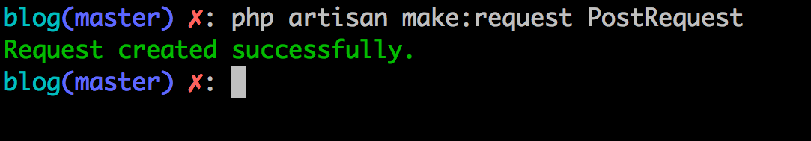

# Validação

Olá tudo bem, estamos quase chegando na reta final do nosso ebook e neste capítulo iremos abordar sobre validações dentro do Laravel. Relembrando, sempre aplicando isso ao nosso projeto!

Podemos usar validação de duas maneiras diretamente em nossas aplicações e uma delas a que vamos usar aqui é usando FormRequests, a outra é usando o objeto Validator e criando nossas validações customizadas e sob demanda.

Irei utilizar o FormRequest pois cria pra gente uma camada extra de validação que não suja nossos controllers e fica totalmente isolada das nossas regras principais, é um forma de utilizar que se encaixa bem com todo o pensamento que estamos trazendo até aqui em nosso projeto.

Então o que é necessário para usar as validações em nossos módulos? Vamos lá!

## Form Request e Validações

Primeiramente vamos gerar nosso form request e logo em seguida iremos comentar sobre o códigos disponivel neste cara. Em seu terminal execute o comando abaixo na raiz do seu projeto:

```
php artisan make:request PostRequest
```



Uma pasta será gerada dentro da pasta Http, a pasta Requests, e lá estará nosso PostRequest. Veja o conteúdo dele abaixo:

```
<?php

namespace App\Http\Requests;

use Illuminate\Foundation\Http\FormRequest;

class PostRequest extends FormRequest
{
    /**
     * Determine if the user is authorized to make this request.
     *
     * @return bool
     */
    public function authorize()
    {
        return false;
    }

    /**
     * Get the validation rules that apply to the request.
     *
     * @return array
     */
    public function rules()
    {
        return [
            //
        ];
    }
}

```

O Form Request trará de cara dois métodos iniciais, o `authorize` e o `rules`. Vamos entender para que servem:

- `authorize`: Este método é disponivel para verificar se determinado acesso é possivel de autorização na sua aplicação, retornando false a requisição é automaticamente bloqueada na rota em que você utilizar este Form Request, retornando true a requisição passará normalmente caindo para as regras de validação em `rules`. No `authorize` você poderia verificar por exemplo se determinado usuário teria o papel de acesso para o recurso solicitado e retornaria true ou false dependendo do teste se este usuário tem ou não este papél. Como não vamos utilizar este controle aqui, você pode deixar o retorno dele como `true`.
- `rules`: No método **rules** você define as regras para que o validador do Laravel teste os dados enviados na requisição pelo usuário, por exemplo validar campo em branco ou tamano de campos, ou até mesmo verificar se o email é um email válido e por aí vai! Vamos conhecer melhor de como montar essas regras para validação mais abaixo.

Podemos usar o Form Request para substituir o Request em nossos métodos que necessitam dele, isso trará a pitada extra de validação que será executada antes da requisição bater na execução do nosso método mas antes vamos entender como definir as regras para validação.

## Montando Regras de Validação

A estrutura para as validações respeitam basicamente o nome dos campos do input do seu formulários e as validações que você quer aplicar para os campos em questão. O Laravel possui diversos validadores, como por exemplo, citando alguns e deixando referência para os outros:

- required: para campos obrigatórios;
- email: valida se um e-mail é válido;
- unique: garante que aquele valor é único no seu banco de dados e já testa se existe algum registro com aquele campos;
- array: valida se o valor é um array;
- image: valida se o valor é uma imagem válida: jpeg, png, bmp, gif, svg, or webp.

Existem diversos validadores e recomendo que você veja o que se enquadra melhor para a validação que você está desejando. Para visualizar as opções acesse: [https://laravel.com/docs/6.x/validation#available-validation-rules](https://laravel.com/docs/6.x/validation#available-validation-rules).

Vamos montar nossas regras de validação para os campos do nosso formulário de criação e edição de postagens e entendermos como podemos definir validadores para cada campo. Vamos lá.

Primeiramente irei colocar todos os campos como obrigatórios para termos um primeiro contato com as validações, veja o trecho do método `rules` do `PostRequest`:


```
/**
 * Get the validation rules that apply to the request.
 *
 * @return array
 */
public function rules()
{
    return [
        'name'        => 'required',
        'description' => 'required',
        'content'     => 'required',
        'thumb'       => 'required',
        'categories'  => 'required'
    ];
}
```

Acima listei no array de retorno do método `rules` nossos campos do formulário e defini para cada campo a validação para campos obrigatórios. Podemos ainda utilizar mais validadores para cada um dos campos, e isso é possivel quando usamos o pipe `|` e informamos outro validador para o campos escolhido.

Por exemplo posso colocar um tamanho minimo ou máximo para nossa descrição(`description`), veja o método alterado:


```
/**
 * Get the validation rules that apply to the request.
 *
 * @return array
 */
public function rules()
{
    return [
        'name'        => 'required',
        'description' => 'required|min:20',
        'content'     => 'required',
        'thumb'       => 'required',
        'categories'  => 'required'
    ];
}
```

Ou mesmo colocar nosso campo categories com a validação para array, como sabemos ele traz os ids para associarmos a postagem criada ou editada. Veja o método alterado:


```
/**
 * Get the validation rules that apply to the request.
 *
 * @return array
 */
public function rules()
{
    return [
        'name'        => 'required',
        'description' => 'required|min:20',
        'content'     => 'required',
        'thumb'       => 'required',
        'categories'  => 'required|array'
    ];
}
```

Ou mesmo validar a thumb como imagens válidas:

```
/**
 * Get the validation rules that apply to the request.
 *
 * @return array
 */
public function rules()
{
    return [
        'name'        => 'required',
        'description' => 'required|min:20',
        'content'     => 'required',
        'thumb'       => 'required|image',
        'categories'  => 'required|array'
    ];
}
```

Perceba que alguns validadores recebem parâmetros, o caso do mix que recebe o tamanho mínimo como 20 e esse valor (parâmetro)  é informado pro tipo de validação pelo `:`.

Como utiliza e exibir esta validação em nossas views? 

## Usando Form Request

É um processo bem simples, só precisamos trocar a referência nos métodos do `Request` pelo `PostRequest`. Por exemplo, os métodos `store`  e `update` que estão assim:

**store**:

```
...
public function store(Request $request)
{
...

```

**update**:

```
...
public function update(Post $post, Request $request)
{
...

```

Ficará assim:

**store**:

```
...

public function store(PostRequest $request)
{

...

```

**update**:

```
...
public function update(Post $post, PostRequest $request)
{
...

```

Simples, simples assim. Não precisamos alterar mais nada nos controllers, o FormRequest extende do Request e por isso ainda teremos acesso aos métodos para manipulação do dados da requisição por isso só trocar a referência já basta, a referência de `Request` para `PostRequest`.

Obs.: Como não vamos utilizar regras no método `authorize` do `PostRequest` ao invés de retornar `false` retorne `true`. 

Veja o `PostRequest` na íntegra e como irei testar mais a frente. Veja:

```
<?php

namespace App\Http\Requests;

use Illuminate\Foundation\Http\FormRequest;

class PostRequest extends FormRequest
{
    /**
     * Determine if the user is authorized to make this request.
     *
     * @return bool
     */
    public function authorize()
    {
        return true;
    }

    /**
     * Get the validation rules that apply to the request.
     *
     * @return array
     */
    public function rules()
    {
        return [
	        'name'        => 'required',
	        'description' => 'required|min:20',
	        'content'     => 'required',
	        'thumb'       => 'required|image',
	        'categories'  => 'required|array'
        ];
    }
}

```

Agora precisamos testar essas validações e exibir pro usuário as mensagens dos validadores retornados pelo Laravel para aquela validação em questão. Vamos conhecer os métodos para recuperarmos os erros nas views.

## Exibindo validações nas Views Blade

O Laravel disponibiliza uma variável para ser acessada em nossas views chamada de `$errors` que receberá um array com as validações que não passaram durante o envio dos dados do formulário. Mas, temos outras possibilidades dentro do Laravel 6 para teste de erros e exibição para cada campo do formulário de forma mais direta.

O Laravel possui a diretiva `@error`


