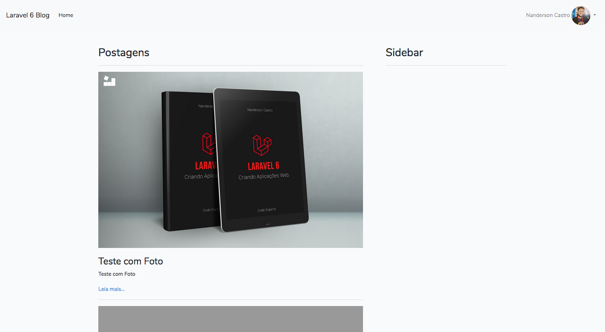
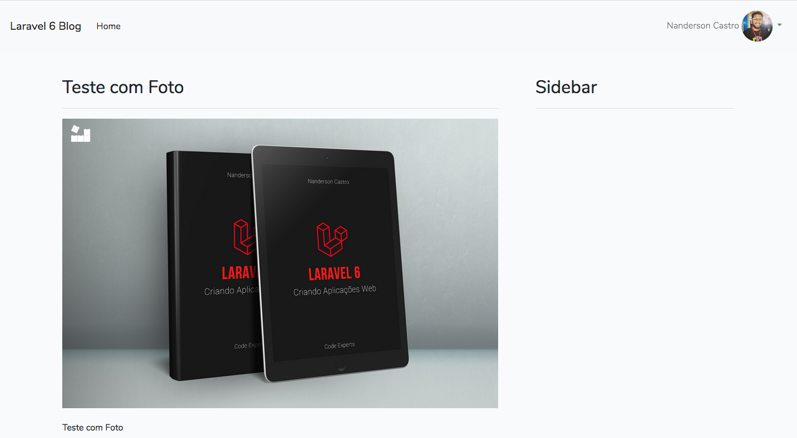
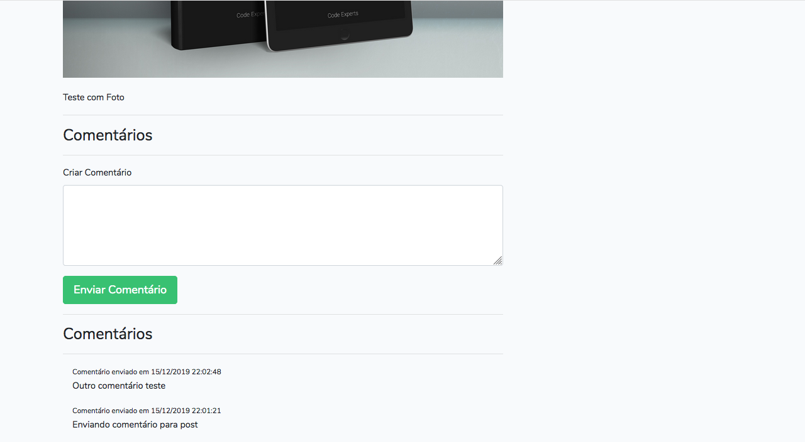
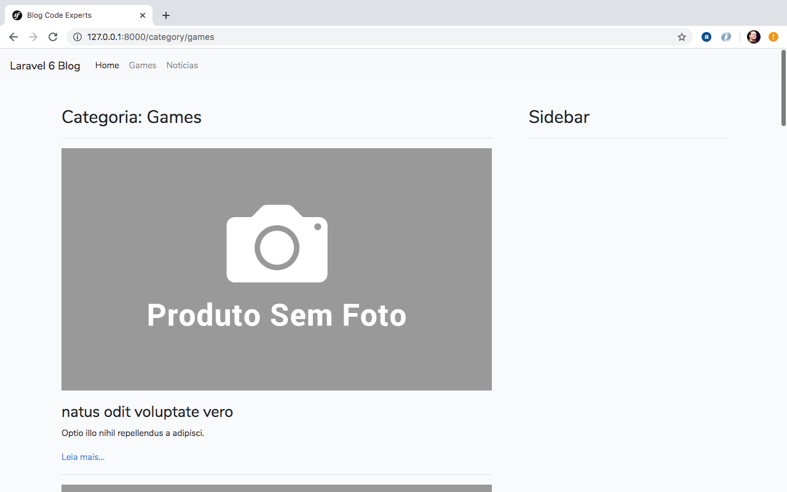
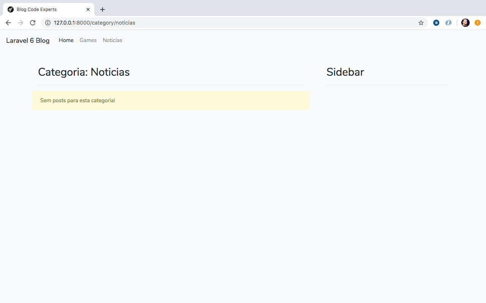

# Criando Front do nosso Blog

Olá tudo bem? Espero que sim!

Chegamos ao nosso último capítulo e aqui vamos criar o front do nosso blog, com a navegação de posts, posts por categorias além de criarmos também uma área de comentários para cada postagem de nosso blog.

E não podemos esquecer, ainda vamos dinamizar a criação dos slugs para as postagens e também para as categorias!

Então vamos lá!

## Front do Blog

Primeiramente vamos gerar os dois controllers para nosso front:

- HomeController: Responsável pela home e pela single da postagem;
- CategoryController: Responsável pela listagem de posts por categorias.

Irei gerar estes controllers dentro da pasta `Site`, que também será seus namespaces. Para gerarmos, já conhecemos então execute na raiz do projeto e um comando após o outro:

```
php artisan make:controller Site/HomeController
```


```
php artisan make:controller Site/CategoryController
```

Agora vamos focar no `HomeController` e realizar a navegação home e single das postagens, vamos lá!


## Listagem de Posts e Single

Aqui, vamos mais nas instruções uma vez que quase tudo que veremos já vimos em outros capítulos. Iremos listar as postagens na home paginando estas postagens, além de ordená-las de forma descrecentes e ainda criar a tela da postagem ou single como costumamos chamar. 

Veja o código completo do `HomeController` que possui dois métodos:

- index: Tela inicial com todos os posts;
- single: Tela única da postagem ou single.

Veja abaixo:

```
<?php

namespace App\Http\Controllers\Site;

use App\Post;
use Illuminate\Http\Request;
use App\Http\Controllers\Controller;

class HomeController extends Controller
{
	/**
	 * @var Post
	 */
	private $post;

	public function __construct(Post $post)
	{
		$this->post = $post;
	}

	public function index()
	{
		$posts = $this->post->orderBy('id', 'DESC')->paginate(15);

		return view('site.posts.index', compact('posts'));
	}

	public function single($slug)
	{
		$post = $this->post->whereSlug($slug)->first();

		return view('site.posts.single', compact('post'));
	}
}

```

Aqui vale alguns comentários, primeiramente no método index. Antes de chamarmos o paginate do Eloquent, utilizamos o método `orderBy` para ordenarmos as postagens de forma descrecente trazendo assim as mais recentes primeiro. Reforço a simplicidade que é realizar esta operação dentro do Eloquent uma vez que o nome do métodos são muito intuitivos.

No método single uso uma abordagem interesante que é chamando o `where` junto com o campo no nome do método, como está lá: `whereSlug`. O Laravel, via Eloquent vai entender que ele têm que buscar o post onde o slug seja igual o slug recebido na url via parâmetro. Isso simplifica muito a escrita de condicionais, logo após o método `whereSlug` uso o método `first` para pegar o resultado desta query e o primeiro e único resultado.

Abaixo segue as views na íntegra. As views estão dentro da pasta de views, na pasta `site/posts`(crie a pasta `site` e a pasta `posts` dentro da pasta `site`):

**index.blade.php**

```
@extends('layouts.site')


@section('content')
<div class="row">
    <div class="col-8">
        <div class="col-12">
            <h2>Postagens</h2>
            <hr>
        </div>
        @foreach($posts as $post)
            <div class="col-12">
                @if($post->thumb)
                    thumb)}}" alt="" class="img-fluid" style="margin-bottom: 20px;">
                @else
                    
                @endif
                <h3>{{$post->title}}</h3>
                <p>
                    {{$post->description}}
                </p>
                <a href="{{route('site.single', ['slug' => $post->slug])}}">Leia mais...</a>
                <hr>
            </div>
        @endforeach
        <div class="col-12">
            {{$posts->links()}}
        </div>
        </div>
        <div class="col-4">
            <div class="col-12">
                <h2>Sidebar</h2>
                <hr>
            </div>
        </div>
    </div>
</div>
@endsection
```

Na view acima, `index.blade.php`, temos uma pequena condição para exibição da thumb da postagem. Caso a postagem não tenha uma thumb na base nós exibimos uma foto padrão.

Você pode baixar esta foto padrão e adicionar dentro da pasta `img` dentro da pasta `public` do projeto. Se a pasta `img` não existir crie ela e jogue a imagem `no-phot.jpg` dentro. Acesse a imagem em [https://codeexperts.com.br/books/no-photo.jpg](https://codeexperts.com.br/books/no-photo.jpg).

Continuando...

**single.blade.php**

```
@extends('layouts.site')


@section('content')
    <div class="row">
        <div class="col-8">
            <div class="col-12">
                <h2>{{$post->title}}</h2>
                <hr>
            </div>

            <div class="col-12">
                @if($post->thumb)
                    thumb)}}" alt="" class="img-fluid" style="margin-bottom: 20px;">
                @else
                    
                @endif
                <p>
                    {!! $post->content !!}
                </p>

            </div>
        </div>
        <div class="col-4">
            <div class="col-12">
                <h2>Sidebar</h2>
                <hr>
            </div>
        </div>
    </div>
    </div>
@endsection
```

Perceba nas views que temos o template associado a elas, template esse a qual elas extendem. Neste caso crie dentro da pasta `layouts` na pasta de views o arquivo `site.blade.php` com o conteúdo abaixo:

```
<!doctype html>
<html lang="en">
<head>
    <meta charset="UTF-8">
    <meta name="viewport"
          content="width=device-width, user-scalable=no, initial-scale=1.0, maximum-scale=1.0, minimum-scale=1.0">
    <meta http-equiv="X-UA-Compatible" content="ie=edge">
    <title>Blog Code Experts</title>
    <link rel="stylesheet" href="{{asset('css/app.css')}}">
    <style>
        .navbar {
            margin-bottom: 40px;
        }
    </style>
</head>
<body>
    <nav class="navbar navbar-expand-lg navbar-light bg-light">
        <a class="navbar-brand" href="/">Laravel 6 Blog</a>
        <button class="navbar-toggler" type="button" data-toggle="collapse" data-target="#navbarNavDropdown" aria-controls="navbarNavDropdown" aria-expanded="false" aria-label="Toggle navigation">
            <span class="navbar-toggler-icon"></span>
        </button>
        <div class="collapse navbar-collapse" id="navbarNavDropdown">
                <ul class="navbar-nav">
                    <li class="nav-item active">
                        <a class="nav-link" href="{{ route('site.index') }}">Home</a>
                    </li>
                </ul>
        </div>


        @auth
            <ul class="navbar-nav ml-auto">
                    <li class="nav-item dropdown">
                        <a id="navbarDropdown" class="nav-link dropdown-toggle" href="#" role="button" data-toggle="dropdown" aria-haspopup="true" aria-expanded="false" v-pre>
                            {{auth()->user()->name}}

                            user()->profile->avatar)}}" alt="Foto de {{auth()->user()->name}}" class="rounded-circle" width="50">

                            <span class="caret"></span>
                        </a>

                        <div class="dropdown-menu dropdown-menu-right" aria-labelledby="navbarDropdown">
                            <a class="dropdown-item" href="{{ route('logout') }}"
                                onclick="event.preventDefault();
                                                document.getElementById('logout-form').submit();">
                                Sair
                            </a>

                            <form id="logout-form" action="{{ route('logout') }}" method="POST" style="display: none;">
                                @csrf
                            </form>

                            <a class="dropdown-item" href="{{ route('profile.index') }}">
                                Profile
                            </a>
                        </div>
                    </li>
            </ul>
        @endauth
    </nav>
    <div class="container">
        @include("flash::message")
        @yield('content')
    </div>

    <script src="{{asset('js/app.js')}}"></script>
</body>
</html>
```

E por último adicione as rotas, no `web.php`, para acesso das telas criadas acima:

```

Route::namespace('Site')->name('site.')->group(function(){
	Route::get('/', 'HomeController@index')->name('index');
	Route::get('/post/{slug}', 'HomeController@single')->name('single');
});

```
Obs.: Comente ou remova os trechos do arquivo `web.php` mostrados abaixo para exitar conflitos de mesmo nome da rota:

**Rota para a tela principal vinda na geração do projeto**

```
Route::get('/', function () {
    return view('welcome');
});
```
**E também nossa rota teste para parâmentros dinâmicos**

```
Route::get('/post/{slug}', function($slug) {
	return $slug;
});
```

Feita estas modificações, veja como ficou as telas:

**Home do Blog** 



**Tela da Postagem**




Obs.: Se você estiver logado o menu do canto superior direito irá aparecer como visto nas imagens acima.

Agora vamos incrementar mais a tela da postagem de nosso blog adicionando a possibilidade de inclusão de comentários para cada postagem.


## Criando Comentários

Primeiramente vamos iniciar os pontos necessários para nosso sistema de comentários e mais a frente só linkamos as coisas dentro da página single das postagens.

Para isso gere o model `Comment` e sua migration com o comando abaixo:

```
php artisan make:model Comment -m
```

Abaixo deixo o conteúdo da migration criada, que no momento que criei recebeu o nome: `2019_12_15_202745_create_comments_table.php`.

Veja o código da migration:


```
<?php

use Illuminate\Support\Facades\Schema;
use Illuminate\Database\Schema\Blueprint;
use Illuminate\Database\Migrations\Migration;

class CreateCommentsTable extends Migration
{
    /**
     * Run the migrations.
     *
     * @return void
     */
    public function up()
    {
        Schema::create('comments', function (Blueprint $table) {
            $table->bigIncrements('id');
            $table->unsignedBigInteger('post_id');
            $table->text('comment');
            $table->boolean('status');
            $table->timestamps();

            $table->foreign('post_id')->references('id')->on('posts');
        });
    }

    /**
     * Reverse the migrations.
     *
     * @return void
     */
    public function down()
    {
        Schema::dropIfExists('comments');
    }
}

```

Feita a criação da migration, execute a mesma em seu projeto com o comando:

```
php artisan migrate
```

Agora vamos associar os models Post e Comment criando a relação entre eles via models. A relação aqui será de Um para Muitos / Muitos para Um onde Um Post pode ter Vários Comentrários e um Comentário pertence a apenas um Post.

## Associando Comentários e Posts

Em **Post.php** adicione o seguinte método dentro de seu model:

```
public function comments()
{
	return $this->hasMany(Comment::class);
}
```

Veja o **Post.php** completo pós adição:

```
<?php

namespace App;

use Illuminate\Database\Eloquent\Model;

class Post extends Model
{
    protected $fillable = [
		'title',
	    'description',
	    'content',
	    'slug',
	    'is_active',
	    'user_id',
	    'thumb'
    ];

	public function user()
	{
		return $this->belongsTo(User::class);
	}

	public function categories()
	{
		return $this->belongsToMany(Category::class, 'posts_categories');
	}

	public function comments()
	{
		return $this->hasMany(Comment::class);
	}
}
```

Agora adicione o trecho abaixo dentro do **Comment.php**:

```
public function post()
{
	return $this->belongsTo(Post::class);
}
```

Veja o conteúdo do **Comment.php** na íntegra pós alteração:

```
<?php

namespace App;

use Illuminate\Database\Eloquent\Model;

class Comment extends Model
{
	 protected $fillable = ['comment', 'status'];
	 
    public function post()
    {
    	return $this->belongsTo(Post::class);
    }
}
```

Feita estas associações mapeando a relação entre os dois models acima estamos aptos a criar de fato a adição de comentários para as postagens de nosso blog.

## Salvando Comentários

Aqui temos poucos campos e uma ligação com o post a qual vai pertencer o comentário. Mais conteúdo que já conhecemos. 

Agora vamos criar o controller de comentários para podermos receber o post com a criação do comentário enviado pelo usuário. Gere o controller com o comando abaixo:

```
php artisan make:controller Site/CommentController
```

Veja nosso controller na íntegra com o método `saveComment` na íntegra:

```
<?php

namespace App\Http\Controllers\Site;

use App\Http\Requests\CommentRequest;
use App\Http\Controllers\Controller;
use App\Post;

class CommentController extends Controller
{
    public function saveComment(CommentRequest $request)
    {
    	try {
			$comment = $request->get('comment');

    		$post = Post::find($request->get('post_id'));
    		$post->comments()->create([
    			'comment' => $comment,
			    'status'  => true
		    ]);

    		flash('Comentário criado com sucesso!')->success();
		    return redirect()->route('site.single', ['slug' => $post->slug]);

	    } catch (\Exception $e) {
		    $message = 'Erro ao criar comentário!';

		    if(env('APP_DEBUG')) {
			    $message = $e->getMessage();
		    }

		    flash($message)->warning();
		    return redirect()->back();
	    }
    }
}

```

Do nosso formulário enviarei dois campos, o campo `post_id` e o campo `comment`. Criamos o comentário via ligação onde buscamos o post pela referência vinda do formulário de comentários na chave `post_id`.

O comentário de fato vêm na chave `comment` onde passo no array para o método `create` via ligação com post, com isso teremos o comentário criado já recebendo a referência da postagem. Perceba que habilito o status sempre como `true` mas você pode colocar como `false` e liberar no painel uma tela para o usuário gerenciar estes comentários e liberar apenas os comentários sensatos.

Adicionei também validação para o campo do comentário, então gere o form request:

```
php artisan make:request CommentRequest
```

E adicione o código abaixo:

```
<?php

namespace App\Http\Requests;

use Illuminate\Foundation\Http\FormRequest;

class CommentRequest extends FormRequest
{
    /**
     * Determine if the user is authorized to make this request.
     *
     * @return bool
     */
    public function authorize()
    {
        return true;
    }

    /**
     * Get the validation rules that apply to the request.
     *
     * @return array
     */
    public function rules()
    {
        return [
            'comment' => 'required'
        ];
    }
}
```
Este request já está linkado em nosso controller CommentController. Vamos prosseguido!

Para exibição dos comentários bem como de seu formulário de criação separei um arquivo que vamos incluir dentro da single da postagem. Então crie dentro da pasta `site` uma pasta `includes` e dentro desta pasta crie um arquivo `comments.blade.php` com o conteúdo abaixo:

```
<div class="col-12">
    <hr>
    <h3>Comentários</h3>
    <hr>
    <form action="{{route('site.single.comment')}}" method="post">
        @csrf
        <input type="hidden" name="post_id" value="{{$post->id}}">
        <div class="form-group">
            <label>Seu Comentário</label>
            <textarea name="comment" class="form-control @error('comment') is-invalid @enderror" cols="30" rows="5">{{old('comment')}}</textarea>

            @error('comment')
                <div class="invalid-feedback">
                    {{$message}}
                </div>
            @enderror
        </div>
        <button type="submit" class="btn btn-lg btn-success">Enviar Comentário</button>
    </form>
</div>

@if($post->comments->count())
<div class="col-12">
    <hr>
    <h3>Comentários</h3>
    <hr>
    @foreach($post->comments()->orderBy('id', 'DESC')->get() as $comment)
    <div class="col-12">
        <small>Comentário enviado em {{date('d/m/Y H:i:s', strtotime($comment->created_at))}}</small>
        <p>{{$comment->comment}}</p>
    </div>
    @endforeach
</div>
@endif
```

Acima temos o form de criação do comentário com o input hidden para o campo `post_id` e um textarea para o comentário em si. Um detalhe importante para analisarmos com calma é o trecho da listagem dos comentários, destaco ela abaixo para comentarmos:

```

@if($post->comments->count())
<div class="col-12">
    <hr>
    <h3>Comentários</h3>
    <hr>
    @foreach($post->comments()->orderBy('id', 'DESC')->get() as $comment)
    <div class="col-12">
        <small>Comentário enviado em {{date('d/m/Y H:i:s', strtotime($comment->created_at))}}</small>
        <p>{{$comment->comment}}</p>
    </div>
    @endforeach
</div>
@endif
```

A exibição da listagem dos comentários é condicionada a existência de comentários para a postagem acessada. Para isso uso o `count` vindo da collection de comentários por meio da ligação:

```
$post->comments->count()
```

Outro ponto é a chamada do método orderBy via ligação para ordenar os comentários pelos mais recentes, dentro dos comentários da postagem acessada:

```
$post->comments()->orderBy('id', 'DESC')->get()
```

Este são dois pontos importantes a salientarmos neste ponto da listagem de comentários. Agora, vamos incluir este arquivo `comments.blade.php` dentro do arquivo `single.blade.php`.

Posicionei a linha abaixo, logo após o `col-12` do conteúdo da postagem:

```
@include('site.includes.comments')
```

Veja a **single.blade.php** completa pós inclusão do arquivo de comentários:

```
@extends('layouts.site')


@section('content')
    <div class="row">
        <div class="col-8">
            <div class="col-12">
                <h2>{{$post->title}}</h2>
                <hr>
            </div>

            <div class="col-12">
                @if($post->thumb)
                    thumb)}}" alt="" class="img-fluid" style="margin-bottom: 20px;">
                @else
                    
                @endif
                <p>
                    {!! $post->content !!}
                </p>

            </div>
            @include('site.includes.comments')
        </div>
        <div class="col-4">
            <div class="col-12">
                <h2>Sidebar</h2>
                <hr>
            </div>
        </div>
    </div>
    </div>
@endsection
```

Um último passo é expor a rota para envio do comentário e criação. Dentro do grupo de rotas que criamos para a home e a single adicione o trecho abaixo:

```
Route::post('/post/comment', 'CommentController@saveComment')->name('single.comment');
```

Uma rota post apontando para o método `saveComment` do `CommentController`.

Com isso você pode testar o envio de comentários para uma postagem. Veja como ficou a tela da postagem agora:




## Postagens por Categorias

Para começarmos vamos iniciar o método index para listagem das postagens por categoria. Quando inicamos o capítulo já realizamos a geração do nosso controller para este trabalho.

Se mai delongas veja o método index, do CategoryController, a ser adicionado:

```
public function index($slug)
{
	$category = $this->category->whereSlug($slug)->first();
	$posts = $category->posts()->paginate(15);

	return view('site.category', compact('category', 'posts'));
}
```

Primeiramente pegamos a categoria pelo slug dela e logo após buscamos as postagens desta categoria, paginei estes posts via ligação para termos nossa paginação também nesta listagem de postagens por categoria.

Após isso é enviarmos os dados para nossa view, nossa view será muito parecida com a view de postagens da home o que muda aqui é que vamos exibir um título com o nome da categoria. Veja a view completa `category.blade.php` criada dentro de `resources/views/site/`:

**category.blade.php**

```
@extends('layouts.site')


@section('content')
    <div class="row">
        <div class="col-8">
            <div class="col-12">
                <h2>Categoria: {{$category->name}}</h2>
                <hr>
            </div>
            @forelse($posts as $post)
                <div class="col-12">
                    @if($post->thumb)
                        thumb)}}" alt="" class="img-fluid" style="margin-bottom: 20px;">
                    @else
                        
                    @endif
                    <h3>{{$post->title}}</h3>
                    <p>
                        {{$post->description}}
                    </p>
                    <a href="{{route('site.single', ['slug' => $post->slug])}}">Leia mais...</a>
                    <hr>
                </div>
            @empty
                <div class="alert alert-warning">Sem posts para esta categoria!</div>
            @endforelse
            <div class="col-12">
                {{$posts->links()}}
            </div>
        </div>
        <div class="col-4">
            <div class="col-12">
                <h2>Sidebar</h2>
                <hr>
            </div>
        </div>
    </div>
    </div>
@endsection
```

Com nossa view criada precisamos expor nossa rota para acesso desta tela. Dentro do grupo de rotas para o site/front adicione a rota abaixo:

```
Route::get('/category/{slug}', 'CategoryController@index')->name('category');

```

O trecho completo com as rotas do site/front estão abaixo:

```
Route::namespace('Site')->name('site.')->group(function(){
	Route::get('/', 'HomeController@index')->name('index');
	Route::get('/post/{slug}', 'HomeController@single')->name('single');

	Route::post('/post/comment', 'CommentController@saveComment')->name('single.comment');

	Route::get('/category/{slug}', 'CategoryController@index')->name('category');
});

```

Agora se acessarmos o link `http://127.0.0.1:8000/category/[slug]` onde `[slug]` seja um slug de uma categoria existente conseguiremos acessar os posts por categoria. Por exemplo, tenho aqui as categorias `noticias` e `games`. Então, acessando `http://127.0.0.1:8000/category/games` tenho o resultado abaixo:



E quando a categoria não possui postagens temos a tela abaixo:




Agora precisamos expor os links em nossas views como você já pode ver na imagem, então vamos a isso.

## Compartilhando Categorias entre as Views

Exibir as categorias em cada view é um ponto que precisamos realizar entretando não podemos ficar repetindo essas buscas as categorias em todos os controllers responsavéis pelas telas do front.

Para isso vamos compartilhar as categorias com todas as views de forma que sempre vai existir a variável com as categorias existentes em nosso blog.

Vamos adicionar esta chamada ao provedor principal de uma aplicação Laravel, o AppServiceProvider que você pode encontrar dentro da pasta `app/Providers`. Nesta classe podemos encontrar dois métodos:

- register: serve para registro de serviços para sua aplicação;
- boot: serve para configurações de inicializações dos serviços de sua aplicação.

Vamos adicionar nosso dado comum para todas as views no método `boot` do `AppServiceProvider`. Veja o método, que antes estava vazio, com o nosso conteúdo:

```
view()->share(['categories' => \App\Category::all('name', 'slug')]);
```

Aqui chamamos a função view sem parâmetros, onde recebemos um View/Factory como resultado, partir deste View/Factory podemos usar o método `share` onde podemos compartilhar parâmetros entre todas as nossas views. Neste caso seto uma chave `categories` que recebe uma busca por todas as categorias onde receberemos somente o nome e o slug de cada uma delas, estas duas informações são mais que necessárias para mostarmos nossos links.

Veja o `AppServiceProvider` completo agora:

```
<?php

namespace App\Providers;

use Illuminate\Support\ServiceProvider;

class AppServiceProvider extends ServiceProvider
{
    /**
     * Register any application services.
     *
     * @return void
     */
    public function register()
    {
    }

    /**
     * Bootstrap any application services.
     *
     * @return void
     */
    public function boot()
    {
        view()->share(['categories' => \App\Category::all('name', 'slug')]);
    }
}

```

## Exibindo categorias no menu

Agora temos em todas as views a possibilidade de acessar as categorias por meio da variável `$categories`, enviado pelo método `share` visto anteriormente.

Agora é só realizarmos um loop e montarmos os links lá dentro do nosso layout `site.blade.php`. Logo após do `li` do link da `home` adicione o trecho abaixo:

```
 @foreach($categories  as $category)
<li class="nav-item">
    <a class="nav-link" href="{{ route('site.category', ['slug' => $category->slug]) }}">{{$category->name}}</a>
</li>
@endforeach
```

Desta forma veremos as categorias cadastradas em nosso blog compondo os menus do nosso front. Para conferência veja o código do layout, `site.blade.php`, completo para análise:

```
<!doctype html>
<html lang="en">
<head>
    <meta charset="UTF-8">
    <meta name="viewport"
          content="width=device-width, user-scalable=no, initial-scale=1.0, maximum-scale=1.0, minimum-scale=1.0">
    <meta http-equiv="X-UA-Compatible" content="ie=edge">
    <title>Blog Code Experts</title>
    <link rel="stylesheet" href="{{asset('css/app.css')}}">
    <style>
        .navbar {
            margin-bottom: 40px;
        }
    </style>
</head>
<body>
    <nav class="navbar navbar-expand-lg navbar-light bg-light">
        <a class="navbar-brand" href="/">Laravel 6 Blog</a>
        <button class="navbar-toggler" type="button" data-toggle="collapse" data-target="#navbarNavDropdown" aria-controls="navbarNavDropdown" aria-expanded="false" aria-label="Toggle navigation">
            <span class="navbar-toggler-icon"></span>
        </button>
        <div class="collapse navbar-collapse" id="navbarNavDropdown">
                <ul class="navbar-nav">
                    <li class="nav-item active">
                        <a class="nav-link" href="{{ route('site.index') }}">Home</a>
                    </li>
                    @foreach($categories  as $category)
                    <li class="nav-item">
                        <a class="nav-link" href="{{ route('site.category', ['slug' => $category->slug]) }}">{{$category->name}}</a>
                    </li>
                    @endforeach
                </ul>
        </div>


        @auth
            <ul class="navbar-nav ml-auto">
                    <li class="nav-item dropdown">
                        <a id="navbarDropdown" class="nav-link dropdown-toggle" href="#" role="button" data-toggle="dropdown" aria-haspopup="true" aria-expanded="false" v-pre>
                            {{auth()->user()->name}}

                            user()->profile->avatar)}}" alt="Foto de {{auth()->user()->name}}" class="rounded-circle" width="50">

                            <span class="caret"></span>
                        </a>

                        <div class="dropdown-menu dropdown-menu-right" aria-labelledby="navbarDropdown">
                            <a class="dropdown-item" href="{{ route('logout') }}"
                                onclick="event.preventDefault();
                                                document.getElementById('logout-form').submit();">
                                Sair
                            </a>

                            <form id="logout-form" action="{{ route('logout') }}" method="POST" style="display: none;">
                                @csrf
                            </form>

                            <a class="dropdown-item" href="{{ route('profile.index') }}">
                                Profile
                            </a>
                        </div>
                    </li>
            </ul>
        @endauth
    </nav>
    <div class="container">
        @include("flash::message")
        @yield('content')
    </div>

    <script src="{{asset('js/app.js')}}"></script>
</body>
</html>
```

Com isso chegamos ao final da nossa aplicação!

## Conclusões

Chegamos ao ponto final da nossa aplicação planejada para este livro, um blog com painel gerenciável. Este capítulo foi bem mais fluído onde usamos dos conhecimentos já adquiridos no decorrer do livro para compormos as telas da noss aplicação.

Utilizamos ainda do compartilhamento de parâmetros entre as views para entregarmos nossas categorias com todas as nossas views e utilizarmos para montagem dos links em nossas telas para a exibição das postagens por categorias.

Com isso espero que todo o conhecimento adquirido aqui possa ter te ajudado imensamente para prosseguir para novos horizontes aplicando este conhecimento em seus projetos futuros e não parar a busca dos conhecimentos para melhor entrega de projetos usando o Laravel Framework.

Mais uma vez obrigado! Desejo sucesso!