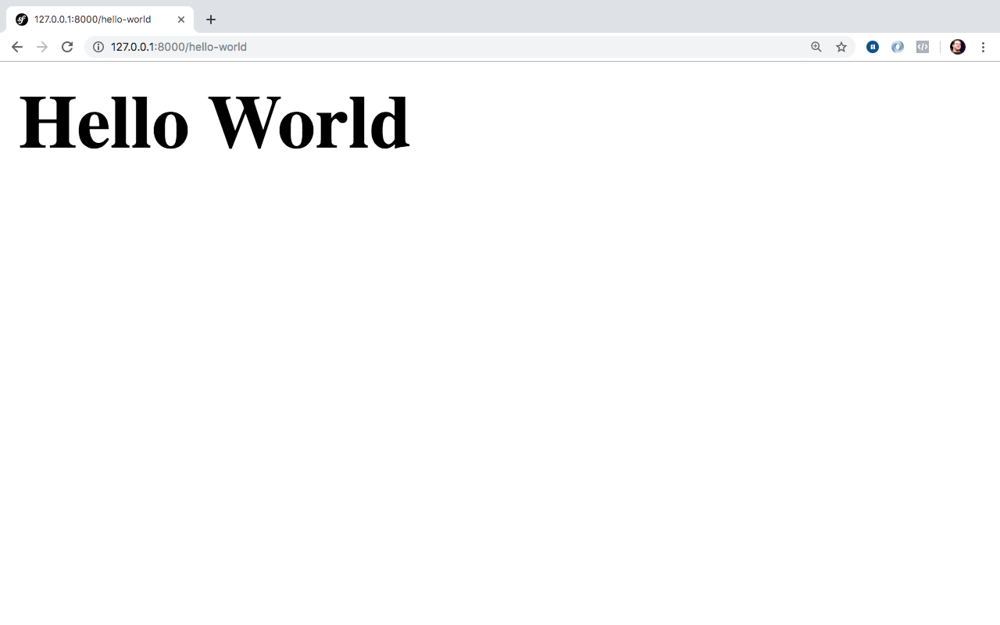

{sample: true}

# Hello World com Laravel

Este capítulo visa mostrar o Laravel de uma forma geral, o que definirá nosso fluxo de trabalho durante todo o desenvolvimento. Gosto muito de tomar uma abordagem prática, por isso, vamos trabalhar todos os conceitos envolvendo o framework em cima de um projeto prático e direto ao ponto.

O projeto escolhido e que nos traz todo o aparato para entedermos cada parte de um framework fullstack será a criação de um blog com gerenciamento de posts e autores, além do sistema de comentários. Então vamos lá colocar a mão na massa e da inicio de fato ao conhecimento por meio do nosso primeiro Hello World com o framework.

## MVC

Antes de continuarmos precisamos conhecer um pouco do modelo base utilizado no mapeamento das classes dentro do nosso projeto Laravel, esse modelo ou padrão é o famoso MVC, ou, Model-View-Controller.

A maioria dos frameworks atuais utilizam esta estrutura para organização de seus componentes, além de termos um `Front Controller` que recebe as requisições enviadas para nossa aplicação e entrega/delega para quem vai resolver aquela requisição. Geralmente este `Front Controller` se encontra na pasta public(Directory Root da aplicação) no index.php dos frameworks, como o é no Laravel.

O modelo MVC possui três camadas base, as que comentei acima, o Model, o Controller e a View. Vamos entender o que é cada parte:

### Model

A camada do Model ou Modelo é a camada que conterá nossas regras de negócio, geralmente possuem as entidades que representam nossas tabelas no banco de dados, podem conter classes que contêm regras de negócio especificas e até podem conter classes que realizam algum determinado serviço.

Dentro do Laravel nossos models serão as classes que representam alguma tabela no banco de dados com poderes de manipulação referentes a esse tratamento com o banco. Você pode encontrar, por default, as classes model dentro da pasta `app` em sua raiz.

### Controller

A camada do Controller ou Controlador é a camada mais fina digamos assim, ele recebe a requisição e demanda para o models em questão, caso necessário, e dada a resposta do model entrega o resultado para a view ou carrega diretamente um view caso não necessitemos de operações na camada do Model.

A ideia pro controller é que ele seja o mais simples possivel, portanto, evite adicionar regras e complexidade em seus Controllers. Dentro do Laravel estes controllers encontram-se na pasta `app/Http/Controllers`.

### View

A camada de View ou visualização é a camada de interação do usuário. Onde nossos templates vão existir, com as telas do nosso sistema e as páginas de nossos sites. Nesta camada, também, não é recomendado colocar regra de negócios, consultas ao banco ou coisas deste tipo. Esta camada é exclusivamente para exibição de resultados e input de dados apenas, via formulários, além de interações Javascripts e outros processos já esperados para melhor aproveitamente do usuário.

No Laravel nossas views encontram-se na pasta `resources/views/`. Em nossas views utilizaremos o template engine, que falarei sobre ele mais a frente, chamado de **Blade**.

## Roteiro para nosso primeiro Hello World


Para criamos nosso hello world, precisaremos seguir os passos abaixo para este momento:

- Criar um controller para execução ao chamarmos nossa rota em questão;
- Criar uma view para envio da nossa string: `Hello World` a ser exibida como resultado do acesso;
- Criar nossa rota para chamada e acesso em nosso browser.

A priore passos bem simples e que vão nos dar um panorama inicial do framework para a partir daí prosseguirmos com os conceitos individualmente.

## Iniciando Hello World

Acesse o projeto iniciado no capítulo passado pelo seu terminal ou cmd no Windows. Na certeza de está na raiz do seu projeto execute o seguinte comando abaixo:

`php artisan make:controller HelloWorldController`

Ao executar o comando acima teremos o seguinte resultado, pro sucesso da criação do nosso primeiro controller, exibido em nosso terminal ou cmd: `Controller created successfully.`

Após isso teremos o nosso controller adicionado dentro da pasta do nosso projeto, especificamente: `app/Http/Controllers` e o arquivo `HelloWorldController.php`. Não esqueça de acessar o projeto em seu editor ou IDE de código de sua preferência.

O código do nosso controller encontra-se abaixo:

```
<?php

namespace App\Http\Controllers;

use Illuminate\Http\Request;

class HelloWorldController extends Controller
{
    //
}

```

O resultado acima é a classe do nosso controller que estende do Controller base e já traz um import para nós, o nosso Request que também conheceremos ele no decorrer do nosso livro.

Vamos criar nosso primeiro método para execução posterior ao acessarmos nossa rota, ainda não criada. Abaixo segue o conteúdo do nosso primeiro método:

```
public function index()
{
	$helloWorld = 'Hello World';

	return view('hello_world.index', compact('helloWorld'));
}
```

Do método acima temos um ponto bem interessante, o retorno da função helper chamada `view` que recebe como primeiro parâmetro a view desejada e o segundo parâmetro um array associativo com os valores a serem enviados para esta view.

Antes de entedermos como criaremos a view com base no primeiro parâmetro, preciso te falar que a função compact é uma função do PHP que pega as variaveis informadas e joga dentro de um array associativo sendo a chave o nome da variável e seu valor o valor contido na variável, foi o que fizemos para enviar `$helloWorld` para nossa view.

Agora como podemos criar nossa view de forma que o primeiro parâmetro da função helper `view` seja satisfeito? Vamos entender!

Temos o seguinte valor: `hello_world.index`. A última parte da string apresentada pós `.` será o nome da nossa view que deve respeitar o seguinte nome de arquivo, se depois do ponto tenho `index` precisarei criar uma view chamada `index.blade.php`, só que antes do ponto temos o valor `hello_world` que neste caso será a pasta onde nosso `index.blade.php` estará, então, no fim das contas precisaremos criar lá dentro da pasta `resources/views` uma pasta chamada `hello_world` e dentro desta pasta nosso arquivo `index.blade.php` chegando ao caminho completo e o arquivo: `resources/views/hello_world/index.blade.php`.

PS.: Se você quiser chamar uma view diretamente que esteja dentro da pasta de views, basta informar apenas o nome da views em questão. Se você tiver mais niveis em questão de pastas até chegar na view, é necessário informá-los até o arquivo da view em questão. Tanto o caminho base até a pasta `views` quanto a extensão `.blade.php` o próprio Laravel adciona automáticamente para nós.

Com isso crie o arquivo `index.blade.php` e sua pasta `hello_world` dentro da pasta `views`. Com o seguinte conteúdo abaixo:

```
<h1>{{$helloWorld}}</h1>
```

Acima temos, dentro do elemento `h1`, o nosso primeiro contato com o template engine Blade. Usamos acima a notação de print, abre `{{` fecha `}}`, dentro da nossa view e pegamos a nossa variável `$helloWorld` vinda lá do nosso controller e exibimos seu valor dentro do elemento html.
 
Agora, que já seguimos os dois passos do nosso roteiro precisamos permitir o acesso e execução deste método, método index do nosso controller HelloWorldController, por parte dos nossos usuários e a liberação de uma url para acesso.

Como faremos isso? Simples, no momento, vamos criar uma rota que apontará para o método do nosso controller! Vamos lá que vou te mostrar!

Abra seu arquivo `web.php` que se encontra na pasta `routes` na raiz do projeto. 

Teremos o seguinte conteúdo:

```
<?php

/*
|--------------------------------------------------------------------------
| Web Routes
|--------------------------------------------------------------------------
|
| Here is where you can register web routes for your application. These
| routes are loaded by the RouteServiceProvider within a group which
| contains the "web" middleware group. Now create something great!
|
*/

Route::get('/', function () {
    return view('welcome');
});
```

Este arquivo web.php conterá todas as rotas da nossa aplicação que trabalham com a exibição de htmls com resultados em nosso projeto. Tudo que for UI ou User Interface(Interface do Usuário) terá suas rotas definidas neste arquivo.

De cara já vemos a primeira definição de rota, a rota principal `/` que exibe a view `welcome.blade.php` que está lá dentro da pasta de views. Esta rota é a rota executado ao acessarmos a página principal de uma aplicação Laravel recém instalada. Agora vamos definir nossa rota de hello world.

Adicione o código abaixo, após a definição da rota principal que já existe:

```
Route::get('hello-world', 'HelloWorldController@index');
```

Acima temos nossa primeira rota definida, a rota escolhida foi `hello-world` que executará o método index do controller HelloWorldController, blz, como isto está definido? Vamos lá!

O segundo parâmetro da função `get` do `Route` é o executavél para esta rota, que pode ser uma função anônima como vimos na definição da rota principal já existente ou uma string que respeite `Controller@método` e foi como definimos `HelloWorldController@index`.

O Laravel vai chamar o namespace base até o nosso controller e trabalhar em cima da string dada separando o controller do método, criando a instância deste controller e efetuando a chamada do método informado.

Com nossa rota definda, chegamos ao passo 3 e final do nosso roteiro e já podemos iniciar nosso webserver, na raiz do projeto para teste de nosso Hello World. Execute o comand abaixo em seu terminal ou cmd:

```
php artisan serve
```

E acesse em seu browser `http://127.0.0.1:8000/hello-world`, onde teremos o resultado abaixo:



O Hello World em nossa tela!

## Conclusões

Neste módulo vimos diretamente o processo de expor uma rota para acesso, a execução de nosso controller através do método index, bem como, a exibição do resultado em uma view onde mostramos o nosso primeiro Hello World com o framework!

É claro que cada etapa destas carece de um pouco mais de informações e também é claro que cada etapa destas contêm diversos detalhes que será necessário que conheçamos para termos um melhor proveito do framework.

A partir de agora iremos debsravar toda estas opções e outros pontos a mais que não foram diretamente mostrados aqui.

Este capítulo serviu para te mostrar um panorama geral que será utilizado no decorrer de sua caminhada com o framework durante o desenvolvimento de suas aplicações mas vamos lá que têm bastante coisa ainda!

Vamos continuar nossa jornada!