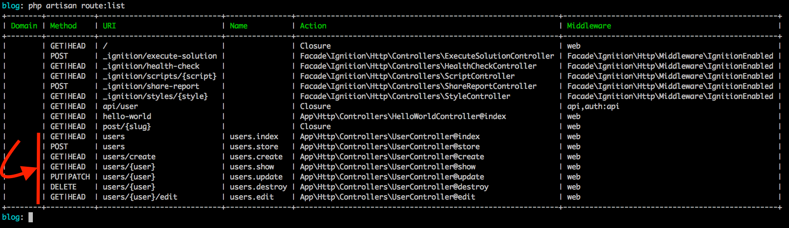

# Rotas & Controllers

As rotas e controllers são integrantes bem importantes em nossas aplicações Laravel. Neste capítulo vamos conhecer as opções que as rotas nos proporcionam e como podemos trabalhar com controllers conhecendo um pouco além do que vimos no capítulo passado.

Vamos as rotas então!

## Rotas

As rotas em nossa aplicação Laravel nos ajudam a termos mais previsibilidade sobre nossas urls. Como nós mapeamos nossas URLs dentro dos arquivos de rotas fica mais fácil termos controle do que será exposto e também fica mais fácil de customizarmos as rotas como queremos.

Dentro do Laravel temos os arquivos de rotas bem separados, que nos ajuda a organizarmos melhor tais rotas que dependendo da aplicação podem se tornar bem grande no quesito de definições dentro do arquivo de rotas em questão.

O Laravel possui os seguintes arquivos de rotas: `web.php`, `api.php`, `channels.php` e `console.php`.

##### web.php

O arquivo web.php conterá as rotas de sua aplicação com as interfaces para o usuário. Todas as rotas que têm esse fim deverão ser definidas neste arquivo.

##### api.php

Se você for trabalhar com APIs, expondo endpoints para que outras aplicações possam consumir seus recursos você deverá definir suas rotas com este fim no arquivo **api.php**.

##### channels.php

Se você for trabalhar com eventos de Broadcasting, Notificações e etc suas rotas deverão ser definidas neste arquivo.

##### console.php

Arquivo para registro de comandos para o console e execução a partir do artisan.

### Definição de Rotas

Como vimos no último capítulo, abordei duas formas de definição de rotas em nosso Hello World. Uma era a rota que já existia no arquivo **web.php** e a outra foi nossa definição de rota para nosso Hello World. 

Vamos da uma revisada, uma relembrada:

```
Route::get('/', function () {
    return view('welcome');
});
```

e 

```
Route::get('hello-world', 'HelloWorldController@index');
```

Acima temos duas formas de definição para rotas, com respeito ao que será executado. Lembrando que o primeiro parâmetro do método get é a rota em questão e o segundo parâmetro será um callable: uma função anônima ou uma string que respeite `Controller@método` que no fim das contas também virará um callable dada a instância do controller e a chamada do método deste controller.

Na rota inicial, que já tinhamos no arquivo web.php, vemos a utilização da função anônima e em nossa rota usamos a definição de chamada do controller e seu método diretamente.

Um primeiro ponto que podemos abordar sobre os métodos do `Route`, como vimos o `get` até o momento, é que teremos métodos respeitando os verbos http, como: 

- GET;
- POST;
- PUT;
- PATCH;
- DELETE;
- OPTIONS;

Podendo utilizá-los da seguinte maneira:

- Route::get($route, $callback);
- Route::post($route, $callback);
- Route::put($route, $callback);
- Route::patch($route, $callback);
- Route::delete($route, $callback);
- Route::options($route, $callback);

Podemos usar os métodos conforme os verbos http mostrados, tendo sempre o primeiro parâmetro, a rota em si, e o segundo parâmetro o callable ou executável para esta rota ao ser acessada.

### Route match e Route any

Se precisarmos usar uma rota que responda a determinados tipos de verbos http, podemos usar o método `match` do `Route`. Como abaixo:

```

Route::match(['get', 'post'], 'posts/create', function(){
	return 'Esta rota bate com o verbo GET e POST';
});

```

Caso queira que uma rota responda para todos os verbos ao mesmo tempo, você pode usar o método `any` do `Route`:

```

Route::any('posts', function(){
	return 'Esta rota bate com todos os verbos HTTP mencionados anteriormente';
});

```

### View Routes

Em determinados momentos você vai precisar apenas renderizar determinadas views como resultado do acesso a sua rota. Para isso temos o método `view` do `Route` que nos permite setar uma rota, primeiro parâmetro, definir uma view, segundo parâmetro, e se preciso podemos passar algum valor para esta view sendo o terceiro parâmetro do método.

Veja como é simples:

```
//Exibindo somente a view

Route::view('/bem-vindo', 'bemvindo');

//Exibindo a view e mandando parâmetros para ela

Route::view('/bem-vindo', 'bemvindo', ['name' => 'Nanderson Castro']);

```

Bem simples mesmo, ao acessarmos a rota `bem-vindo` em nosso browser carregaremos a view `bemvindo.blade.php` diretamente como resultado.


### Parâmetros dinâmicos 

Continuando, vamos conhecer um ponto bem importante sobre rotas que é a possibilidade de informamos parâmetros dinâmicos. Parâmetros estes que podem servir para identificar determinado recurso como uma postagem em um blog por exemplo. 

Veja a rota definida abaixo:

```
Route::get('/post/{slug}', function($slug) {
    return $slug;
});

```

Temos a rota `/post/` após isso definimos um parâmetro dinâmico chamado `slug` dentro de chaves como é solicitado pelo componente de rotas. Em nossa função anônima passamos o parâmetro `$slug` que receberá o valor dinâmico e assim, poderemos utilizar ele dentro da nossa função. 

Se eu estiver usando um controller e seu método, basta informarmos no método o parâmetro correspondente como informamos na função anônima e utilizarmos tranquilamente.

Com esta rota defininda em nosso arquivo `web.php` e nosso server levantado, podemos acessar em nosso browser a seguinte url: `http://127.0.0.1:8000/post/teste-parametro-dinamico`.

Resultado:


Como retornamos o parâmetro informado, teremos o valor dinâmico exibido em nosa tela como mostra a imagem acima.

### Parâmetros Opcionais

Se você precisar definir parâmetros opcionais para sua rota em questão, basta adicionar a `?` antes do fechamento da última chave do parâmetro na definição da rota. Veja abaixo:

```
Route::get('/post/{slug?}', function($slug = null) {

    return !is_null($slug) ? $slug : 'Comportamento sem a existência do param slug';
    
});

```

Agora nosso parâmetro `slug` é opcional ou seja não será necessário informá-lo na rota e isso nos abre precedente para validarmos ou exibirmos os resultados com base na não existência do parâmetro.

Mais um ponto bem útil nas rotas no Laravel.
 

### Regex em parâmetros

Podemos validar o formato dos parâmetros aceitos em nossas rotas por meio de expressões regulares para um melhor controle. Para isso podemos utilizar o método `where` com este fim:

```

Route::get('/user/{id}', function($slug) {
    return $slug;
})
->where(['id' => '[0-9]+']);

```

O método `where` espera um array associativo, sendo a chave o nome do parâmetro e o valor a expressão regular (Regex) a ser validada no parâmetro informado. 

Se você tiver mais de um parâmetro dinâmico e quiser informar uma regex para tal, basta ir adicionando no array, respeitando o pensamento chave sendo o parâmetro e valor sendo a experessão regular.

### Apelido para rotas

Outro ponto bem importante em nossas rotas são seus apelidos. Mas para que servem? Até agora conhecemos o valor real ou nome real da rota mas podemos chamá-las por meio de seus apelidos também, isso nos ajuda quando precisamos, em um futuro, alterar o nome real das rotas.

Quando fazemos referência aos apelidos, podemos alterar tranquilamente o nome real da rota que o peso desta modificação não será tão impactante assim no quesito negativo. E como utilizar este apelido?

Vamos pegar nossa última rota do parâmetro dinâmico:


```
Route::get('/post/{slug}', function($slug) {
    return $slug;
})
->name('post.single');

```

Perceba a adição simples que fiz após o método `get` antes de fechar com o `;`. Chamei o método `name` que me permite adicionar um apelido para a rota em questão, neste caso agora posso chamar o apelido `post_single` toda vez que eu precisar usar a rota `post/{slug}`. 

Em um link em nossa view ao invés de usarmos desta maneira:

```
<a href="/post/primeiro-post">Primeiro Post</a>
```

Vamos utilizar desta maneira:

```
<a href="{{route('post.single', ['slug' => 'primeiro-post'])}}">Primeiro Post</a>
```

Perceba acima que estamos em uma suposta view e utilizamos um método helper do Blade que é o `route` em nosso atributo href da âncora. O primeiro parâmetro do `route` é o apelido da rota e se a rota tiver parâmetros dinâmicos, que é o nosso caso, agente informa isso dentro de um array no segundo parâmetro do helper, informando o nome do parâmetro dinâmico e o seu valor.

O método route irá gerar a url correta, informando o parâmetro dinâmico no local correto. Com isso fica mais simples se precisarmos futuramente modificar o nome real da rota por esta questão, de chamarmos a rota pelo apelido ao invés de seu nome real.

### Grupo de Rotas & Prefixo

Podemos definir determinadas configurações para um grupo especifico de rotas, para conhecermos o poder do group decidir mostrar ele aqui com a definição de um prefixo, método existente no Route também.

Vamos ao código abaixo:

```

Route::prefix('posts')->group(function(){

    Route::get('/', 'PostController@index')->name('posts.index');
    
    Route::get('/create', 'PostController@create')->name('posts.create');
    
    Route::post('/save', 'PostController@save')->name('posts.save');

});

```

Perceba no set de rotas acima que utilizei incialmente o método `prefix` e me utilizei do método `group` para definir esse prefixo para um grupo de rotas específico. Esse grupo de rotas é adicionado dentro do método `group` por meio de uma função anônima.

Agora, as rotas dentro do group serão prefixadas com o `posts`, ficando desta maneira:

- **/posts/**;
- **/posts/create**;
- **/posts/save**.

Duas rotas acessivéis via GET e uma acessível via POST. 

O grupo nos permite esse tipo de configuração, quando precisamos organizar melhor determinadas configurações que se repetirão para mais de um set de rota. Isso melhora até a escrita dos nossos arquivos de rotas e definições.

### Grupo de Rotas & Apelidos

Vamos melhorar ainda mais nosso set de rotas do momento passado. Podemos, também, definir um apelido base para um grupo de rotas, então vamos melhorar nosso grupo anterior.

Veja como ficou:

```

Route::prefix('posts')->name('posts.')->group(function(){

    Route::get('/', 'PostController@index')->name('index');
    
    Route::get('/create', 'PostController@create')->name('create');
    
    Route::post('/save', 'PostController@save')->name('save');

});

```

Perceba que agora isolei a parte `posts.` referente ao apelido das rotas após a definição do prefixo. Agora as rotas deste grupo além de receberem um prefixo, irão receber um apelido base que será concatenado com os apelidos de cada rota do grupo.

Os apelidos ficarão desta forma:

- **posts.index**;
- **posts.create**;
- **posts.save**.

Esses serão os apelidos das rotas gerados, o mesmo que seria anteriormente mas agora com o detalhe de termos organizado e isolado o que era repetido, ou seja, o  `posts.`.

### Grupo de Rotas & Namespaces

O namespace base do Laravel é `App`, e o namespace base dos controllers é `App\Http\Controllers`. Esse namespace é adicionado automaticamente pelo Laravel quando chamamos uma rota referenciando o método de um Controller mas podem existir casos em que você queira criar mais um nível de namespace para um determinado grupo de controllers dentro de sua aplicação.

Por exemplo, podemos ter controllers especificos de um painel administrativo. Suponhamos que temos dentro da pasta controllers uma pasta `Admin` (que também representará mais um nivel de namespace) e dentro desta pasta `Admin` temos um `PostController`, um `UserController` ambos referentes ao gerenciamento de posts e usuários de nosso painel administrativo.

Como podemos referir o namespace `Admin` durante o set de rotas?

Vejamos as duas rotas abaixo:

```
Route::get('admin/users/', 'Admin\\UserController@index')->name('users.index');


Route::get('admin/posts/', 'Admin\\PostController@index')->name('posts.index');

```

Perceba como eu informei o namespace extra, `Admin`, nas duas rotas acima que supostamente levam para a listagem de usuários e posts dentro do nosso admin.

Perceba que temos repetições nas duas rotas, vamos nos focar em organizar o namespace inicialmente.

Organizando o namespace por grupos podemos chegar no resultado abaixo:

```
Route::namespace('Admin')->group(function(){

    Route::get('admin/users/', 'UserController@index')->name('users.index');


    Route::get('admin/posts/', 'PostController@index')->name('posts.index');

});

```

Agora isolamos o namespace através do método, do `Route`, chamado `namespace` e todas as rotas deste grupo irão receber este namespace. 

Podemos ainda organizar os prefixos, perceba a repetição do `admin` nos nomes reais das rotas. Organizando fica assim:

```
Route::namespace('Admin')->prefix('admin')->group(function(){

    Route::get('/users/', 'UserController@index')->name('users.index');


    Route::get('/posts/', 'PostController@index')->name('posts.index');

});

```

Agora as coisas começam a ficar mais organizadas. 

Podemos organizar e agrupar nossas rotas conforme nossa necessidade, então, sempre que estiver escrevendo suas rotas analise o que pode ser organizado e agrupado com o método `group` e as opções disponiveis para as configurações em questão.

## Controllers


Já tivemos nosso primeiro contato com controllers até este momento. Os controllers são parte importantíssima nesta arquitetura utilizando o Laravel. Relembrando, de forma simples, os controllers são o ponto de delegação entre Model e View, recebendo a requisição e entregando para quem é de direito.

Utilizando o **artisan** podemos automatizar, como já fizemos, a geração dos nossos controllers. Como por exemplo fizemos no capítulo passado ao executarmos o comando abaixo:

```
php artisan make:controller HelloWorldController
```

Agora vamos explorar mais opções dentro deste comando e buscar mais produtividade na execução de nossos projetos.

### Controllers como Recurso

Podemos gerar controllers com métodos para cada operação de CRUD e por meio de uma configuração de rota termos também as rotas automáticas para cada um destes métodos.

Este tipo de controller chamamos de controller como recurso. Vamos gerar e entender como são. Em seu terminal na raiz do seu projeto execute o comando abaixo:

```
php artisan make:controller UserController --resource
```

Perceba agora que usei o mesmo comando para gerar um novo controller, no caso acima o controller `UserController` mas adicionei um parâmetro, o `--resource` que criará um controller com os seguintes métodos abaixo:

- index;
- create;
- store;
- show;
- edit;
- update;
- destroy;

Percebe que quando iniciamos o controller como recurso já temos um controller com os métodos acima definidos só no ponto para colocarmos nossas lógicas de inserção, regra de negócio e etc.

Veja o controller gerado abaixo na íntegra:

```
<?php

namespace App\Http\Controllers;

use Illuminate\Http\Request;

class UserController extends Controller
{
    /**
     * Display a listing of the resource.
     *
     * @return \Illuminate\Http\Response
     */
    public function index()
    {
        //
    }

    /**
     * Show the form for creating a new resource.
     *
     * @return \Illuminate\Http\Response
     */
    public function create()
    {
        //
    }

    /**
     * Store a newly created resource in storage.
     *
     * @param  \Illuminate\Http\Request  $request
     * @return \Illuminate\Http\Response
     */
    public function store(Request $request)
    {
        //
    }

    /**
     * Display the specified resource.
     *
     * @param  int  $id
     * @return \Illuminate\Http\Response
     */
    public function show($id)
    {
        //
    }

    /**
     * Show the form for editing the specified resource.
     *
     * @param  int  $id
     * @return \Illuminate\Http\Response
     */
    public function edit($id)
    {
        //
    }

    /**
     * Update the specified resource in storage.
     *
     * @param  \Illuminate\Http\Request  $request
     * @param  int  $id
     * @return \Illuminate\Http\Response
     */
    public function update(Request $request, $id)
    {
        //
    }

    /**
     * Remove the specified resource from storage.
     *
     * @param  int  $id
     * @return \Illuminate\Http\Response
     */
    public function destroy($id)
    {
        //
    }
}
```

Agora com o controller como recurso gerado, podemos expor rotas para cada um dos métodos acima. Neste caso, para facilitar mais ainda nossas vidas, temos um método dentro do `Route` chamado de `resource` que já expõe para nós as rotas para cada um destes métodos simplificando ainda mais as coisas.

Em seu arquivo de rotas web adicione a rota abaixo:

```
Route::resource('/users', 'UserController');
```

Se nós debugarmos as rotas existentes em nosso projeto até o momento, podemos encontrar, focando no controller como recurso e em suas rotas, o resultado destacado abaixo na imagem. 

Para debugarmos as rotas existentes no Laravel, definidas dentro de sua aplicação, basta executar na raiz do seu projeto o comando abaixo:

```
php artisan route:list
```

Obtendo a lista de rotas de sua aplicação. Veja o destaque nas rotas criadas pelo método `resource` do `Route`:




Além de termos gerado o controller com os métodos para serem utilizados dentro de um CRUD completo, temos também a criação das rotas para cada um dos métodos do controller, por meio da chamada de apenas um método, o `resource`. O método `resource` recebe o nome da rota como primeiro parâmetro e o nome do controller, gerado como recurso, no segundo parâmetro, simples assim.

Perceba que na imagem acima temos as rotas, temos também apelidos para estas rotas e ainda temos rotas para cada um dos verbos HTTP.

Entenda abaixo:

- Temos uma rota principal, que serve para listagem de todos os dados, neste caso usuários. Esta rota é `/users` que aponta para o método `index` do `UserController`;
- Temos a rotas `users/create` que aponta para o método create do `Usercontroller` que se refere a tela de exibição do form de criação, a rota `users/store` aponta para o método store de `UserController` se refere ao salvar de fato os dados vindos do form de criação;
- Temos ainda a rota para visualização de um dado específico, neste caso, podemos usar tanto a `users/{user}` (aponta para `UserController@show`) ou `users/{user}/edit` (aponta para `UserController@edit`) via GET;
- Para atualização temos a rota `users/{user}` que aponta para o método update de UserController e também temos o método destroy que serve para o remover um dado e têm a rota `users/{user}` e aponta para o método `destroy` do `UserController`. Para atualização verbos PUT ou PATCH e para remoção verbo DELETE do HTTP.

Melhorando a visualização e simplificando:

- rota: `/users/`, verbo: `GET`, controller@método: `UserController@index`;
- rota: `/users/`, verbo: `POST`, controller@método: `UserController@store`;
- rota: `/users/create`, verbo: `GET`, controller@método: `UserController@create`;
- rota: `/users/{user}`, verbo: `GET`, controller@método: `UserController@show`;
- rota: `/users/{user}`, verbo: `PUT ou PATCH`, controller@método: `UserController@update`;
- rota: `/users/{user}`, verbo: `DELETE`, controller@método: `UserController@destroy`;
- rota: `/users/{user}/edit`, verbo: `GET`, controller@método: `UserController@edit`;

Lembrando que você precisa adicionar sua lógica para cada um dos métodos, entretanto, todas as rotas já estão definidas como vimos acima e quando geramos o controller temos as definições dos métodos também.

## Conclusões

Vimos aqui neste capítulo diversas possibilidades sobre as rotas de nossa aplicação e mais opções referentes aos nossos controllers. É claro, que temos mais opções, tanto dentro das rotas quanto na exploração dos controllers.

A cada capítulo vamos conhecendo mais opções para rotas, por exemplo a opção dos middlewares quando conhecermos os conceitos envolvendo esta parte!

No próximo capítulo iremos falar sobre o envio de dados de um formulário para nosso backend e a manipulação das `requests` e do nosso `response`.

Até lá!


