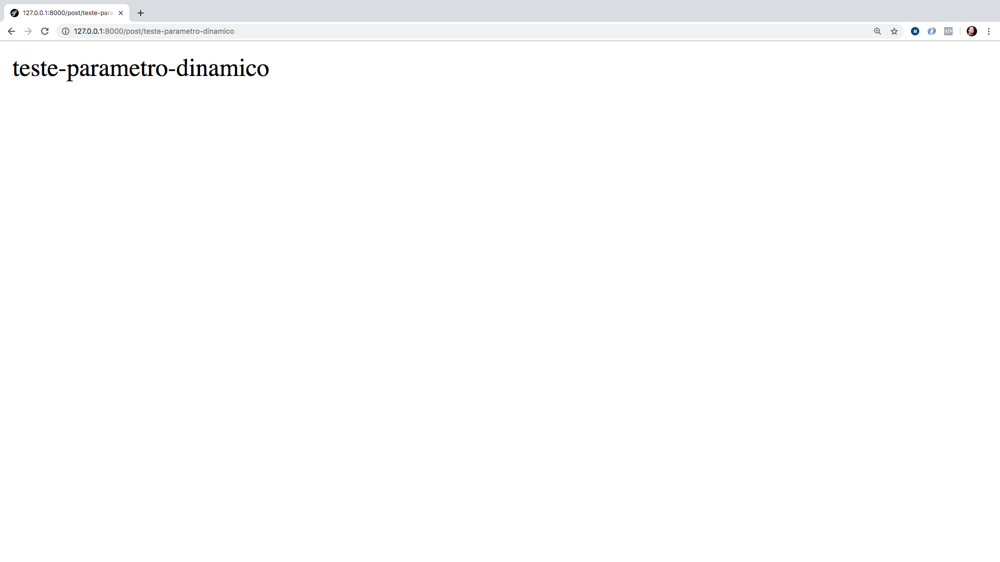

# Rotas & Controllers

As rotas e controllers são integrantes bem importantes em nossas aplicações Laravel. Neste capítulo vamos conhecer as opções que as rotas nos proporcionam e como podemos trabalhar com o controllers conhecendo um pouco além do que vimos no capítulo passado.

Vamos as rotas então!

## Rotas

As rotas em nossa aplicação Laravel nos ajudam a termos mais previsibilidade sobre nossas urls. Como nós mapeamos nossas URLs dentro dos arquivos de rotas fica mais fácil termos controle do que será exposto e também fica mais fácil de customizarmos as rotas como queremos.

Dentro do Laravel temos os arquivos de rotas bem separados o que nos ajuda a organizarmos melhor tais rotas que dependendo da aplicação podem se tornar bem grande no quesito de definições dentro do arquivo de rotas em questão.

O Laravel possui os seguintes arquivos de rotas: `web.php`, `api.php`, `channels.php` e `console.php`.

##### web.php

O arquivo web.php conterá as rotas de sua aplicação com as interfaces para o usuário. Todas as rotas que têm esse fim deverão ser definidas neste arquivo.

##### api.php

Se você for trabalhar com APIs, expondo endpoints para que outras aplicações possam consumir seus recursos você deverá definir suas rotas com este fim no arquivo api.php.

##### channels.php

Se você for trabalhar com eventos de Broadcasting, suas rotas deverão ser definidas neste arquivo.

##### console.php

Arquivo para registro de comandos para o console e execução no artisan.

### Definição de Rotas

Como vimos no último capítulo, abordei duas formas de definição de rotas em nosso Hello World. Uma era a rota que já existia no arquivo web.php e a outra foi nossa definição de rota para nosso Hello World. Vamos da uma revisada, uma relembrada:

```
Route::get('/', function () {
    return view('welcome');
});
```

e 

```
Route::get('hello-world', 'HelloWorldController@index');
```

Acima temos duas formas de definição para rotas, no quesito do que será executado. Lembrando que o primeiro parâmetro do método get é a rota em questão e o segundo parâmetro será um callable: uma função anônima ou uma string que respeite `Controller@método` que no fim das contas também virará um callable dada a instância do controller e a chamada do método deste controller.

Na rota inicial vemos a utilização da função anônima e em nossa rota usamos a definição de chamada do controller e seu método diretamente.

Um primeiro ponto que podemos abordar sobre os métodos do `Route`, como vimos o `get` até o momento, é que teremos métodos respeitando os verbos http, como: 

- GET;
- POST;
- PUT;
- DELETE;
- OPTIONS;
- HEAD;

Podemos usar os métodos conforme os verbos http mostrados acima, tendo sempre o primeiro parâmetro, a rota em si, e o segundo parâmetro o callable ou executável para esta rota ao ser acessada.

### Parâmetros dinâmicos 

Continuando vamos conhecer um ponto bem importante sobre rotas que é a possibilidade de informamos parâmetros dinâmicos em nossas rotas. Parâmetro este que pode servir para identificar determinado recurso como uma postagem em um blog por exemplo. 

Veja a rota definida abaixo:

```
Route::get('/post/{slug}', function($slug) {
    return $slug;
});

```

Temos a rota `/post/` após isso definimos um parâmetro dinâmico chamado `slug` dentro de chaves como é solicitado pelo componenete de rotas. Em nossa função anônima passamos o parâmetro `$slug` que receberá o valor dinâmico e poderemos utilizar ele dentro da nossa função. Se eu estiver usando um controller e seu método, basta informarmos no método o parâmetro correspondente como informamos na função anônima e utilizarmos tranquilamente.

Com esta rota defininda em nosso arquivo `web.php` e nosso server levantado, podemos acessar em nosso browser a seguinte url: `http://127.0.0.1:8000/post/teste-parametro-dinamico`.

Resultado:



Como retornamos o parâmetro teremos o valor dinâmico exibido em nosa tela como mostra a imagem acima.

### Apelido para rotas

Outro ponto bem importante em nossas rotas são seus apelidos. Mas para que servem? Até agora conhecemos o valor real ou nome real da rota mas podemos chama-las por meio de seus apelidos também, isso nos ajuda quando precisamos, em um futuro, alterar o nome real das rotas.

Quando fazemos referência aos apelidos, podemos alterar tranquilamente o nome real da rota que o peso desta modificação não será tão impactante assim no quesito negativo. E como utilizar este apelido?

Vamos pegar nossa última rota do parâmetro dinâmico:


```
Route::get('/post/{slug}', function($slug) {
    return $slug;
})
->name('post_single');

```

Perceba a adição simples que fiz após o método `get` antes de fechar com o `;`. Chamei o método `name` que me permite adicionar um apelido para a rota em questão, neste caso agora posso chamar o apelido `post_single` toda vez que eu precisar usar a rota `post/{slug}`. 