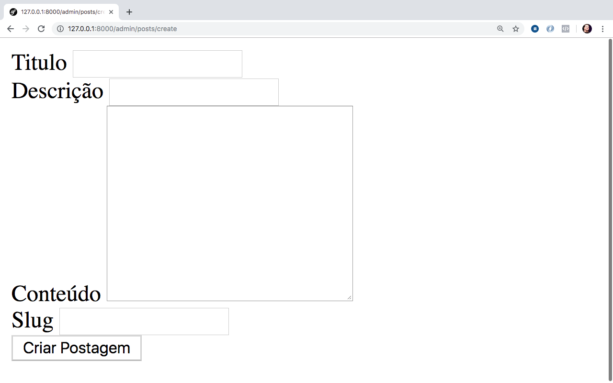
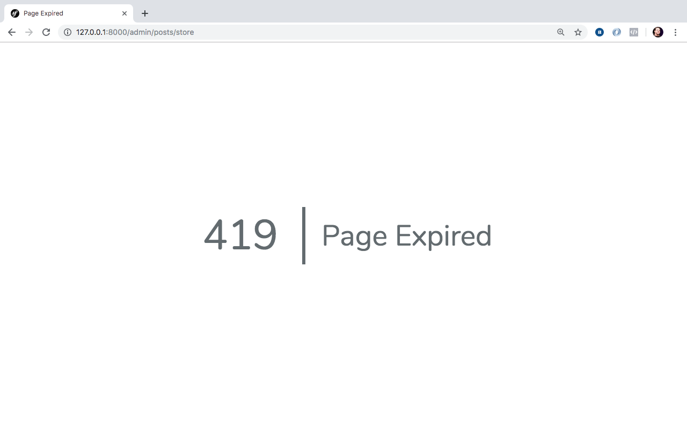
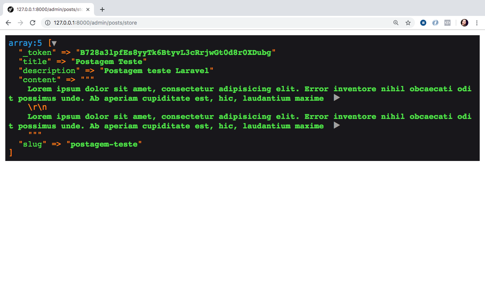

# Formulários, Request & Response

Neste capítulo vamos conhecer um ponto crucial para a criação das nossas aplicações, como manipular informações recebidas em nossas requests e as particularidades do response ou respostas HTTP dentro do Laravel.

Aproveito também e já abordo isso com dados vindos de um formulário onde teremos pequenos pontos importantes a serem abordados neste aspecto.

Então vamos lá!

## Iniciando pelo formulário

Para começarmos, vamos criar um formulário para envio dos dados para nosso controller. Para isso crie um arquivo chamado de `create.blade.php` dentro da pasta de views, colocando ele dentro da pasta posts, então crie esta pasta também. O caminho completo até o arquivo ficará assim:

`resources/views/posts/create.blade.php`

Veja o formulário abaixo a ser adicionado no `create.blade.php`:

```
<form action="{{route('posts.store')}}" method="post">

    <div class="form-group">
        <label>Titulo</label>
        <input type="text" name="title" class="form-control">
    </div>

    <div class="form-group">
        <label>Descrição</label>
        <input type="text" name="description" class="form-control">
    </div>

    <div class="form-group">
        <label>Conteúdo</label>
        <textarea name="content" id="" cols="30" rows="10" class="form-control"></textarea>
    </div>

    <div class="form-group">
        <label>Slug</label>
        <input type="text" name="slug" class="form-control">
    </div>

    <button class="btn btn-lg btn-success">Criar Postagem</button>
</form>
```

No formulário temos 4 campos diretamente, são eles:

- Titulo;
- Descrição;
- Conteúdo;
- Slug (futuramente vamos automatizar esta geração);

Obs.: Utilizei a estrutrua do form pensando no Twitter Bootstrap, mais a frente no livro vamos linkar esse framework css do Twitter em nossas  mas já dando uma pincelada, usei as classes de formulário disponiveis neste framework são elas: `form-group` e `form-control`. Além das classes para botões: `btn`, `btn-lg`(botão largo) & `btn-success`(que traz a cor verde ao botão.

Nosso formulário trabalhará com envio dos dados via método `POST` e já adicionamos, a action do formulário, a chamada de uma rota pelo seu apelido, a `posts.store`. Vamos gerar nosso controller e nossas rotas para que possamos fazer esse form funcionar.

Gere o controller a partir do seu terminal, com o comando abaixo:

```
php artisan make:controller Admin/PostController
```

Perceba mais um apredizado acima, como coloquei `Admin/` nosso controller será criado dentro da pasta `Admin` dentro da pasta de controllers. Isso simplifica também nossas gerações.

Pro nosso exemplo não vou gerar como recurso porque nosso foco ainda não é gerarmos um crud e sim conhecermos esse trabalho entre as requisições e o envio de dados.

Uma vez criado o controller, adicione os métodos abaixo:

```
public function create()
{
	return view('posts.create');
}
```

e também:

```
public function store(Request $request)
{

}
```

O primeiro método será para exibição de nossa view criada anteriormente e o segundo para manipularmos o que for enviado do formulário de criação. Este segundo método veremos mais adiante seu conteúdo.

Até o momento nosso controller fica desta maneira:

```
<?php

namespace App\Http\Controllers\Admin;

use Illuminate\Http\Request;
use App\Http\Controllers\Controller;

class PostController extends Controller
{
    public function create()
    {
		return view('posts.create');
    }

    public function store(Request $request)
    {

    }
}

```

View criada, controller e métodos definidos vamos adicionar no arquivo de rotas `web.php` nossas definições de rota para este trabalho. Vamos lá!

Veja as rotas adicionadas abaixo:

```
Route::prefix('admin')->namespace('Admin')->group(function(){

	Route::prefix('posts')->name('posts.')->group(function(){
	
		Route::get('/create', 'PostController@create')->name('create');
		
		Route::post('/store', 'PostController@store')->name('store');
		
	});

});
```

Perceba acima que isolei o prefixo **admin** e o namespace **Admin** para o grupo de rotas que contêm o nosso post. E também isolei o prefixo **posts**, bem como o seu apelido **posts.** para o conjunto de rotas pensadas para este capítulo.

No fim ao acessarmos **/admin/posts/create** veremos nosso formulário, ainda sem estilo, carregado em nossa tela. E também ao enviarmos nosso form ele mandará os dados para nossa rota **/admin/posts/store**.

Com nosso servidor ligado, através do comando `php artisan serve` podemos acessar nosso link **http://127.0.0.1:8000/admin/posts/create** chegando ao resultado da imagem abaixo:



Feito isso vamos conhecer o request!

## Request, manipulando requisições

Vamos começar este trecho tentando enviar qualquer dado para o nosso backend a partir do formulário. Podemos enviar até o form vazio mesmo, então vamos clicar em **Criar Postagem** em nosso formulário.

Se você recebeu a tela de expirado abaixo, não se preocupe! rsrsrsrsrsr!



Por que isso aconteceu? Perceba, pela sua barra de endereços, que ele enviou a requisição para a rota correta: **/admin/posts/store** então porque recebemos uma tela de requisição expirada?

Quando enviamos dados via POST, PUT ou PATCH o Laravel faz uma validação na requisição para evitar que fontes externas enviem dados ou falsifiquem nossa requisição. Esse controle é chamado de **CSRF**.

Obs.: O CSRF não é algo exclusivo do Laravel, é um tópico de segurança e recomendo fortemente a leitura sobre o assunto.

Agora como podemos adicionar esta possibilidade em nosso formulário? Vamos lá então, adicione após a abertura da tag form o seguinte input abaixo:

```
<input type="hidden" name="_token" value="{{csrf_token()}}">

```

Acima estamos enviando o token csrf, para validar a procedência e envio dos dados do nosso formulário através de nossa requisição. Feito isso, volte para a página do formulário atualize e tente enviar novamente.

Agora você verá tudo branco e a página de expirado já não existe mais, como não temos nada definido no método `store` lá no controller o resultado será mesmo uma página em branco mas nossa requisição post, vinda do formulário, já bate na execução do método.

 O input acima, com o token csrf, pode ser substituido completamente pelo:
 
 ```
 {{csrf_field()}}
 ```
 
 Que adicionará o input completo como fizemos na mão anteriormente. Ou ainda podemos simplificar mais, utilizando uma diretiva disponível do blade, abaixo:
 
 ```
 @csrf
 ```
 Que também adiciona o input como fizemos anteriormente. O formulário agora fica desta forma:
 
 ```
 <form action="{{route('posts.store')}}" method="post">

    @csrf
    
    <div class="form-group">
        <label>Titulo</label>
        <input type="text" name="title" class="form-control">
    </div>

    <div class="form-group">
        <label>Descrição</label>
        <input type="text" name="description" class="form-control">
    </div>

    <div class="form-group">
        <label>Conteúdo</label>
        <textarea name="content" id="" cols="30" rows="10" class="form-control"></textarea>
    </div>

    <div class="form-group">
        <label>Slug</label>
        <input type="text" name="slug" class="form-control">
    </div>

    <button class="btn btn-lg btn-success">Criar Postagem</button>
</form>

 ```
 
Agora que nosso form já está 'funcionando' e nossa requisição está chegando no método como podemos manipular os dados dentro do método `store`?

## Manipulando os dados da requisição

Se voltarmos ao método `store` do `PostController`, vamos perceber que em sua assinatura temos a definição de um parâmetro.

```
public function store(Request $request)
{

}
```

O parâmetro `$request`, e seu tipo esperado é um objeto `Request` do próprio Laravel. O objeto `Request` vêm do namespace `Illuminate\Http\Request` e ele é automaticamente resolvido pelo container de injeção de dependências do Laravel, mais a frente falaremos sobre esse container.

Com isso, por meio do parâmetro `$request` temos a possibilidade de acesso, das mais variadas formas, aos dados enviados na requisição para nosso método, e em nosso caso, vindos do formulário.

Vamos ver um panorama geral dos dados enviados. Adicione o seguinte trecho dentro do método `store`:

```
dd($request->all());
```

Acima temos contato com mais uma função helper do Laravel, o `dd` que simplesmente faz uma dump mais customizado dos dados informados e em seguida joga um die travando a continuação da execução do código. Por isso o `dd` ou `dump and die`.

Continuando...

Preencha dados em seu formulário e envie novamente a requisição. Veja o resultado:

 

O resultado acima são todos os campos vindos do nosso formulário, o resultado do dump é o que temos acima mas os dados estão sendo resgatados por meio do método `all` do objeto `Request` que traz todos os dados enviados por meio desta requisição.

### Recuperando valores específicos

Você pode acessar os campos diretamente, por exemplo se eu quiser acessar o titulo da postagem enviado do formulário eu posso acessar das seguintes maneiras:

```
dd($request->get('title'));
```

ou

```
dd($request->title);
```

ou ainda

```
dd($request->input('title'));
```

Isso vale para cada campo que você envia e que deseja recuperar o valor.

Obs.: Só uma observação, e frisando novamente, estou usando o `dd` aqui apenas para debug. Mais a frente vamos concluir esta etapa de manipulação, como por exemplo pegar estes valores e salvar no banco de dados.

### Verificando a existência de um dado na requisição

Podemos verificar ainda se determinado campo, parâmetro ou input foi informado em nossa requisição. Para isso podemos utilizar o método `has` do objeto request.

Veja abaixo:

```
if($request->has('title')) {
    dd($request->title);
}
```

Com isso podemos realizar determinadas operações para a existência ou não existência dos campos. Se você deseja verificar a existência de vários inputs, você pode utilizar o método `hasAny`, veja abaixo:

```
if($request->hasAny(['title', 'content', 'slug'])) {
    dd($request->title);
}
```

### Recuperando campos específicos

Podemos recuperar inputs a nosso gosto caso precisarmos. Por exemplo, se eu quiser recuperar apenas o campo `title` e o campo `slug` da nosso request:

```
$request->only(['title', 'slug']);
```

Desta maneira vamos receber um array com os dois campos informados e seus respectivos valores.

Caso você queira ignorar campos específicos também é possivel, por exemplo:

```
$request->except(['title']);
```

Neste caso receberemos um array com todos os campos e somente o campo `title` não estará presente neste array. São método bem úteis quando precisamos destes comportamentos.

### Trabalhando com Query Strings ou Parâmetros de URL

Parâmetros de url, as famosas query strings, são parâmetros informados em nossa url sempre após a `?` e respeitando `chave=valor` e quando temos mais de um parâmetro são concatenados pelo `&`. 

Por exemplo, como eu poderia recuperar o parâmetro `search` da seguinte url `http://127.0.0.1:8000?search=teste`?

Para acessarmos seu valor, nós podemos utilizar o método `query` para recuperar este input exclusivo vindo da url.

Por exemplo:

```
$request->query('search');
```

Este método, o `query`, assim como o `get` e o `input`, aceita um segundo parâmetro pro caso da não existência do parâmetro ou input solicitado. Podemos definir um valor default que será carregado caso não tenhamos o input em questão. 

Veja abaixo:

```
$request->query('search', 'este valor será retornado caso não tenhamos o parâmetro search na query string');

//Pro input e pro get

$request->get('title', 'este valor será retornado caso não tenhamos o parâmetro title na requisição');

$request->input('title', 'este valor será retornado caso não tenhamos o parâmetro title na requisição');
```

## Response, manipulando respostas

Dentro das linguagens Web é importante entendermos o protocolo HTTP e a base dessa arquitetura que é a Web, onde trabalhamos com Requests & Responses e no meio temos os processamentos no backend, seja lá qual for a linguagem.

Manipulamos nossa requisição e de certa forma realizamos processamentos até o momento, agora precisamos conhecer a manipulação das responses ou respostas HTTP. 

É claro que abordarei aqui dentro da estrutura do framework mas já deixo uma recomendação de, se caso você não tenha conhecimento básico do http pelo menos, procure mais informações sobre o assunto para entender melhor esta arquitetura da web, isso vai te abrir muito a mente.

Então, como podemos manipular esse tal Response, ou respostas http?

### Manipulando as respostas HTTP

Podemos manipular as respostas http em nossos controllers ou funções anônimas em nossas rotas utilizando a função helper `response`. Veja abaixo uma utilização simples:

```
return response('Retornando uma resposta', 200);
```

Acima retornei uma resposta com o conteúdo `Retornando uma resposta` e o status code http 200, que se refere a status de sucesso.

Podemos definir cabeçalhos HTTP em nossa resposta também. Por exemplo, posso dizer que o tipo da minha resposta é um json da seguinte maneira:

```
return response('Retorno do tipo json', 200)
            ->header('Content-Type', 'application/json');
```

Agora o tipo da resposta, que por default seria do tipo **'text/html'**, será do tipo **'application/json'** por meio da manipulação do cabeçalho http `Content-Type` e informando o mime-type por meio deste cabeçalho, em  nosso caso, colocando o tipo para json: `application/json`.

Podemos ainda manipular cookies e enviar quantos cabeçalhos forem necessários por meio do objeto response. Por exemplo, se você quiser retornar um cookie em uma determinada resposta, basta utilizar como abaixo:

```
return response('Retorno do tipo json', 200)
            ->cookie('nome_cookie', 'valor_cookie', 'tempo_em_minutos_de_validade_do_cookie');
```

### Redirecionamentos

Dentro desta manipulação do response que têm a ver com o retorno de nossas rotas (quer seja em função anônima quer seja no método de um controller) precisamos abordar, também, sobre redirecionamentos.

Em alguns momentos vamos precisar apenas retornar um redirecionamento pós realização de uma determinada execução. Para isso temos a função helper `redirect`:

```
return redirect('/');
```

Acima creio que está bem intuitivo mas não custa comentarmos. 

Após um determinado processo posso redirecionar o usuário para uma determinada url, acima redireciono ele para a página inicial do nosso wbsite mas podemos melhorar mais ainda esses redirecionamentos, acima redirecionei ele para uma rota chamando o nome real da rota entretanto eu te disse anteriormente que é melhor trabalharmos com os apelidos da rota ao invés do seu nome real, correto?

Correto, então não se preocupe! 

Podemos redirecionar o usuário para a rota desejada por meio do apelido desta rota. Veja abaixo:

```
return redirect()->route('home');
```

Chamo a função redirect sem parâmetros, com isso terei o retorno do objeto `\Illuminate\Routing\Redirector` e com isso posso ter acesso ao método `route`, que inclusive já utilizamos aqui no livro. Agora basta que eu informe o apelido da rota desejada, e  se essa rota possuir parâmetros dinâmicos basta informar em um array no segundo parâmetro do `route` como já vimos anteriormente.

Podemos utilizar também um redirect para o estado anterior de uma requisição, isso é perfeito para momentos de erro no processamento de determinado acesso ou envio de dados. Por exemplo, quando enviamos os dados de um formulário para o backend e temos algum erro de validação nos dados. 

Para isso temos a função helper `back`.

Por exemplo:

```
return back();
```

Que retornará o usuário para o estado anterior da requisição assim como o botão back do browser ou melhor simulando esse comportamento.

Geralmente usamos essa função `back` para momentos de erro de processo ou validações, e nestes casos você precisa voltar o usuário pro momento anterior, caso o usuário tenha mandado dados de um formulário podemos retornar os campos já digitados por ele também como podemos ver abaixo:

```
return back()->withInput();
```

Acima além de voltarmos pro estado da requisição anterior, estamos mandando de volta as inputs digitados também. Para manipularmos lá na view, no form e exibir os valores vindos do `withInput` podemos usar a função helper `old` nos inputs do nosso formulário.

Lembra do nosso formulário? Olha como ele fica após adicionarmos essa possibilidade de pegar o valor novamente dos campos digitados anteriormente pelo usuário:

```
<form action="{{route('posts.store')}}" method="post">

    @csrf

    <div class="form-group">
        <label>Titulo</label>
        <input type="text" name="title" class="form-control" value="{{old('title')}}">
    </div>

    <div class="form-group">
        <label>Descrição</label>
        <input type="text" name="description" class="form-control" value="{{old('description')}}">
    </div>

    <div class="form-group">
        <label>Conteúdo</label>
        <textarea name="content" id="" cols="30" rows="10" class="form-control">{{old('content')}}</textarea>
    </div>

    <div class="form-group">
        <label>Slug</label>
        <input type="text" name="slug" class="form-control" value="{{old('slug')}}">
    </div>

    <button class="btn btn-lg btn-success">Criar Postagem</button>
</form>
```

Perceba no textarea e nos atributos value de cada input que temos agora o print do retorno da função helper `old` onde informados o nome do campo que queremos recuperar o valor digitado anteriormente. Caso aquele campo em questão não esteja na requisição, adicionado pelo `withInput`, o campo simplemente fica em branco e o usuário preenche tranquilamente.

Isso é perfeito para o usuário, que não precisará digitar tudo novamente caso tenhamos algum problema no backend e precisamos retornar pro estado anterior.

## Conclusões

Neste capítulo trabalhamos com o envio de dados de um formulário para uma determinada rota e aprendemos também a manipular estes valores além de conhecermos mais detalhes sobre o objeto Request. 

Vimos ainda, particularidades sobre as repostas HTTP nos resultados de nossos processos também, além de conhecermos as possibilidades de redirecionamento que estão diretamente atrelados aos responses uma vez que os redirecionamentos também são uma execução pós-processos.

Agora que já entendemos essas manipulações, vamos conhecer como o Laravel trabalha com banco de dados e como podemos manipular a parte do Model fechando o ciclo MVC dentro do nosso livro.

Nos vemos no próximo capítulo.


