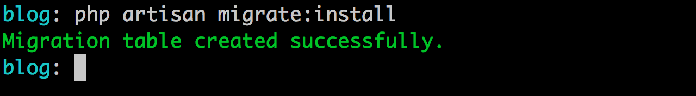
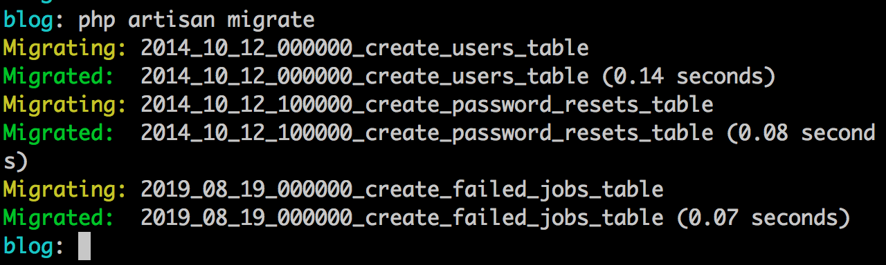
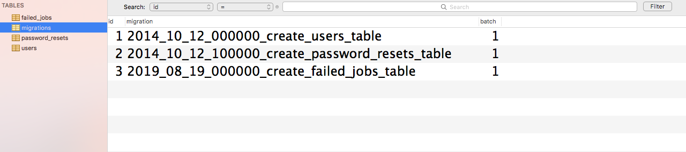
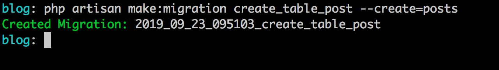
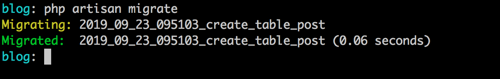

# Database: Migrations, Seeds & Factories

Neste capítulo vamos entrar na área, provavelmente a mais esperada, do banco de dados. Conhecendo como o Laravel nos permite realizar a persistência de dados.

Preciso ressaltar aqui que temos algumas camadas dentro do framework quando tratamos de banco de dados, uma delas é a que vamos abordar neste capítulo, a camada mais baixa, a camada mais estrutural composta por: `migrations`, `seeds` & `factories`.

Vamos entender o que cada ponto têm de importante aqui.

Comecemos pelas migrations.

## Migrations

As migrations ou migrações são ferramentas que nos auxiliam no versionamento da estrutura de nossas bases de dados. Funciona basicamente como uma documentação da linha histórica do crescrimento da estrutura do banco e criação das tabelas, ligações e etc.

Vale ressaltar que o conceito migrações não é algo do Laravel mas que ele se utiliza para trazer mais essa opção e facilidade. Criar tabelas e seus aparatos se torna mais fácil quando realizamos isso do ponto de vista de código que após um comando é traduzido para o banco em questão.

As migrations dentro do nosso projeto podem ser encontradas dentro da pasta `database/migrations`. Nesta pasta você já vai encontrar alguns arquivos de migração inicial, como a migração para a tabela de usuários e a para a tabela de reset de senhas, e também temos uma migration a mais disponivel, a da tabela de jobs falhos do sistema de filas do framework.

Vamos da uma olhada na migration da tabela de usuários e entedermos como é formado um arquivo de migração. 

Veja abaixo o arquivo `2014_10_12_000000_create_users_table.php`:

```
<?php

use Illuminate\Database\Migrations\Migration;
use Illuminate\Database\Schema\Blueprint;
use Illuminate\Support\Facades\Schema;

class CreateUsersTable extends Migration
{
    /**
     * Run the migrations.
     *
     * @return void
     */
    public function up()
    {
        Schema::create('users', function (Blueprint $table) {
            $table->bigIncrements('id');
            $table->string('name');
            $table->string('email')->unique();
            $table->timestamp('email_verified_at')->nullable();
            $table->string('password');
            $table->rememberToken();
            $table->timestamps();
        });
    }

    /**
     * Reverse the migrations.
     *
     * @return void
     */
    public function down()
    {
        Schema::dropIfExists('users');
    }
}

```
Perceba acima que a classe de migração para a tabela users, inicialmente extende de uma classe base chamada Migration e traz a definição de dois métodos, o método `up` e o método `down`.

O método `up` será executado quando pegarmos essa migration e executarmos ela em nosso banco de dados. E o método `down` contêm a definição do inverso do método `up`, no método `down` nos definimos a remoção do que foi aplicado no método `up`, isso nos permite voltarmos para estados anteriores pré-execução do último lote de migrações.

Vamos da uma atenção ao método `up`:

```
public function up()
{
    Schema::create('users', function (Blueprint $table) {
       $table->bigIncrements('id');
       $table->string('name');
       $table->string('email')->unique();
       $table->timestamp('email_verified_at')->nullable();
       $table->string('password');
       $table->rememberToken();
       $table->timestamps();
    });
}
``` 

Temos uma classe base responsável pela definição dos schemas da base de dados e com ela que acim criamos nossa tabela por meio do método `create` informando como primeiro parâmetro o nome da tabela e o segundo parâmetro será um callback (ou função anônima) onde definiremos os campos e estrutura da tabela em questão, aqui a tabela `users`.

Para definir os campos de nossa tabela precisamos do objeto `Blueprint` que nos permite criarmos os campos e tipos por meio de seus métodos, por isso tipamos o parâmetro `$table` do callback como `Blueprint`.

O `Blueprint` contêm métodos para tudo que é necessário de manipulação de nosso banco, geração e remoção de colunas, os mais variados tipos de dados para as colunas em questão, definição de chaves estrangeiras, criação de índices e muito mais.

Podemos criar nossas chaves primárias e auto-incrementável utilizando o método `bitIncrements`, como temos na linha abaixo:

```
$table->bigIncrements('id');
```

Podemos definir campos do tipo string, como ocorre abaixo:

```
$table->string('name');
$table->string('email')->unique();
```
Acima temos a definição de um campo Varchar e por default recebe 255 caracteres, caso queira especificar um tamanho para o campo, basta preencher o segundo parâmetro com o valor inteiro, correspondente ao tamanho do campo desejado.

Perceba também que para o e-mail atribuimos uma definição na coluna assinalando este campo como `unique` ou seja evitando a duplicação de linhas com o mesmo email tornando assim a partir da base o usuário único por email.

Podemos definir campos de data e hora por meio do método timestamp, veja abaixo:

```
$table->timestamp('email_verified_at')->nullable();
```
O campo `email_verified_at` que tabém será nulo, definido pelo método nullable que por padrão traz o valor true para esta definição.

Temos também a definição de mais um campo tipo VARCHAR para a coluna `password`:

```
$table->string('password');
```
E por fim temos a chamada do método `rememberToken()` e também do `timestamps()`, o que são esses métodos ou que eles fazem?

```
$table->rememberToken();
$table->timestamps();
```

O método `rememberToken` irá criar uma coluna chamada de remember_token varchar com tamanho 100 e aceitando o valor nulo. Já o método `timestamps` irá criar dois campos do tipo timestamp, um chamado de `created_at` e outro chamada de `updated_at` ambos representando a data de criação e atualização do dado em questão, os mais interessante é que o Laravel controla os valores destes dois campos automaticamente.

Se o método `up` defini a criacão da tabela de `users`(usuários) o `down` defini a remoção desta tabela. Veja sua definição:

```
public function down()
{
    Schema::dropIfExists('users');
}
``` 

A exclusão ocorre por meio do método `dropIfExists` do objeto `Schema` onde informamos a tabela que queremos remover e se ela existir na base será removida. Isso simplifica bastante pois poderemos assim, voltar um passo anterior se tivermos executado esta migração em algum momento.

Agora como pegamos esse código Orientado a Objetos e jogamos para uma base relacional? É o que vamo ver a seguir.

## Executando primeira migração

Se já temos estas migrações disponiveis vamos executá-las em nossa base, epa, espera aí, não temos base ou banco de dados!??

É claro que para executarmos as migrações precisamos está conectados com nossa base de dados em questão. Para isso, na gerenciador de sua escolha crie um banco de dados chamado `larave6_ebook_blog` e adicione as configurações de acesso em seu arquivo .env na raiz do projeto.

Basta modificar os parâmetros com os valores de sua conexão:

```
;Parâmetros dentro do arquivo .env

DB_CONNECTION=mysql
DB_HOST=127.0.0.1
DB_PORT=3306
DB_DATABASE=larave6_ebook_blog
DB_USERNAME=root
DB_PASSWORD=
```

Caso você esteja utilizando outro banco de dados que não mysql será necessário alterar o drive na variável `DB_CONNECTION`. 

Para testarmos se nossa conexão ocorreu com sucesso, no cenário em que estamos no momento, vamos ao nosso terminal e na raiz do projeto vamos executar o comando abaixo:

```
php artisan migrate:install
```

Se tudo ocorrer bem como mostra o resultado abaixo, sua conexão está correta e setada com sucesso:



Agora o que este comando que executamos acabou de fazer? Bem simples, ele apenas criou a tabela de controle de migrações executadas na base. Se você acessar sua base verá que existe lá uma tabela chamada de `migrations` que registra o nome da migração executada e o lote em que esta migração foi executada.

Ainda não executamos a execução das migrações existentes no projeto até o momento, então, como realizamos esta execução?

Para rodarmos e executarmos os arquivos de migração existentes é necessário executar o comando abaixo:

```
php artisan migrate
```

Resultado:



Veja que agora cada arquivo de migração existente foi executado em nossa base e já estão registrados na tabela migrations com o lote (coluna batch) como 1, primeiro lote de execução:



E é claro as tabelas também foram criadas e estão em nosso banco agora.

Mas como posso criar minhas migrações para tabelas do meu projeto também? Certo! Vamos fazer isso agora!

## Criando Nossas Migrações

Primeiro passo é irmos ao nosso terminal e executarmos o comando para geração de nosso arquivo de migração:

```
php artisan make:migration create_table_posts --create=posts
```



O comando acima criará nosso primeiro arquivo de migração dentro da pasta de migrações, chamado de `2019_09_23_095103_create_table_post`, o nome do arquivo de migração respeita a data de criação mais o timestamp e o nome escolhido, em nosso caso: `create_table_posts`. Essa deinição da data e timestamp permite o Laravel organizar a ordem  das migrações. 

O parâmetro `--create=posts` adicionará para nós o código da classe `Schema` e o método `create` como podemos ver no conteúdo do arquivo gerado abaixo:

```
<?php

use Illuminate\Support\Facades\Schema;
use Illuminate\Database\Schema\Blueprint;
use Illuminate\Database\Migrations\Migration;

class CreateTablePost extends Migration
{
    /**
     * Run the migrations.
     *
     * @return void
     */
    public function up()
    {
        Schema::create('posts', function (Blueprint $table) {
            $table->bigIncrements('id');
            $table->timestamps();
        });
    }

    /**
     * Reverse the migrations.
     *
     * @return void
     */
    public function down()
    {
        Schema::dropIfExists('posts');
    }
}

```

Por termos utilizado o parâmetro `--create` além das definições do métodos `up` e `down` foram adicionados seus conteúdos com algum detalhes de campos iniciais no `up`, a definição do campo de auto incremento e a defnição dos campos de criação e atualização dos registros.

O `down` já trouxe o movimento contrário, neste caso a remoção da tabela `posts`.

Agora vamos as nossas adições, a adição dos nossos campos para nossa tabela de posts. Criaremos os seguintes campos:

- title: string 255;
- description: string 255;
- content: text;
- slug: string 255;
- is_active: boolean;

Agora como podemos representar este campos acima dentro do nosso arquivo? Vamos lá, após a definição do `bigIncrements` defina o código abaixo:

```
    $table->string('title');
    $table->string('description');
    $table->text('content');
    $table->string('slug');
    $table->boolean('is_active');
```

Simples, acima realizamos as definições dos nossos campos. Agora estamos aptos a executar esta migração em nosso banco de dados, para isso vamos ao nosso terminal executar o comando que já conhecemos. Veja abaixo:

```
php artisan migrate
```

Ao executarmos o comando acima novamente o Laravel só executará as migrations que ainda não foram executadas, em nosso caso e no momento a única que não foi executada foi a que geramos acima. Por isso teremos o resultado abaixo:



## Relacionamentos via Migrations

Agora que temos nossa tabela posts criada vamos mapear nosso primeiro relacionamento, entre posts e usuários caracterizando assim a relação de posts e autor. O relacionamento aquie irei mapear será de 1:N (Um para Muitos) onde 1 autor(usuário) poderá ter N (vários) posts e 1 post poderá ter ou pertencer a apenas um 1 autor.

Como estamos definindo nossa base via migration vamos aprender aqui a definir este relacionamento e de quebra saber como alterar uma tabela já exsitente por meio de migrations. Neste momento alterar posts para adicionarmos a referência para user e ainda criar nossa chave estrangeira.


