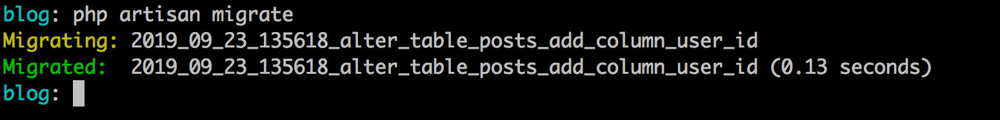
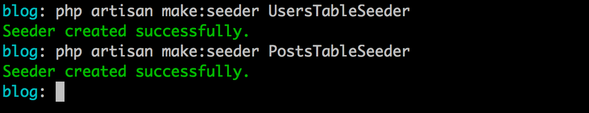
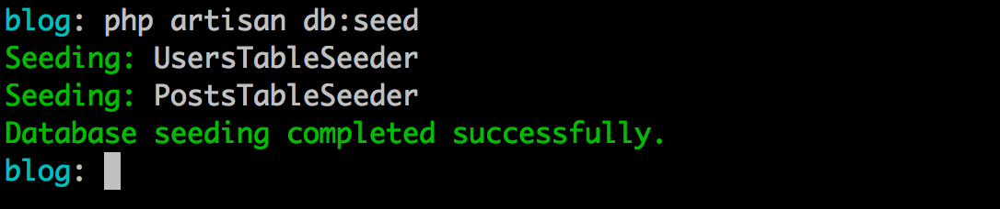
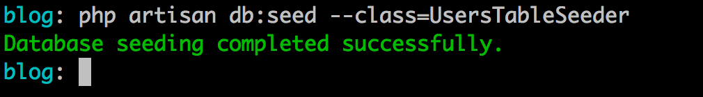
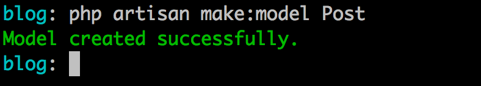
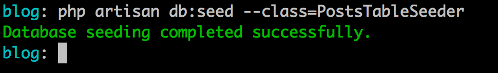
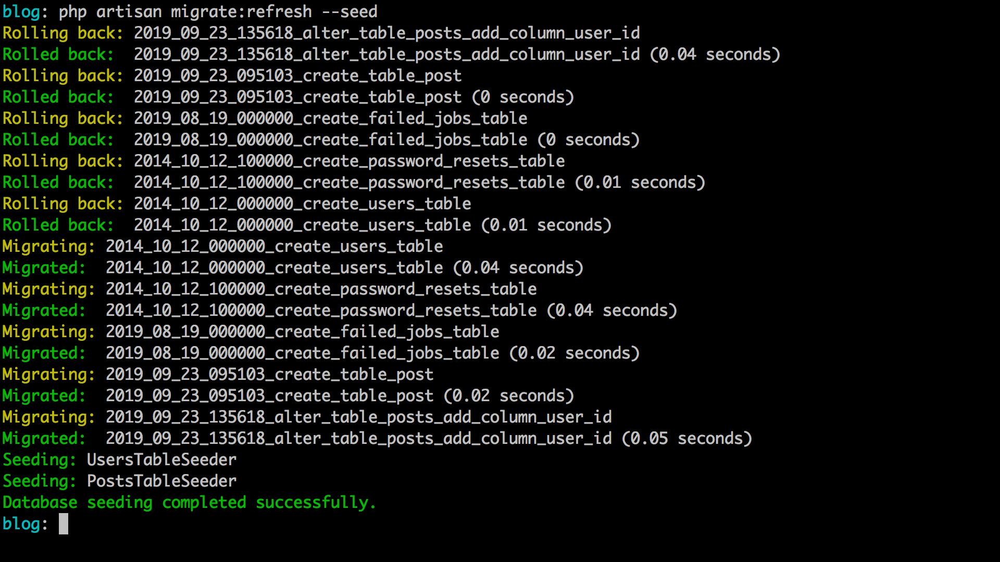

# Database: Migrations, Seeds & Factories

Neste capítulo vamos entrar na área, provavelmente a mais esperada, do banco de dados. Conhecendo como o Laravel nos permite realizar a persistência de dados.

Preciso ressaltar que temos algumas camadas dentro do framework quando tratamos de banco de dados, uma delas é a que vamos abordar neste capítulo, a camada mais baixa, a camada mais estrutural composta por: `migrations`, `seeds` & `model factories`.

Vamos entender o que cada ponto têm de importante aqui.

Comecemos pelas migrations.

## Migrations

As migrations ou migrações são ferramentas que nos auxiliam no versionamento da estrutura de nossas bases de dados. Funciona basicamente como uma documentação da linha histórica do crescrimento da estrutura do banco, criação das tabelas, ligações e etc.

Vale ressaltar que o conceito migrações não é algo do Laravel mas que ele se utiliza para trazer mais essa opção e facilidade para quem está desenvolvendo. Criar tabelas e seus aparatos se torna mais fácil quando realizamos isso do ponto de vista de código que após um comando é traduzido para o banco em questão.

As migrations dentro do nosso projeto podem ser encontradas dentro da pasta `database/migrations`. Nesta pasta você já vai encontrar alguns arquivos de migração iniciais, como a migração para a tabela de usuários e a para a tabela de reset de senhas, e também temos uma migration a mais disponivel, a da tabela de jobs falhos do sistema de filas do framework.

Vamos da uma olhada na migration da tabela de usuários e entedermos como é formado um arquivo de migração. 

Veja abaixo o arquivo `2014_10_12_000000_create_users_table.php`:

```
<?php

use Illuminate\Database\Migrations\Migration;
use Illuminate\Database\Schema\Blueprint;
use Illuminate\Support\Facades\Schema;

class CreateUsersTable extends Migration
{
    /**
     * Run the migrations.
     *
     * @return void
     */
    public function up()
    {
        Schema::create('users', function (Blueprint $table) {
            $table->bigIncrements('id');
            $table->string('name');
            $table->string('email')->unique();
            $table->timestamp('email_verified_at')->nullable();
            $table->string('password');
            $table->rememberToken();
            $table->timestamps();
        });
    }

    /**
     * Reverse the migrations.
     *
     * @return void
     */
    public function down()
    {
        Schema::dropIfExists('users');
    }
}

```

Perceba acima que a classe de migração para a tabela users, inicialmente extende de uma classe base chamada Migration e traz a definição de dois métodos, o método `up` e o método `down`.

O método `up` será executado quando pegarmos essa migração e executarmos em nosso banco de dados. E o método `down` contêm a definição do inverso do método `up`, no método `down` nos definimos a remoção do que foi aplicado no método `up`, isso nos permite voltarmos para estados anteriores pré-execução do último lote de migrações.

Vamos da uma atenção ao método `up`:

```
public function up()
{
    Schema::create('users', function (Blueprint $table) {
       $table->bigIncrements('id');
       $table->string('name');
       $table->string('email')->unique();
       $table->timestamp('email_verified_at')->nullable();
       $table->string('password');
       $table->rememberToken();
       $table->timestamps();
    });
}
``` 

Temos uma classe base responsável pela definição dos schemas (Schema) da base de dados e é com ela que criamos nossa tabela por meio do método `create` informando como primeiro parâmetro o nome da tabela e o segundo parâmetro será um callback (ou função anônima) onde definiremos os campos e estrutura da tabela em questão, aqui a tabela `users`.

Para definir os campos de nossa tabela precisamos do objeto `Blueprint` que nos permite criarmos os campos e tipos por meio de seus métodos, por isso tipamos o parâmetro `$table`, do callback, como `Blueprint`.

O `Blueprint` contêm métodos para tudo o que é necessário de manipulação de nosso banco, geração e remoção de colunas, os mais variados tipos de dados para as colunas em questão, definição de chaves estrangeiras, criação de índices e muito mais.

Podemos criar nossas chaves primárias e auto-incrementáveis utilizando o método `bigIncrements`, como temos na linha abaixo:

```
$table->bigIncrements('id');
```

Podemos definir campos do tipo string (Varchar), como ocorre abaixo:

```
$table->string('name');
$table->string('email')->unique();
```

Acima temos a definição de um campo Varchar e por default recebe 255 caracteres, caso queira especificar um tamanho para o campo, basta preencher o segundo parâmetro com o valor inteiro, correspondente ao tamanho do campo desejado.

Perceba também que para o e-mail atribuimos uma definição na coluna, assinalando este campo como `unique` ou seja evitando a duplicação de linhas com o mesmo email, tornando assim, a partir da base, o usuário único por email.

Podemos definir campos de data e hora por meio do método timestamp, veja abaixo:

```
$table->timestamp('email_verified_at')->nullable();
```
O campo `email_verified_at` que tabém será nulo, definido pelo método nullable.

Temos também a definição de mais um campo tipo VARCHAR para a coluna `password`:

```
$table->string('password');
```
E por fim temos a chamada do método `rememberToken()` e também do `timestamps()`, o que são esses métodos ou que eles fazem?

```
$table->rememberToken();
$table->timestamps();
```

O método `rememberToken` irá criar uma coluna chamada de **remember_token**, varchar com tamanho 100 e aceitando o valor nulo. Já o método `timestamps` irá criar dois campos do tipo timestamp, um chamado de `created_at` e outro chamada de `updated_at` ambos representando a data de criação e atualização do dado em questão, o mais interessante é que o Laravel controla os valores destes dois campos automaticamente via Models.

Se o método `up` define a criacão da tabela de `users`(usuários) o `down` defini a remoção desta tabela. Veja sua definição:

```
public function down()
{
    Schema::dropIfExists('users');
}
``` 

A exclusão ocorre por meio do método `dropIfExists` do objeto `Schema` onde informamos a tabela que queremos remover e se ela existir na base, será removida. Isso simplifica bastante pois poderemos voltar um passo anterior se tivermos executado esta migração em algum momento.

Agora como pegamos esse código Orientado a Objetos e jogamos para uma base relacional? É o que vamo ver a seguir.

## Executando primeira migração

Se já temos estas migrações disponíveis vamos executá-las em nossa base, epa, espera aí, não temos base ou banco de dados!??

É claro que para executarmos as migrações precisamos está conectados com nossa base de dados em questão. Para isso, na gerenciador de sua escolha crie um banco de dados chamado `larave6_ebook_blog` e adicione as configurações de acesso em seu arquivo .env na raiz do projeto.

Basta modificar os parâmetros com os valores de sua conexão:

```
;Parâmetros dentro do arquivo .env

DB_CONNECTION=mysql
DB_HOST=127.0.0.1
DB_PORT=3306
DB_DATABASE=larave6_ebook_blog
DB_USERNAME=root
DB_PASSWORD=
```

Caso você esteja utilizando outro banco de dados que não mysql será necessário alterar o drive na variável `DB_CONNECTION`. 

Para testarmos se nossa conexão ocorreu com sucesso, no cenário em que estamos no momento, vamos ao nosso terminal e na raiz do projeto vamos executar o comando abaixo:

```
php artisan migrate:install
```

Se tudo ocorrer bem como mostra o resultado abaixo, sua conexão está correta e setada com sucesso:


Agora o que este comando que executamos acabou de fazer? Bem simples, ele apenas criou a tabela de controle de migrações executadas na base. Se você acessar sua base verá que existe lá uma tabela chamada de `migrations` que registra o nome da migração executada e o lote em que esta migração foi executada.

Ainda não executamos a execução das migrações existentes no projeto até o momento, então, como realizamos esta execução?

Para rodarmos e executarmos os arquivos de migração existentes é necessário executar o comando abaixo:

```
php artisan migrate
```

Resultado:


Veja que agora cada arquivo de migração existente foi executado em nossa base e já estão registrados na tabela migrations com o lote (coluna batch) como 1, primeiro lote de execução:


E é claro as tabelas também foram criadas e estão em nosso banco agora.

Mas como posso criar minhas migrações para tabelas do meu projeto também? Certo! Vamos fazer isso agora!

## Criando Nossas Migrações

Primeiro passo é irmos ao nosso terminal e executarmos o comando para geração de nosso arquivo de migração:

```
php artisan make:migration create_table_posts --create=posts
```


O comando acima criará nosso primeiro arquivo de migração dentro da pasta de migrações, chamado de `2019_09_23_095103_create_table_post`, o nome do arquivo de migração respeita a data de criação mais o timestamp e o nome escolhido, em nosso caso: `create_table_posts`. Essa deinição da data e timestamp permite o Laravel organizar a ordem  das migrações. 

O parâmetro `--create=posts` adicionará para nós o código da classe `Schema` e o método `create` como podemos ver no conteúdo do arquivo gerado abaixo:

```
<?php

use Illuminate\Support\Facades\Schema;
use Illuminate\Database\Schema\Blueprint;
use Illuminate\Database\Migrations\Migration;

class CreateTablePost extends Migration
{
    /**
     * Run the migrations.
     *
     * @return void
     */
    public function up()
    {
        Schema::create('posts', function (Blueprint $table) {
            $table->bigIncrements('id');
            $table->timestamps();
        });
    }

    /**
     * Reverse the migrations.
     *
     * @return void
     */
    public function down()
    {
        Schema::dropIfExists('posts');
    }
}

```

Por termos utilizado o parâmetro `--create` além das definições do métodos `up` e `down` foram adicionados seus conteúdos com alguns detalhes de campos iniciais no `up`, a definição do campo de auto incremento e a defnição dos campos de criação e atualização dos registros.

O `down` já trouxe o movimento contrário, neste caso a remoção da tabela `posts`.

Agora vamos as nossas adições, a adição dos nossos campos para nossa tabela de posts. Criaremos os seguintes campos:

- title: string 255;
- description: string 255;
- content: text;
- slug: string 255;
- is_active: boolean;

Agora como podemos representar estes campos acima dentro do nosso arquivo? Vamos lá, após a definição do `bigIncrements` defina o código abaixo:

```
    $table->string('title');
    $table->string('description');
    $table->text('content');
    $table->string('slug');
    $table->boolean('is_active');
```

Simples, acima realizamos as definições dos nossos campos. Agora estamos aptos a executar esta migração em nosso banco de dados, para isso vamos ao nosso terminal executar o comando que já conhecemos.

Veja abaixo:

```
php artisan migrate
```

Ao executarmos o comando acima novamente, o Laravel só executará as migrações que ainda não foram executadas. Em nosso caso, e no momento, a única que não foi executada foi a que geramos acima. Por isso teremos o resultado abaixo:


## Relacionamentos via Migrations

Agora que temos nossa tabela posts criada, vamos mapear nosso primeiro relacionamento entre posts e usuários caracterizando assim a relação de posts e autor. O relacionamento aqui que irei mapear será de 1:N (Um para Muitos) onde 1 autor(usuário) poderá ter N(vários) posts e 1 post poderá ter ou pertencer a apenas um 1 autor/usuário.

Como estamos definindo nossa base via migrations vamos aprender aqui a definir este relacionamento e de quebra saber como alterar uma tabela já exsitente por meio de migrations, neste caso alterar posts para adicionarmos a referência para user e ainda criar nossa chave estrangeira.

Para isso execute o comando abaixo:

```
php artisan make:migration alter_table_posts_add_column_user_id --table=posts
```

Perceba que o comando continua o mesmo, eu apenas criei outro arquivo e aqui temos a chamada de um novo parâmetro, quando queremos criar uma tabela e suas definições nós utilizamos o método, do objeto Schemam, chamado de create como vimos no trecho passado. Agora que eu quero alterar uma tabela já existente eu preciso utilizar o método `table` por isso chamei o parâmetro `--table` e o nome da tabela `posts`, este parâmetro vai gerar o conteúdo do arquivo conforme podemos ver abaixo:

```
<?php

use Illuminate\Support\Facades\Schema;
use Illuminate\Database\Schema\Blueprint;
use Illuminate\Database\Migrations\Migration;

class AlterTablePostsAddColumnUserId extends Migration
{
    /**
     * Run the migrations.
     *
     * @return void
     */
    public function up()
    {
        Schema::table('posts', function (Blueprint $table) {
            //
        });
    }

    /**
     * Reverse the migrations.
     *
     * @return void
     */
    public function down()
    {
        Schema::table('posts', function (Blueprint $table) {
            //
        });
    }
}

```

Ele já traz os conteúdos do método `up` e do método `down` chamando o método `table`, o que nos resta é só adicionarmos nossas modificações para a tabela desejada. O nome da tabela vai no primeiro parâmetro do método `table` e o segundo, mesmo pensamento do create, vai as definições para a tabela na função anônima ou callback.

Como vamos adicionar a referência para user, irei criar um campo `user_id` respeitando as mesmas configurações do campo id na tabela de users para que nossa ligação na chave estrangeira possa ser satisfeita.

Precirei criar um campo do tipo `bigInteger` e `unsigned` para isso adicione no método `up` a definição abaixo:

```
$table->unsignedBigInteger('user_id')->after('id');
```

A definição já satisfaz o tipo e configurações esperadas para esta referência, e aqui temos mais um conhecimento. Como estou alterando a tabela posts pós criação, posso informar em que posição quero que o campo novo seja adicionado, neste caso, depois do campo **id** de posts e isso é realizado pelo método `after`(em pt depois).

Agora, ainda no método `up`, precisamos criar nossa chave estrangeira para a coluna `user_id` referenciando a coluna `id` na tabela `users`. Adicione o trecho abaixo, após a definição anterior.

```
$table->foreign('user_id')->references('id')->on('users');
```

Acima assinalei a criação da chave estrangeira com o método `foreign` informando o nome da coluna, no caso `user_id` e informei o campo e a tabela remota para esta referência, neste caso o campo `id` por meio do método `references` e a tabela `users` por meio do método `on`. Ou seja se fossemos traduzir: crie uma chave estrageira para o campo `user_id` de `posts` que faz referência para o `id` lá na tabela `users`.

O nosso método `down`, por ser o reverso do `up`, conterá a remoção da chave estrangeira e também da coluna `user_id`. Então, adicione as duas definições abaixo:

```
$table->dropForeign('posts_user_id_foreign');
$table->dropColumn('user_id');
```

Quando o Laravel, por meio das migrations, cria a chave estrangeira ela recebe o nome respeitando a estrutura abaixo:

```
tabela_coluna_foreign
```

Por isso no `down` estou apagando a chave estrangeira, por meio do método `dropForeign` e informando a string `posts_user_id_foreign` e logo após, por meio do método `dropColumn` removo a coluna `user_id` completando assim o reverso do que é executado no método `up`.

Agora para que isso seja executado em nossa base, basta irmos ao nosso terminal e executarmos o comando abaixo:

```
php artisan migrate
```
Comando que já conhecemos e que vai executar a última migração criada, porque ainda não temos registro dela, na tabela de migrations. Veja o resultado:



Agora já temos nossa tabela para salvar as postagens e também nossa referência para criação do autor da postagem em questão. Sobre migrations, por enquanto, ficaremos por aqui. 

É claro que ainda veremos bastante elas aqui no livro mas por hora já tivemos um excelente conhecimento a respeito de sua utilização. Agora vamos conhecer mais dois caras que nos auxiliam no momento do nosso desenvolvimento e banco de dados.

Os **seeds** e as **factories**.

## Seeds

Quando estamos em nosso ambiente de desenvolvimento nós precisaremos criar dados no banco para teste de nossas lógicas, os seeds nos permitem este processo. Podemos por meio das seeds alimentar nosso banco de dados com informações para que possamos testar nossos CRUDs por exemplo.

Você pode encontrar os seeds do sistema dentro da pasta `database/seeds`, dentro desta pasta você vai encontrar o arquivo `DatabaseSeeder.php` que é o arquivo principal que executa todas as outras seeds que tivermos nesta pasta. 

Perceba que temos seu conteúdo mostrado abaixo:

```
<?php

use Illuminate\Database\Seeder;

class DatabaseSeeder extends Seeder
{
    /**
     * Seed the application's database.
     *
     * @return void
     */
    public function run()
    {
        // $this->call(UsersTableSeeder::class);
    }
}

```

Perceba a linha comentada do método `$this->call`, que contêm a chamada para um arquivo de seed que ainda não exite mas já nos mostra como podemos registrar os arquivos de seed para serem executados, ou seja, por meio do método `call` e informando a classe de seed em questão. 

Vamos criar dois arquivos de seed para este momento, primeiro o arquivo que já temos referenciado acima, o `UsersTableSeeder` e também vamos criar o `PostsTableSeeder`. 

Ta! Mas como podemos criar isso? Eu te mostro, é bem simples!

Exeute os comandos abaixo, primeiro executando a geração de um, depois do outro:

```
php artisan make:seeder UsersTableSeeder
```

Após a execução acima, execute a criação do outro arquivo seeder:

```
php artisan make:seeder PostsTableSeeder
```

Veja o resultado:



Após a criação, veja que temos dois arquivos criados dentro da pasta de seeds, o `UsersTableSeeder.php` e também o `PostsTableSeeder.php`. 

Agora o que faremos com eles?

Podemos utilizar ambos os arquivos de seed para gerarmos 1 usuário e 1 postagem para nossa base. Como fazer isso?

Abra o arquivo `UsersTableSeeder.php` e adicione o código abaixo no método `run`:

```
\DB::table('users')->insert([
    'name'     => 'Primeiro Usuário',
    'email'    => 'email@email.com',
    'password' => bcrypt('secret')
]);   
```

Acima temos o primeiro contato com o objeto `DB` que nos permite realizarmos a execução de queries SQL no mais baixo nível em relação a parte do ORM que veremos mais a frente. Então informo a tabela que quero realizar a inserção do dado, por meio do método `table` e logo após, aninhando, chamo o método `insert` informando um array respeitando as colunas que quero adicionar valor e seus valores em questão.

Perceba que no campo de senha do usuário utilizo o helper **bcrypt** para encryptar a senha do nosso usuário.

Após isso adicione o conteúdo do método `run` do `PostsTableSeeder`:

```
\DB::table('posts')->insert([
    'title'       => 'Primeira Postagem',
    'description' => 'Postagem teste com seeds',
    'content'     => 'Conteúdo da postagem',
    'is_active'   => 1,
    'slug'        => 'primeira-postagem',
    'user_id'     => 1
]);
```
Acima temos o mesmo pensamento com a diferença que estamos lidando com posts e respeitando o nome da tabela e os campos. Perceba também que referenciei o `user_id` como 1, isso é pouco chato de se fazer assim mas neste caso se encaixa tranquilamente, uma vez que vamos executar a seed de users na ordem antes de posts onde teremos o usuário com id 1 para satisfazer com o `user_id` da postagem definida acima.

Agora vamos voltar lá no `DatabaseSeeder` e descomentar a linha que temos definida e adicionar mais uma para a chamada do `PostsTableSeeder`. 

O conteúdo do arquivo `DatabaseSeeder` ficará assim, veja ele todo na íntegra abaixo:

```
<?php

use Illuminate\Database\Seeder;

class DatabaseSeeder extends Seeder
{
    /**
     * Seed the application's database.
     *
     * @return void
     */
    public function run()
    {
        $this->call(UsersTableSeeder::class);
        $this->call(PostsTableSeeder::class);
    }
}

```

Temos a chamada descomentada do `UsersTableSeeder` e adicionamos a chamada para o `PostsTableSeeder`. Este passo feito, vamos ao terminal e conhecer mais um comando. Desta vez para execução dos nossos seeds.

Em seu terminal e na raiz do projeto execute o comando abaixo:

```
php artisan db:seed
```

Veja o resultado:



Se você for ao seu banco e consultar as tabelas verá que tens os dados lá como definimos nas classes de seed. 

Se precisarmos de mais dados, como por exemplo, inserir 30 posts de primeira por meio dos seeds teríamos um trabalho animal mas este trabalho se simplifica por meio do que chamamos de **Model Factories**. 

Então vamos crescer mais dentro do Laravel conhecendo mais este conceito/ferramenta que nos auxilia neste camada/etapa do desenvolvimento.

Vamos continuando...

## Factories

Quando precisamos realizar a geração de muitos dados de forma mais automatizada podemos utilizar as **Factories** ou **Model Factories**. Vamos conhece-las por meio da execução.

Aqui de certa forma teremos algum contato sobre models mas não vou me ater a elas (Models) no momento, pois o próximo capítulo será sobre esta camada e o tratamento com banco de dados. Como precisamos de models para geração automatizada de dados para nossa aplicação vou começar primeiramente com o model que já temos em nossa aplicação, o model Users.

As factories definem as regras, com base no model escolhido e conforme a quantidade especificada, para criação de dados fictícios em nossas tabelas. No fim das contas, são chamados de factories ou fábricas por serem um esboço para criação de dados e junto com os seeds realizamos as gerações esperadas. Você pode encontrar os arquivos de factories na pasta `database/factories`.


Nesta pasta já temos um arquivo de factory, o `UserFactory.php`. Veja o conteúdo dele abaixo:

```
<?php

/** @var \Illuminate\Database\Eloquent\Factory $factory */
use App\User;
use Faker\Generator as Faker;
use Illuminate\Support\Str;

/*
|--------------------------------------------------------------------------
| Model Factories
|--------------------------------------------------------------------------
|
| This directory should contain each of the model factory definitions for
| your application. Factories provide a convenient way to generate new
| model instances for testing / seeding your application's database.
|
*/

$factory->define(User::class, function (Faker $faker) {
    return [
        'name' => $faker->name,
        'email' => $faker->unique()->safeEmail,
        'email_verified_at' => now(),
        'password' => '$2y$10$92IXUNpkjO0rOQ5byMi.Ye4oKoEa3Ro9llC/.og/at2.uheWG/igi', // password
        'remember_token' => Str::random(10),
    ];
});

```

Perceba acima que temos a definição para criação de usuários, um código diretamente definido sem uma casca(objeto ou coisa assim). Um ponto importante aqui nesta definição é a utilização do pacote Faker que nos permite gerar dados aleatórios dos mais variados, como nomes fakes, emails, conteúdos de textos, valores decimais e muito mais.

Vale ressaltar que o pacote Faker é uma lib a parte mas que o Laravel se utiliza para facilitar esse esboço para criação de dados fictícios para teste de nossas aplicações.

Veja que a estrutura quase que se assemelha ao que fizemos no seed no que se refere a dizermos as colunas referentes a tabela, aqui `user`, e para o que colocamos na mão do dado a ser salvo, aqui usamos o Faker para gerarmos nomes fakes, emails fakes únicos. 

Agora, relembrando, aqui temos um esboço mas e como executar esta geração?

Vamos ver a seguir.

## Model Factories com Seeds

Como comentado vamos executar nossa inserção de dados utilizando o dado esboçado pela factory. Como o título do trecho diz, precisamos combinar a geração dos dados, utilizando a factory, junto com a execução via seeds. Agora, vamos alterar nosso UsersTableSeeder para utilizar as factories.

Comente o conteúdo do método `run` do UsersTableSeeder e adicione a chamada abaixo:

```
factory(\App\User::class, 10)->create();
```

Ao invés de usarmos o objeto `DB`, como fizemos, chamaremos o helper `factory` informando o model para o qual queremos gerar os dados e passando um segundo parâmetro onde informamos a quantidade de dados que queremos inserir em uma execução. Com isso chamamos o método `create` para realizar a execução dos dados e criação de 10 usuários aleatórios. 

Depois desta definição na classe `UsersTableSeeder` vamos ao terminal e vamos rodar somente o seed para a classe de seed de usuário. Para isto execute o comando abaixo:

```
php artisan db:seed --class=UsersTableSeeder
```

Resultado:



Acima conhecemos mais uma possibilidade dos seeds, podemos executar seeds especificando a classe que queremos executar, em nosso caso apenas o conteúdo do UsersTableSeeder informando o parâmetro `--class` e o nome da classe. 

Se você for ao seu banco, além do dado que você inseriu no momento anterior com o seed você verá mais 10 registros que foram gerados neste último comando por meio da execução da factory via execução dos seeds. Perceba que isso simplifica bastante nossas vidas, pois se quisermos mais dados fakes basta deinimos a quantidade no parâmetro do helper factory ou até mesmo ficar executando os seeds várias vezes.

## Nossa primeira factory

Vamos fazer um trabalho agora, criando uma factory do zero até sua execução por meio do ou em combinação com os seeds. Para criarmos nossa primeira factory, acesse seu terminal e execute o comando abaixo:

```
php artisan make:factory PostFactory
```

Você poderá encontrar a factory criada na pasta em questão. Abra ela e vamos as definições para esta factory. Inicialmente temos o código na ítegra abaixo sem alterações:

```
<?php

/** @var \Illuminate\Database\Eloquent\Factory $factory */

use App\Model;
use Faker\Generator as Faker;

$factory->define(Model::class, function (Faker $faker) {
    return [
        //
    ];
});

```

Primeira coisa que precisamos definir é o model `Post` entretanto não temos este model ainda, isso não é problema pro momento. Vamos ao terminal e vamos gerar nosso primeiro Model:

```
php artisan make:model Post
```



Após a execução do comando acima, você poderá encontrar seu primeiro model gerado na pasta `app`. Como comentei estamos tendo aqui neste trecho nossos primeiros contatos com os models mas não vamos adentrar ainda neles, vamos nos focar em sua relação com as factories para geração de dados fakes.

Agora que temos nosso model `Post` gerado, podemos alterar a definição da factory, que esta assim:


```
$factory->define(Model::class, ...
```

para

```
$factory->define(\App\Post::class, ...
```

Agora precisamos definir dentro da função anônima, por meio do Faker, nossos dados falsos para futuras gerações de postagens para testes de nossa aplicação. Vamos as definições abaixo:

```
return [
       'title'       => $faker->words(4, true),
	    'description' => $faker->sentence,
	    'content'     => $faker->paragraphs(9, true),
	    'slug'        => $faker->slug,
	    'is_active'   => $faker->boolean,
	    'user_id'     => rand(1, 10)
    ];
```

Acima temos o array de retorno do nosso callback, vamos entender cada definição fake acima:

- **words(4, true)**: estou definindo 4 palavras pro título e essa geração têm que ser em texto por isto o true como segundo parâmetro;
- **setence**: gero aqui uma setença de texto para a descrição do post;
- **paragraphs(9, true)**: este é mais intuitivo, espero gerar 9 parágrafos como texto, por isso o segundo parâmetro como true, caso false ele retorna um array com os parágrafos, o mesmo vale pro segundo parâmetro do `word` acima.
- **slug**: temos defnições especifícas para slug;
- **boolean**: e definições aleatórias para true ou false;
- por fim, no `user_id` usei o **rand** do PHP para pegar um inteiro aleatório entre 1 e 10 pensando nos 10 usuários gerados com faker anteriormente.

Obs.: Sobre essa referência ao `user_id` podemos realizar criações mais organizadas e menos adivinhatórias mas ainda não chegamos neste conhecimento. Não se preocupe que terei o cuidado de mencionar o conhecimento quando chegarmos nele e inclusive vamos voltar e melhorar nossas factories no momento de suas gerações.

Com isto definido, veja o conteúdo na íntegra do PostFactory antes de chamarmos em nosso PostsTableSeeder:

```
<?php

/** @var \Illuminate\Database\Eloquent\Factory $factory */

use App\Model;
use Faker\Generator as Faker;

$factory->define(\App\Post::class, function (Faker $faker) {
    return [
        'title'       => $faker->words(4, true),
	    'description' => $faker->sentence,
	    'content'     => $faker->paragraphs(9, true),
	    'slug'        => $faker->slug,
	    'is_active'   => $faker->boolean,
	    'user_id'     => rand(1, 10)
    ];
});

``` 

Agora vamos adicionar a chamada para execução dentro do nosso `PostsTableSeeder`, comente o `DB` insert usado anteriormente e adicione ao método `run` o trecho abaixo:

```
factory(\App\Post::class, 30)->create();
```

Agora quando rodarmos nosso seed para posts, vamos gerar 30 postagens fakes. Vamos executar então, no terminal. 

Execute o comando abaixo:

```
php artisan db:seed --class=PostsTableSeeder
```



Agora temos, 31 postagens por conta das 30 usando factories e da 1 utilizando o objeto DB. É muito simples gerarmos dados fakes usando essa combinação, definição por meio das factories e execução das factories por meio dos seeds. Isso facilitará muito os testes de sua aplicação no que diz respeito do trabalho com dados.

Antes de concluirmos este capítulo, quero mostrar mais algumas coisas sobre migrations, alguns passos para realizarmos o caminho reverso. Execuções pro caso de queremos limpar nossas tabelas por meio das migrations, limpar e re-criar usando ainda os seeds junto, esses pontos que vão nos auxiliar mais ainda nesta etapa de desenvolvimento. 

Vamos lá!

## Migrations! Revertendo coisas!

Agora que já conhecemos como criar tabelas e como alimentá-las com dados falsos para nosso desenvolvimento vamos entender como podemos reverter as coisas quando tratamos das migrações e suas criações.

Primeramente caso precisemos voltar o último lote de migrações executados, podemos usar o comando abaixo:

```
php artisan migrate:rollback
```

O comando acima, como comentado, desfará tudo que as migrações do último lote de execução fez. Em nosso caso, foi a adição do autor do post. Você pode voltar também as execução por meio de passos, informando o parâmetro `--step`:


```
php artisan migrate:rollback --step=2
```
Neste caso acima, ele desfará as duas migrações mais recentes, em nosso caso a criação da tabela posts e ainda a remoção da tabela de failed_jobs. Tabela posts criada por nós e failed_jobs que já vêm definido nas migrações do projeto.

Podemos ainda realizar operações em cima de todas as migrações, desfazendo-as, de uma vez só com o comando abaixo:

```
php artisan migrate:reset
```

O comando acima desfará todas as migrações executadas em sua base, deixando apenas a tabela migrations mas vazia. Caso queiramos resetar mas executar as migrações novamente e ao mesmo tempo, podemos executar o comando abaixo:

```
php artisan migrate:refresh
```

Ou ainda executar tudo do zero novamente com o comando fresh, que apaga todas as tabelas e executa as migrations novamente:

```
php artisan migrate:fresh
```

Este comando acima, o `migrate:fresh` executa um drop table na base para cada tabela. Mesmo para tabelas que não foram executadas via migration, então, fique em alerta com este comando.

### Refresh com execução de seeds

Caso queira voltar todos os passos executados nas migrations e na re-execução, executar as seeds podemos informar o parâmetro `--seed` junto com o comando `refresh`. Veja abaixo:

```
php artisan migrate:refresh --seed
```

Com isso teremos a execução reversa das migrações, sua re-execução e ainda a execução das seeds no banco de dados. Veja o resultado do comando abaixo:



## Conclusões

Bom, este capítulo foi bem denso e puxado. Recomendo fortemente que você execute bastante os comandos aprendidos aqui e teste cada nuances dos comandos para reverter coisas no banco via migrations.

No próximo capítulo vamos subir o nível de utilização da camada de banco tratando agora diretamente com as Models e suas representações. Então até lá!


