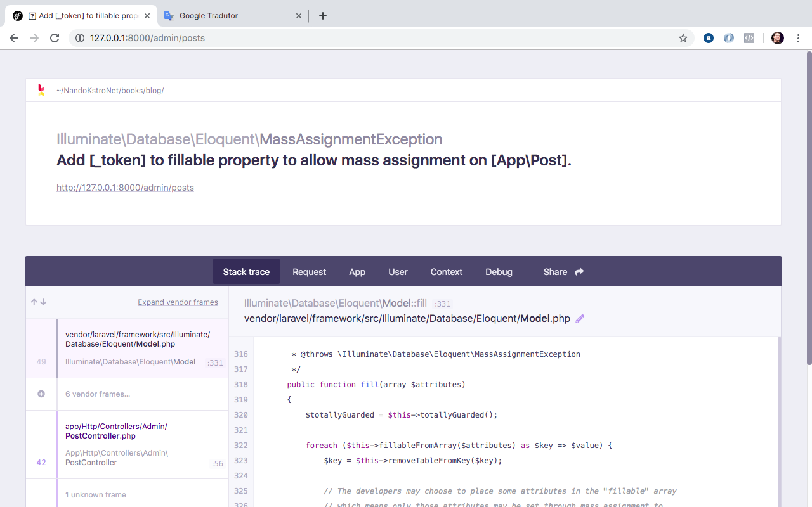
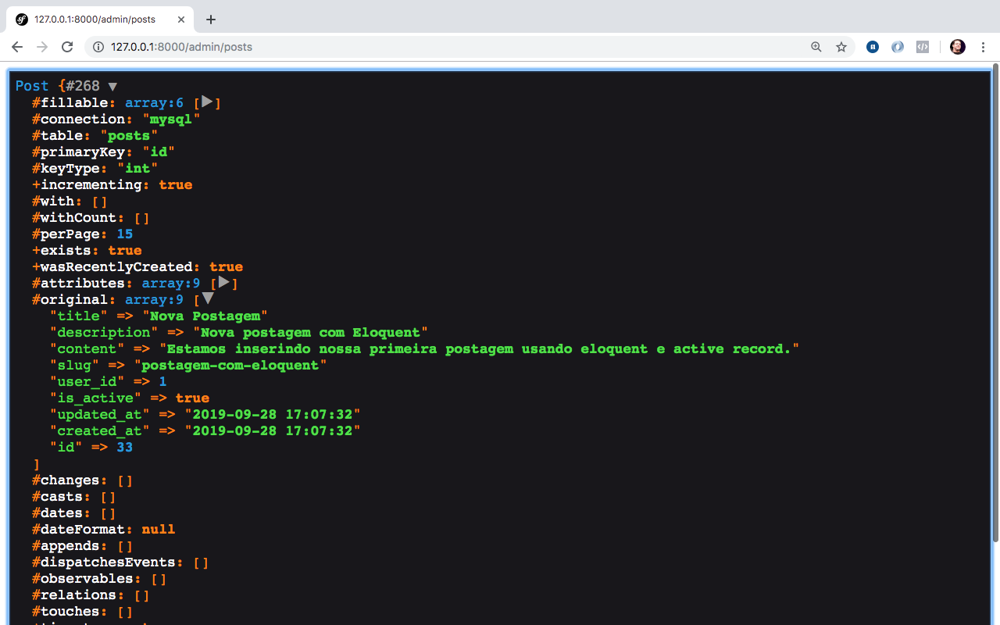
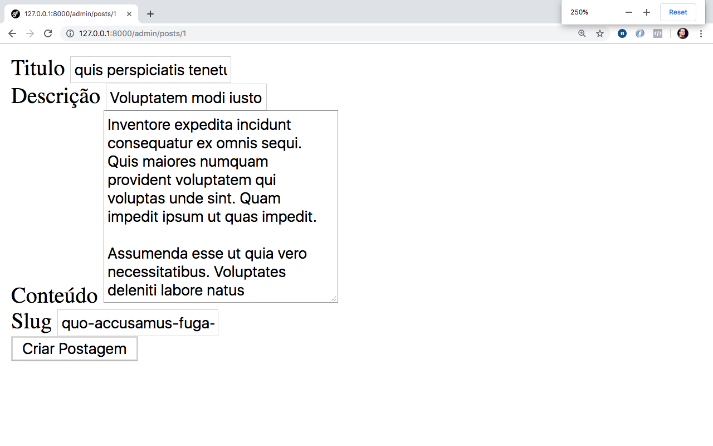
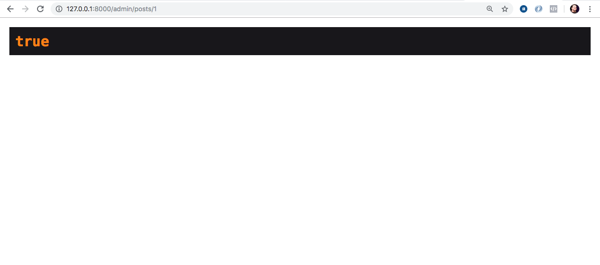
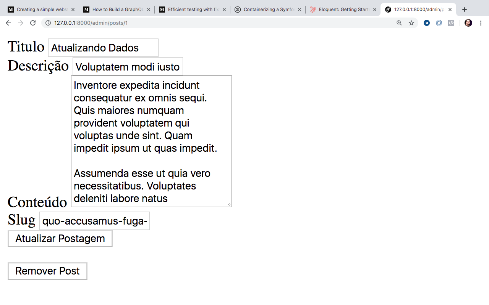
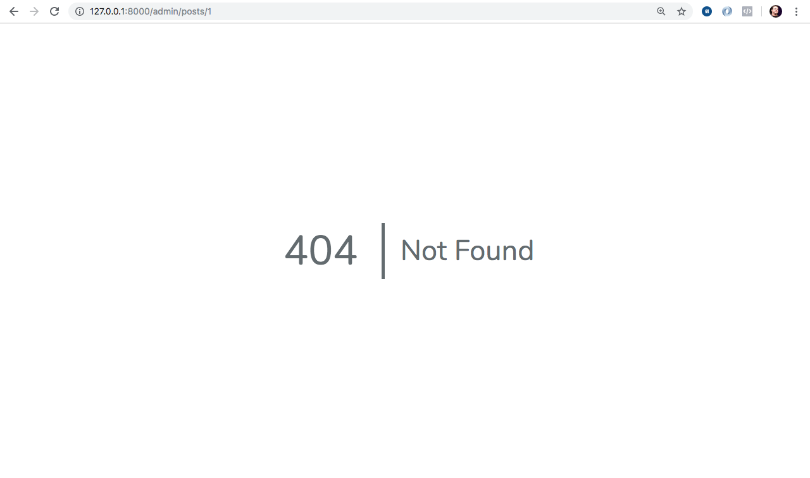

# Eloquent, trabalhando com Models

Continuando nosso trabalho com a camada de dados e persitência, vamos subir o nível conhecendo a camada dos models e como podemos trabalhar buscas, inserções, atualizações remoções e até mesmo os relacionamentos da base relacional com o nível do objetos que são nossos models.

Vamos começar primeiro pelas queries e ir crescendo nosso conhecimento no decorrer deste capítulo. Para isto vamos usar nosso controller `PostsController` que se encontra dentro da pasta `Admin` em controllers.

## Os Models!

No Laravel os models são a representação do ponto de vista de objetos das tabelas do nosso banco de dados. Representação essa pensando em uma entidade que represente todos os dados da tabela em questão.

Por exemplo, por convenção do framework, se eu tenho uma tabela chamada `posts` a representação, em model desta tabela, será uma classe chamada de `Post`. Se eu tenho uma tabela `users` sua representação via model será uma classe chamada de `User`.

Quando nós temos entidades/models no singular o Laravel automáticamente tentará, por convenção, resolver sua tabela no plural por ter o pensamento, na base, de uma coleção de dados.

Por exemplo, como posso pegar todos as postagens via Model? Para isto temos um método chamada de `all` que faz este trabalho para nós.

Por exemplo:

```
return \App\Post::all();
```

O resultado do comando acima será uma sql como está:

```
select * from posts posts
```

Onde o Laravel pegará automáticamente o nome do seu model e tentará resolver ele no plural na execução da query, por exemplo model `Post` tabela `posts`.

Agora vamos conhecer o conteúdo do model `Post` disponivel pós-geração deste. Veja abaixo:

```
<?php

namespace App;

use Illuminate\Database\Eloquent\Model;

class Post extends Model
{
    //
}

```

Veja nosso model acima, somente com sua definição, bem seca inclusive, já podemos realizar diversos trabalhos e operações em cima de nossa tabela `posts` associada ao model `Post`. Se, por ventura, você quiser utilizar um nome de sua escolhae não quiser que o Laravel resolva o nome da sua tabela, você pode sobscrever o atributo dentro do seu model como mostrado no conteúdo abaixo:

```
<?php

namespace App;

use Illuminate\Database\Eloquent\Model;

class Post extends Model
{
    protected $table = 'nome_da_sua_tabela';
}

```

Acima ao invés do Laravel tentar encontrar a tabela no plural ele pegará o valor do atributo `$table`.

Deixarei o conteúdo acima para exemplo mas utilizarei a convenção em nossos models sem a utilização do atributo `$table`. Os poderes extras dos models são concedidos pela classe `Model` do Eloquent. Certo mas então o que é o Eloquent?

## Eloquent?

O Eloquent é o ORM padrão do Laravel, é a camada via objetos para manipulação dos dados de seu banco de dados. O ORM é a camada que traduz sua estrutura de objetos, dos models, para a camada relacional e o eloquent se utiliza do active record para prover uma interface de utilização de forma mais simples e direta.

Por exemplo, uma visualização rápida de inserção de um post utilizando esta interface do Active Record:

```
//O códiga poderia está em um método do controller

$post = new Post();
$post->title       = 'Post salvo com eloquent e active record';
$post->description = 'Descrição post';
$post->content     = 'Conteúdo do post';
$post->slug        = 'post-salvo-com-eloquent-e-active-record';
$post->is_active   = true;
$post->user_id     = 1;

$post->save(); //Aqui a inserção do post com o conteúdo acima é inserida na tabela.
```

Veja como é simples, inicio uma nova instância de `Post` chamo as colunas como atributos do objeto e por fim, para salver os dados atribuidos a cada um dos atributos utilizo o método `save` do model para realizar a operação de criação desta postagem.

Aqui no livro vou abordar mais conceitos do Eloquent de forma prática e pontuando os comportamentos. Me utilizarei, para salvar e atualizar os dados, do conceito de **Mass Assingment** que explicarei mais a frente mas resumidamente é uma outra forma de inserção e atualização de dados disponível no Laravel por meio Eloquent.

PS.: Antes de prosseguirmos, recomendo fortemente a leitura sobre Active Record caso queira conhecer esse padrão.

## Eloquent na prática

Lembra que já temos um controller para utilização e criação de um CRUD para posts e por meio deste CRUD vamos focar nos pontos mais cruciais para você conhecer o trabalho do Eloquent em nossas aplicações. Nosso controller encontra-se na pasta dos controllers, dentro da pasta `Admin` e o controller `PostsControllers`.

Primeiramente vamos definir nosso método index. Trabalhando do ponto de vista dos models eu consigo realizar operações de busca dos dados em minhas tabelas, por exemplo posso buscar todos os registros do banco de dados por meio do método `all`. Como mostro no trecho abaixo:

```
return \App\Post::all();
```

Ou posso retornar os dados paginados, para exibição em uma tabela na view. Então vamos começar a implementar o método index no controller `PostController` que está na pasta `Admin`. Veja o conteúdo dele abaixo:

```
public function index()
{
	$posts = Post::paginate(15);

	dd($posts); //no próximo capítulo vamos mandar para view...
}
```
Veja o código acima, por enquanto ainda não vamos utilizar a view, retornaremos a ela e os pontos do Blade no próximo capítulo. Voltando ao código acima, perceba que chamei o `Post::paginate` informando que quero 15 postagens, neste caso, os dados vão vir do banco paginados e teremos 15 postagens por cada tela da paginação.

Não esqueça de importar a classe post em seu controller:

```
use App\Post;
```

Vamos lá em nosso arquivo de rotas e realizar uma pequena alteração no que já havíamos feito. Para o conjunto de rotas de post, o que está assim:

```
Route::prefix('admin')->namespace('Admin')->group(function(){

	Route::prefix('posts')->name('posts.')->group(function(){
		Route::get('/create', 'PostController@create')->name('create');
		Route::post('/store', 'PostController@store')->name('store');
	});

});
```

Vamos atualizar para a chamada do controller como recurso. Como vemos abaixo:

```
Route::prefix('admin')->namespace('Admin')->group(function(){

	Route::resource('posts', 'PostController');

});
```
Perceba que agora simplificamos mais ainda nossas rotas dentro do grupo para o admin. Quando trabalhamos com request e os métodos `create` e `store` que já existem no controller tomei o cuidado de já deixá-los dentro do pensamos para o roteamento com o método `resource` para os controllers como recurso.

Se você for ao seu browser agora e acessar `http://127.0.0.1:8000/admin/posts` você verá o resultado abaixo:


Veja que expandi o atributo `items` e seu nivel a dentro, onde temos a coleção de dados retornada. Veja que tivemos 15 itens retornados, em nosso caso 15 posts. Para navegar entre as páginas é bem simples, basta nós informarmos na url o parâmetro `page=2` (como querystring) por exemplo.

Quando formos trabalhar com as views e o blade veremos que temos uma forma simples de criar a páginação no frontend, simplificando esta navegação.

### Buscando apenas um post

Para buscarmos dados podemos trabalhar com diversos métodos. Por exemplo, se você quiser buscar uma postagem pelo id dela você pode usar o método `find`, veja:

```
Post::find(1);
```

Ou ainda, buscando pelo id, você pode usar o método `findOrFail` que caso não encontre o dado em questão irá lançar uma Exception. Podemos usar desta maneira:

```
Post::findOrFail(1);
```

Só pra frizar, o parâmetro informado nos métodos acima são o id da postagem desejada. Vamos criar mais método em nosso controller `PostController` para recuperação de uma post em questão, para nossa futura tela de edição. Veja o conteúdo do método `show` e já adicione ele em seu controler:

```
public function show($id)
{
	$post = Post::findOrFail($id);

	dd($post); //em breve mandaremos pra view
}
```

Usarei o `findOrFail`, para mais a frente tratarmos melhor estas exceptions com blocos `try` e `catch`.  Se você acessar a postagem de id 1 em seu browser pelo link `http://127.0.0.1:8000/admin/posts/1` você terá o resultado do dump, abaixo na imagem eu destaco só o atributo `original` que traz o dados escolhido, a postagem única em questão:


Nosso controller até o momento está desta maneira, com os dois métodos criados no capítulo sobre requests e mais o `index` e o `show`. Veja na íntegra:

```
<?php

namespace App\Http\Controllers\Admin;

use Illuminate\Http\Request;
use App\Http\Controllers\Controller;
use App\Post;

class PostController extends Controller
{
	public function index()
	{
		$posts = Post::paginate(15);

		dd($posts); //no próximo capítulo vamos mandar para view...
	}

	public function show($id)
	{
		$post = Post::findOrFail($id);

		dd($post);
	}

    public function create()
    {
		return view('posts.create');
    }

    public function store(Request $request)
    {
		if($request->hasAny(['title', 'content', 'slug'])) {
			var_dump($request->except(['title']));
		}

		return back()->withInput();
    }
}

```

Agora vamos ao método `store` pois nele vamos trabalhar a inserção de dados propriamente dita!

## Inserindo dados com Eloquent

Como mencionei anteriormente, poderíamos utilizar o método via Active Record para salvar os dados, por meio da referência dos atributos dinâmicos, baseados nas colunar do banco para aquela tabela (posts)  e por meio do método `save` criar um dado ou atualizar um caso quisessemos.

Como estamos tratando aqui de criação, vou mostrar a título de conhecimento o salvar dos dados usando Active Record, veja como ficaria, vamos adicionar dentro do método store o código abaixo comente o remova o conteúdo anterior já existente neste método:

```
 public function store(Request $request)
 {
    $data = $request->all();

    $post = new Post();
    
    $post->title       = $data['title'];
    $post->description = $data['description'];
    $post->content     = $data['content'];
    $post->slug        = $data['slug'];
    $post->is_active   = true;
    $post->user_id     = 1;

    dd($post->save()); //veja o resultado no browser
}
```
Veja que agora pego os dados de campo da request, vindas do formulário e repasso para cada atributo para na chamada do método `save` nós criarmos este registro na base.

Para testarmos vamos ao nosso formulário no link `http://127.0.0.1/admin/posts/create` e enviar uma informação de lá. Veja o resultado na imagem abaixo:


Perceba que o resultado do método `save` foi o valor boleano true, confirmando assim a criação do registro em nossa base. Se você quiser atualizar um registro usando Active Record, basta, ao invés de instanciar um model post, passar o resultado de um find por exemplo:

```
$post = Post::find(1);
    
$post->title       = $data['title'];
$post->description = $data['description'];
$post->content     = $data['content'];
$post->slug        = $data['slug'];
$post->is_active   = true;
$post->user_id     = 1;

dd($post->save());
```

Como temos a referência em post agora de um dado vindo da base, ao chamarmos o método `save` o Eloquent irá atualizar este registro ao invés de criar um novo. 

Este trecho foi um rápido desmontrativo do active record no Eloquent, quero te mostrar uma técnica mais direta e que é mais utilizada hoje em dia dentro do Laravel, via Eloquent. Esta técnica é o que chamaos de `Mass Assignment` ou Atribuição em Massa.

Vamos conhecer esta técnica.

## Mass Assignment

Mass Assignment ou Atribuição em Massa é uma forma de inserir ou atualizar os dados por meio de uma única chamada e de uma vez só, como o nome já nos da lembranças. Por exemplo eu poderia passar todo o array vindo da request e já salvar isso direto no banco por meio de um método do `Eloquent` o método `create`.

Então vamos a alteração, mais uma vez do nosso método `store`, que está assim:

```
public function store(Request $request)
{
    $data = $request->all();

    $post = new Post();
    
    $post->title       = $data['title'];
    $post->description = $data['description'];
    $post->content     = $data['content'];
    $post->slug        = $data['slug'];
    $post->is_active   = true;
    $post->user_id     = 1;

    dd($post->save()); //veja o resultado no browser
}
```

Agora, passará a ficar assim:

```
public function store(Request $request)
{
   $data = $request->all();
   $data['user_id'] = 1;
   $data['is_active'] = true;
	 
   $post = new Post();

   dd($post->create($data));
}
```

Perceba a redução acima, ao invés de chamarmos os atributos chamamos apenas o método do `create` passando para ele nosso array recuperado da request. Atente só a um detalhe, o array passado pro método `create` deve respeitar, em suas chaves, os nomes das colunas da tabela em questão.

Obs.: Perceba que adicionei na mão a chave e valor para o `user_id` e a do `is_active`. Vamos trabalhar o `user_id` diretamente na parte de relação entre o Autor e a Postagem, como já mapeamos no banco. O `is_active` pode ir pro formulário com um `select` com as opções `ativo` ou `inativo` esta alteração faremos quando formos para o blade no próximo capítulo.

Se você for ao browser e testar isso enviando os dados do formulário, perceberá que teremos uma exception sobre a adição de um campo na propriedade `$fillable` do model, aqui entra um ponto importante. Antes de comentar você também pode está se preocupando, esta atribuição em massa não pode ser problemático já que ele pelo visto aceita tudo?!

Veja a exception lançada:



Para resolver a exception lançada acima, sobre o atributo `$fillable` e o seu questionamento ao mesmo tempo, nós precisamos de fato definir este bendito atributo `$fillable`.

Agora para que serve este atributo, tecnicamente ele é bem simples. Como estamos passando esta atribuição em massa, precisamos indicar para o Model/Eloquent que ao salvarmos os dados ou atualizarmos usando a atribuição em massa, que ele preencha os valores apenas para os campos definidos no array desta propriedade, ou seja, ele só vai atribuir valor para as colunas que estiverem registradas neste atributo `$fillable`.

Vamos adicionar ele em nosso model `Post` e logo após comentarmos mais um pouco sobre este detalhe. Veja a alteração em `Post.php`:

```
<?php

namespace App;

use Illuminate\Database\Eloquent\Model;

class Post extends Model
{
    protected $fillable = [
		'title',
	    'description',
	    'content',
	    'slug',
	    'is_active',
	    'user_id'
    ];
}

```
Agora com os campos aceitos pelo Mass Assignment ou Atribuição em Massa vamos enviar os dados novamente do nosso formulário.

Veja o resultado, no dd, vindo do método `create`: 



O método `create` ao criar um dado retorna este dado criado junto com seu id na base como resultado. Veja o conteúdo da informação abrindo a propriedade `original`.

A segurança do método `create` usando a atribuição em massa se dá pela propriedade `$fillable` no model, uma vez definida e tendo as colunas permitidas só teremos o preechimento das informações para a coluna em questão se esta coluna estiver mapeada nesta propriedade.

Agora como fazemos a atualização do dados com o Mass Assignment(Atribuição em Massa)?

Vamos lá.

### Atualizando dados

Para atualizarmos os dados vamos trabalhar aqui com nossa view de edição e conhecer mais alguns detalhes do Laravel, crie lá dentro da pasta `resources/views/posts` o arquivo `edit.blade.php` e adicione o conteúdo abaixo:

```
<form action="{{route('posts.update', ['postId' => $post->id])}}" method="post">

    @csrf
    @method("PUT")

    <div class="form-group">
        <label>Titulo</label>
        <input type="text" name="title" class="form-control" value="{{$post->title}}">
    </div>

    <div class="form-group">
        <label>Descrição</label>
        <input type="text" name="description" class="form-control" value="{{$post->description}}">
    </div>

    <div class="form-group">
        <label>Conteúdo</label>
        <textarea name="content" id="" cols="30" rows="10" class="form-control">{{$post->content}}</textarea>
    </div>

    <div class="form-group">
        <label>Slug</label>
        <input type="text" name="slug" class="form-control" value="{{$post->slug}}">
    </div>

    <button class="btn btn-lg btn-success">Atualizar Postagem</button>
</form>

```

Agora, lá no método `show` do `PostController` substitua o dd pelo trecho abaixo:

```
return view('posts.edit', compact('post'));
```

Se você acessar o link `http://127.0.0.1:8000/admin/posts/1` você obterá o resultado abaixo:



Veja nosso formulário de edição já preenchido com os valores pegos do banco pelo Eloquent e enviados para a view.

Agora vamos entender os códigos alterado acima. Vamos lá.

Primeiramente atente a chamada da rota na action do formulário: 

```
<form action="{{route('posts.update', ['post' => $post->id])}}" method="post">
```

Enviaremos nossos dados para a rota de apelido `posts.update` atribuída pelo resource do `Route`. Informamos o nome do parâmetro dinâmico da rota que será o id da postagem, estes dados serão enviados para o método `update` que vamos criar lá no nosso controller.

Temos agora mais uma alteração/novidade, a chamada da diretiva `@method`. Vamos entender ela.

Sabemos que os formulários html só suportam os verbos http: `post` e `get`. Por meio desta diretiva `@method` fazemos o Laravel interpretar o formulário em questão, com verbo passado na diretiva, ou seja, como usei o valor `PUT` este formulário será interpretado pelo Laravel como sendo enviado via verbo PUT e cairá para a execução do método `update` do controller, que é o método que recebe as solicitações quando usamos os verbos `PUT` ou `PATCH` em nossa requisição.

Continando, agora em nossos inputs recebemos os valores vindos lá do controller. Quando fazemos um `find` pelo dado desejado ele retorna um objeto populado com os dados requisitados, neste caso, os dados da postagem escolhida, o que nos resta é acessarmos eles respeitando os nomes das colunas mas chamando como atributos do objeto. Isso pode ser visto em cada atributo value dos inputs do nosso formulário.

Agora precisamos definir o método para manipulação do dados enviados do formulário de edição, para isso crie um método chamado de `update` em seu controller com o conteúdo abaixo:

```
public function update($id, Request $request)
{
    //Atualizando com mass assignment
    $data = $request->all();

    $post = Post::findOrFail($id);

    dd($post->update($data));
}
```

Perceba que busquei a postagem usando o método `findOrFail` pelo id vindo da `url` e do parâmetro dinâmico. Neste caso como quero atualizar, o método da atribuição para atualização em massa, é o update que me retorna um booleano para o sucesso ou falha desta execução.


Acessando o formulário de edição no link `http://127.0.0.1:8000/admin/posts/1` vamos alterar algum campo e clicar em `Atualizar Postagem`. Veja o resultado:



### Deletando Registros

Bom para completarmos nosso ciclo, vamos deletar postagens de nossa base. Isso será realizado pelo método `delete` do `Eloquent`. Veja o método abaixo, a ser adicionado no `PostController`:

```
public function destroy($id)
{
    $post = Post::findOrFail($id);
    
    dd($post->delete());
}
```

O método do controller como recurso que responde a chamada para remoção de um dado é o `destroy` entretanto o método do `Eloquent` que irá remover um dado é o `delete` que retorna um boleano para o caso de sucesso ou falha da operação de remoção do dado da base. Perceba que como queremos remover o dado, precisamo buscar por ele via `Eloquent` para então removermos.

Agora precisamos adicionar o botão de remoção lá na tela e edição, neste caso como precisamos simular o envio do verbo http **DELETE**, vou precisar usar um form para o botão de remoção. Adicione o form abaixo, após o formulário de edição:

```
<form action="{{route('posts.destroy', ['post' => $post->id])}}" method="post">
    @csrf
    @method('DELETE')
    <button type="submit">Remover Post</button>
</form>
```

Perceba também que temos adicionado o controle csrf para esta operação além da definição da diretiva @method com o verbo `DELETE`. A tela de edição fica assim:



Ao clicar no botão remover você verá o resultado na tela true para sucesso na remoção ou false para o caso de falha. Após removido se tentarmos acessar a mesma postagem teremos uma tela de 404 em nossa cara:



Agora completamos as 4 etapas de um CRUD completo e utilizando o Eloquent que nos permite trabalhar com o banco pela visão de objetos.

## Conclusões

Neste capítulo conhecemos diversas possibilidades usando o Eloquent, o ORM padrão do Laravel. Com isso realizamos a criação de um CRUD completo usando nosso Model `Post` por meio dos métodos disponiveis e herdados do Model do Eloquent, que nos permitiu realizarmos estas operações de seleção na base, criação, atualização e ainda remoção dos dados.

Para completarmos o ciclo e deixarmos as coisas mais dinâmicas e integradas precisamos conhecer o Blade, o famoso template engine do Laravel e que nos permite escrever views de forma mais dinâmica e rápida.

Conheceremos o Blade no próximo capítulo. Até lá!


