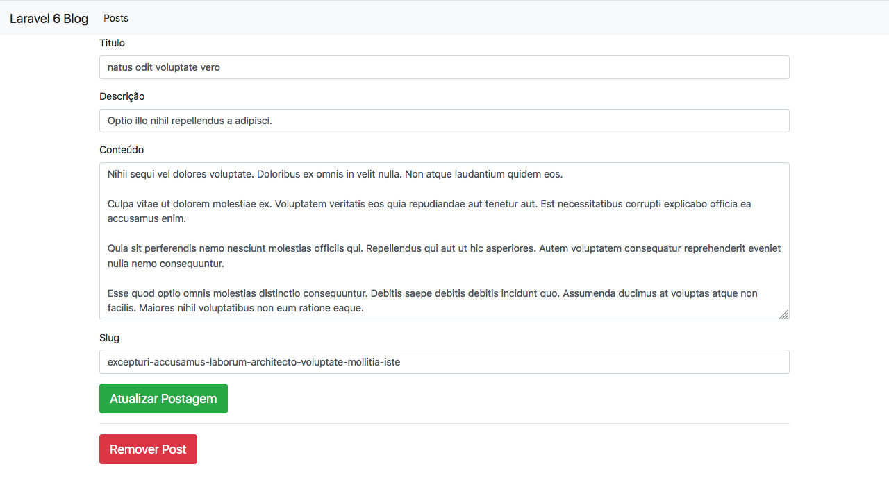
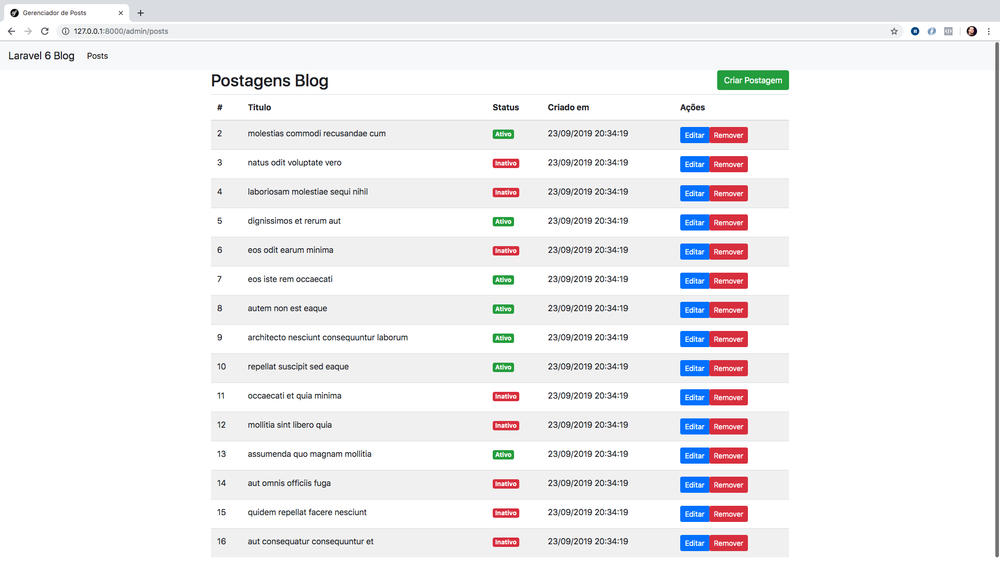

# Blade, Template Engine do Laravel

Olá tudo bem? Vamos continhar nosso livro e desta vez vamos conhecer o famoso template engine do Laravel, o Blade. 

O Blade é o template engine default do Laravel e traz consigo diversas estruturas que simplificam muito nosso trabalho na criação de nossas views, estruturas condicionais, laços e também diversas diretivas que nos permitem criar controles de forma simples e rápido por conta da pouca escrita para alcançar um resultado desejado.

O Blade ao longo do tempo veio e vem recebendo diversos incrementos e pretendo mostrar, na prática, estas possibilidades usando seu poder para construirmos nossas views.

Então vamos criar as views de nossa aplicação utilizando o poder do Blade!

## Layouts

Vamos começar pelo layout, em nosso Hello World com Laravel nós tivemos um contato com o blade quando mandamos nossa strind para a view e exibimos ela com o interpolador `{{ }}` que nos permite retornar/exibir informações passadas a ele. Antes de entrarmos em pontos como este que comentei, vamos definir e organizar um template base usando o blade para melhor dispormos as views do nosso painel.

Primeiramente crie uma pasta chamada de `layouts` dentro da pasta de views e dentro da pasta layouts crie o arquivo `app.blade.php`. Adicione o seguinte conteúdo e logo após farei os comentários:

```
<!doctype html>
<html lang="en">
<head>
    <meta charset="UTF-8">
    <meta name="viewport"
          content="width=device-width, user-scalable=no, initial-scale=1.0, maximum-scale=1.0, minimum-scale=1.0">
    <meta http-equiv="X-UA-Compatible" content="ie=edge">
    <title>Gerenciador de Posts</title>
    <link rel="stylesheet" href="https://stackpath.bootstrapcdn.com/bootstrap/4.3.1/css/bootstrap.min.css">
</head>
<body>
    <nav class="navbar navbar-expand-lg navbar-light bg-light">
        <a class="navbar-brand" href="/">Laravel 6 Blog</a>
        <button class="navbar-toggler" type="button" data-toggle="collapse" data-target="#navbarNavDropdown" aria-controls="navbarNavDropdown" aria-expanded="false" aria-label="Toggle navigation">
            <span class="navbar-toggler-icon"></span>
        </button>
        <div class="collapse navbar-collapse" id="navbarNavDropdown">
            <ul class="navbar-nav">
                <li class="nav-item active">
                    <a class="nav-link" href="{{ route('posts.index') }}">Posts</a>
                </li>
            </ul>

        </div>
    </nav>
    <div class="container">
        @yield('content')
    </div>
</body>
</html>
```

Acima temos a definição do nosso layout base, aqui entramos no primeiro conceito do Blade, neste caso, na herança de templates. Se você perceber no layout definir dentro do body na `div.container` uma diretiva chamada de `@yield` que me permite apontar onde os templates que heradarem deste layout devem exibir seus conteúdos.

Por exemplo, vamos enteder como isso acontece fazendo nossa view `create.blade.php` herdar do nosso layout `app.blade.php`. Veja as alterações que fiz na view abaixo:

```
@extends('layouts.app')

@section('content')
    <form action="{{route('posts.store')}}" method="post">

        @csrf

        <div class="form-group">
            <label>Titulo</label>
            <input type="text" name="title" class="form-control" value="{{old('title')}}">
        </div>

        <div class="form-group">
            <label>Descrição</label>
            <input type="text" name="description" class="form-control" value="{{old('description')}}">
        </div>

        <div class="form-group">
            <label>Conteúdo</label>
            <textarea name="content" id="" cols="30" rows="10" class="form-control">{{old('content')}}</textarea>
        </div>

        <div class="form-group">
            <label>Slug</label>
            <input type="text" name="slug" class="form-control" value="{{old('slug')}}">
        </div>

        <button class="btn btn-lg btn-success">Criar Postagem</button>
    </form>
@endsection
```

Aqui temos o conteúdo do formulário envolvido por uma diretiva chamada de `@section` que recebe o valor `content` e a definição de onde essa diretiva termina com o `@endsection`. O que isso quer dizer!

A diretiva `@section` defini o conteúdo que será substituido no layout principal, ou seja, quando eu acessar essa view ele vai herdar o que tem em `app.blade.php` e onde eu defini o `@yield('content')` será adicionado o conteúdo que temos na diretiva `@section`.

Mas Nanderson, onde está definido que o `create.blade.php` herda de `layout.blade.php`? Não comentei de proposito mas ele se encontra como sendo a primeira linha da nossa view, veja a definição que aponta de qual template `create.blade.php` herda por meio da diretiva `@extends` que recebe o layout pai da view em questão. Neste caso digo que a view `create.blade.php` herda de `app.blade.php` informando a diretiva `@extends` da seguinte maneira: `@extends('layouts.app')`.

Sendo que `layouts` é a pasta dentro de views e `app` o arquivo `app.blade.php`, onde sabemod que o Laravel irá incluir a extensão internamente e link o cominho até a pasta layouts.

Alterei também a view `edit.blade.php`, segue o conteúdo:

```
@extends('layouts.app')

@section('content')
    <form action="{{route('posts.update', ['post' => $post->id])}}" method="post">

        @csrf
        @method("PUT")

        <div class="form-group">
            <label>Titulo</label>
            <input type="text" name="title" class="form-control" value="{{$post->title}}">
        </div>

        <div class="form-group">
            <label>Descrição</label>
            <input type="text" name="description" class="form-control" value="{{$post->description}}">
        </div>

        <div class="form-group">
            <label>Conteúdo</label>
            <textarea name="content" id="" cols="30" rows="10" class="form-control">{{$post->content}}</textarea>
        </div>

        <div class="form-group">
            <label>Slug</label>
            <input type="text" name="slug" class="form-control" value="{{$post->slug}}">
        </div>

        <button class="btn btn-lg btn-success">Atualizar Postagem</button>
    </form>
    <hr>
    <form action="{{route('posts.destroy', ['post' => $post->id])}}" method="post">
        @csrf
        @method('DELETE')
        <button type="submit" class="btn btn-lg btn-danger">Remover Post</button>
    </form>
@endsection
```

Obs.: Fiz duas pequenas alterações além da definição da `section` e do `extends`. Adicionei a tag html `hr` entre o form de edição e o do botão de `Remover Post` e adicionei no button as classes: `btn btn-lg btn-danger`.

Veja o formulário na íntegra na imagem abaixo:



Lembra que comentei que já tinha adicionado algumas classes do Bootstrap no Formulário, agora que linkamos o bootstrap.css lá no app.blade.php os estilos foram aplicados e nossa interface está mais aceitável.

Agora vamos para a nossa listagem dos posts e conhecer mais possibilidades do Blade.

## Laços de Repetição & Condicionais

Sabemos que para iterarmos em cima de uma coleção de dados precisamos usar laços de repetição, o Blade nos traz algumas possibilidades interessantes. A primeira delas é a possibilidade de utilição do foreach, como vemos abaixo:

```
@foreach($posts as $post)
	<li>$post->title</li>
@endforeach
```

Desta maneira a iteração na coleção de posts vindas do banco de dados no mesmos moldes do foreach do PHP, e claro, no procesamento desta view essa diretiva se tornará um foreach nativo.

Mas aqui quero utilizar um foreach não muito convencional do dia a dia da forma que vamos escrever, mas é claro que com condicionais e combinando com os laços chegariamos no mesmo resultado. Mas Nanderson, do que você está falando!

Por exemplo, poderíamos fazer um controle condicional pro caso de não existirem postagens na base e somente, se existirem, exibissemos a tabela com elas. Por exemplo, veja o trecho abaixo:

```
@if($posts)
    @foreach($posts as $post)
		<li>$post->title</li>
	@endforeach
@else 
   <h2> Nenhuma postagem cadastrada!</h2>
@endif
```

Acima de cara te apresento o controle condicional ou como usar os se...senão (if...else) via diretivas do Blade. Primeiramente verificamos se o valor de `$posts` é verdadeiro, se verdadeiro nós realizamos os loops, senão exibimos uma mensagem padrão.

Agora podemos melhorar essa escrita usando blade com a diretiva de loop chamada de `@forelse`. Vamos ao conteúdo do nosso `index.blade.php`, então crie este arquivo lá dentro da pasta das views de posts. 

Veja seu conteúdo abaixo:

```
@extends('layouts.app')

@section('content')
    <div class="row">
        <div class="col-sm-12">
            <a href="{{route('posts.create')}}" class="btn btn-success float-right">Criar Postagem</a>
            <h2>Postagens Blog</h2>
            <div class="clearfix"></div>
        </div>
    </div>
    <table class="table table-striped">
        <thead>
            <tr>
                <th>Titulo</th>
                <th>Descrição</th>
                <th>Status</th>
                <th>Criado em</th>
            </tr>
        </thead>
        <tbody>
        @forelse($posts as $post)
            <tr>
                <td>{{$post->title}}</td>
                <td>{{$post->description}}</td>
                <td>
                    @if($post->is_active)
                        <span class="badge badge-success">Ativo</span>
                    @else
                        <span class="badge badge-danger">Inativo</span>
                    @endif
                </td>
                <td>{{date('d/m/Y H:i:s', strtotime($post->created_at))}}</td>
            </tr>
        @empty
            <tr>
                <td colspan="4">Nada encontrado!</td>
            </tr>
        @endforelse
        </tbody>
    </table>
@endsection
```

Não esqueça de substituir, lá no controller `PostController`, o `dd` por:

```
return view('posts.index', compact('posts'));
```

Vamos ao ponto da view `index.blade.php`. Perceba que aqui usei a diretiva:

```
@forelse($posts as $post)
  ...
@empty
  ...
@endforelse

```


Resultado da nossa view:




