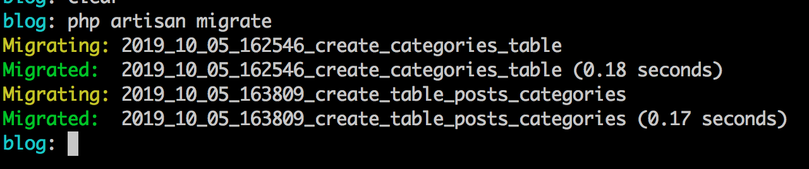

# Relacionamentos com Eloquent

Olá, tudo bem? Espero que sim!

Vamos começar agora um trecho que é necessário bastante atenção e cuidado, vamos falar sobre relacionamentos de uma base relacional (nosso banco de dados) e a representação destes relacionamentos do ponto de vista de Objetos, representadados por nossos Models junto com o Eloquent.

Como venho fazendo vamos mostrar os relacionamentos e suas nuances aplicados em nosso blog onde teremos as seguintes representações:

- Relacionamento 1:N(Um para Muitos): Autor x Postagens;
- Relacionamento N:N(Muitos para Muitos: Postagens & Categorias;
- Relacionamento 1:1 (Um para 1): Autor e Perfil.

Já temos definido na base o primeiro relacionamento da listagem acima e vamos começar por ela, para cada relacionamento restante(os dois última da lista acima) vou criar os insumos(Models, Controllers e etc) no momento que forem necessários, até para darmos uma relembrada.

Então vamos lá, vamos a obra! Quer dizer mão aos teclados!

## Relacionamento 1:N (Um para Muitos e Inverso)

Primeiramente vamos definir nossa relação entre Autor(User)  e suas Postagens(Post). Para isto precisamos definir métodos dentro de cada model que representem esta ligação.

Primeiramente vamos criar o método do ponto de vista de Post em relação ao nosso User. Veja o método abaixo adicionado ao model Post:

```
public function user()
{
    return $this->belongsTo(User::class);
}
```

Definimos o método acima para representar a ligação entre nossos models, neste caso quando precisarmos acessar dados desta relação, criar um dados por meio desta relação vamos chamar o método `user` do ponto de vista de Post.

O método `belongsTo` vêm do Eloquent e indica que o model Post pertence a(belongsTo) User, por isso passei o nome qualificado do model User no parâmetro do método `belongsTo`.

Outro ponto a ressaltar aqui é que, o Laravel vai tentar resolver o nome da referência na tabela posts por meio do nome do método, se coloquei `user` ele vai buscar dentro da tabela post, no banco de dados, pela referência `user_id`.

Se por ventura você usou um nome de coluna, que representa a referência na sua tabela, por exemplo, não usou o `user_id` mas sim `author_id`. Neste caso você precisa informar para o Eloquent o nome da coluna, veja um trecho abaixo:

```
return $this->belongsTo(User::class,  'author_id');
```

Desta forma quando o Eloquent for acessar suas tabelas e gerar as queries sql dos acessos irá buscar pela coluna `author_id`. Lembrando isso vale para você ter usado o nome da coluna que recebe a chave estrangeira que não seja `user_id`.

Agora como digo que o model User têm muitas postagens, vamos lá no model `User` e definir o método abaixo:

```
public function posts()
{
    return $this->hasMany(Post::class);
}
```

Se indiquei que o Post pertence a User por meio do método belongsTo, dentro de User eu indico que ele têm muitos(has Many) por meio do método `hasMany`. Agora toda vez que eu precisar acessar as postagens de um usuário eu irei acessar pormeio do método `posts`.

As definições do ponto de vista do Model são estas para entendermos melhor vamos realizar algumas queries para testarmos esta relação.

Vamos exibir lá na listagem de posts o autor da postagem. Para isto adicione mais uma coluna no `thead`, depois da coluna do id(#):

```
<th>Autor</th>
```

No `tbody` vamos adicionar o conteúdo para esta coluna, veja abaixo:

```
<td>{{$post->user->name}}</td>
```

Antes de vermos o resultado no browser, vamos ver na íntegra a view de posts agora, com esta alteração:

```
@extends('layouts.app')

@section('content')
    <div class="row">
        <div class="col-sm-12">
            <a href="{{route('posts.create')}}" class="btn btn-success float-right">Criar Postagem</a>
            <h2>Postagens Blog</h2>
            <div class="clearfix"></div>
        </div>
    </div>
    <table class="table table-striped">
        <thead>
            <tr>
                <th>#</th>
                <th>Autor</th>
                <th>Titulo</th>
                <th>Status</th>
                <th>Criado em</th>
                <th>Ações</th>
            </tr>
        </thead>
        <tbody>
        @forelse($posts as $post)
            <tr>
                <td>{{$post->id}}</td>
                <td>{{$post->user->name}}</td>
                <td>{{$post->title}}</td>
                <td>
                    @if($post->is_active)
                        <span class="badge badge-success">Ativo</span>
                    @else
                        <span class="badge badge-danger">Inativo</span>
                    @endif
                </td>
                <td>{{date('d/m/Y H:i:s', strtotime($post->created_at))}}</td>
                <td>
                    <div class="btn-group">
                        <a href="{{route('posts.show', ['post' => $post->id])}}" class="btn btn-sm btn-primary">
                            Editar
                        </a>
                        <form action="{{route('posts.destroy', ['post' => $post->id])}}" method="post">
                            @csrf
                            @method('DELETE')
                            <button type="submit" class="btn btn-sm btn-danger">Remover</button>
                        </form>
                    </div>
                </td>
            </tr>
        @empty
            <tr>
                <td colspan="4">Nada encontrado!</td>
            </tr>
        @endforelse
        </tbody>
    </table>

    {{$posts->links()}}
@endsection
```

Veja o resultado:


Por meio da definição do método `user` em `Post` e `posts` em `User` criamos as relações entre os objetos dos dois pontos de vistas. Acessei o auto da postagem do ponto de vista de Post, quando exibimos na tabela:

```
{{$post->user->name}}
```

Pegando a ligação que está em Post, `user`, e pegando o atributo name do usuário. Agora você pode está se perguntando, cara tu acessou `user` como se fosse um atributo mas tu definiu um método lá no model.

Vou explicar isso agora, vamos lá!

Aqui tecnicamente é bem simples, quando você acessar a ligação como se fosse o atributo da classe uma coleção é retornada ou o objeto oposto da ligação. Para simplificar:

- Como user tem muitos posts o retorno de `$user->posts` seria a coleção de posts ligadas ao usuário em questão;
- Já como uma postagem está ligada ou pertence a apenas um usuário, a chamada `$post->user` retornará o objeto User com as informações do usuário ligado a aquela postagem.

Se em algum momento você quiser recuperar as postagens de um usuário, por exemplo do usuário 2, você pode seguir o pensamento do trecho de código abaixo:

```
...
#No controller fazer a busca pelo usuário

$user = User::find(1);

#Acessar a ligação de usuário e postagens

$posts = $user->posts;
```

E na view você poderia fazer o loop, usando `@foreach` ou o `@forelse` que já utilizamos aqui.

```
@foreach($posts as $post)
   
    <h2>{{$post->title}}</h2>
   
@endforeach
```

Vamos as considerações sobre inserção de dados para esta relação!

## Inserindo Autor da Postagem

A minha intenção nesta inserção é termos o usuário logado e quando este criar a postagem nós pegamos a referência dele na sessão mas como ainda não chegamos na parte de autenticação vou colocar direto no código a criação desta relação diretamente.

No próximo capítulo vamos conhecer a parte de autenticação e lá realizaremos essa melhoria. Sem mais delongas vamos a criação do autor do post no momento da criação da postagem.

Vamos ao nosso método `store` lá no `PostController`. Faça a seguinte alteração no código, o que está assim:

```
public function store(Request $request)
{
    //Salvando com mass assignment
    $data = $request->all();
    $data['user_id'] = 1;
    $data['is_active'] = true;

    $post = new Post();

    dd($post->create($data));
}
```

Ficará assim:

```
public function store(Request $request)
{
	$data = $request->all();
	$data['is_active'] = true;
	
	$user = User::find(1);
	
	//Continuamos a salvar com mass assignment mas por meio do usuário
	$user->posts()->create($data);
	
	return redirect()->route('posts.index');
}
```

Não esqueça de importar `User`:

```
use \App\User;
```

Perceba que agora nós inserimos uma nova postagem por meio da ligação que temos com o usuário, como eu quero ter acesso aos métodos da ligação eu preciso chamar de fato o método `posts()` ao invés de chamar como atributo `posts`.

O Eloquent ao criar a postagem irá adicionar a referência do usuário que buscamos por meio do método `find` automaticamente. Como a postagem pertence ao usuário, defini ele como prioridade quando busquei pelo mesmo primeiramente e adicionei uma postagem ao seu conjunto de posts.


## ManyToMany com Eloquent: Categorias e Posts

Agora neste ponto vamos começar a parte da relação de Muitos para Muitos, a relação aqui será entre Posts e Categorias. Vamos primeiramente criar o model Category(Categoria), suas migrations e todo o CRUD deste cara. 

Podemos já começar criando nosso model com todo o aparato necessário de uma vez só, criar o model, a migration e o controller como recurso de uma vez só!

Execute na raiz do seu projeto o comando abaixo:

```
php artisan make:model Category -m -c -r
```

Veja o resultado:


Obs.: O comando irá criar o controller na pasta de Controllers normalmente, apenas mova este controller para a pasta `Admin` e corrija o namespace, de `namespace App\Http\Controllers;` para `namespace App\Http\Controllers\Admin;` e adicione o import do controller base: `use App\Http\Controllers\Controller;`.

Veja o controller na íntegra depois das observações acima:

```
<?php

namespace App\Http\Controllers\Admin;

use App\Category;
use App\Http\Controllers\Controller;
use Illuminate\Http\Request;

class CategoryController extends Controller
{
    /**
     * Display a listing of the resource.
     *
     * @return \Illuminate\Http\Response
     */
    public function index()
    {
        //
    }

    /**
     * Show the form for creating a new resource.
     *
     * @return \Illuminate\Http\Response
     */
    public function create()
    {
        //
    }

    /**
     * Store a newly created resource in storage.
     *
     * @param  \Illuminate\Http\Request  $request
     * @return \Illuminate\Http\Response
     */
    public function store(Request $request)
    {
        //
    }

    /**
     * Display the specified resource.
     *
     * @param  \App\Category  $category
     * @return \Illuminate\Http\Response
     */
    public function show(Category $category)
    {
        //
    }

    /**
     * Show the form for editing the specified resource.
     *
     * @param  \App\Category  $category
     * @return \Illuminate\Http\Response
     */
    public function edit(Category $category)
    {
        //
    }

    /**
     * Update the specified resource in storage.
     *
     * @param  \Illuminate\Http\Request  $request
     * @param  \App\Category  $category
     * @return \Illuminate\Http\Response
     */
    public function update(Request $request, Category $category)
    {
        //
    }

    /**
     * Remove the specified resource from storage.
     *
     * @param  \App\Category  $category
     * @return \Illuminate\Http\Response
     */
    public function destroy(Category $category)
    {
        //
    }
}
```

Por enquanto vamos deixá-lo assim, vamos da uma atenção lá para nossa migration, acesse a pasta de migrations e abra o arquivo: `2019_10_05_162546_create_categories_table.php`.

Adicione o seguintes campos abaixo:

```
$table->string('name');
$table->string('description')->nullable();
$table->string('slug');
```

Como você pode ver o Laravel pegou o nome do nosso model e já preparou nossa migration para o plural pela convenção já comentada aqui. Neste caso teremos a tabela `categories` com os campos:

- id;
- name;
- description;
- slug;
- created_at;
- updated_at;

Após as alterações que comentei anteriormente vamos criar uma nova migration, a migração para nossa tabela pivot para a relação de muitos para muitos. Muitos para Muitos permite que uma postagem tenha várias categorias e uma categoria tenha várias postagens. Pensando nisso precisamos de uma tabela intermediária para manter esta relação/ligação.

Para isso execute em seu terminal o comando abaixo para criação da migração para esta tabela intermediária:

```
php artisan make:migration create_table_posts_categories --create=posts_categories
```

Veja o conteúdo na íntegra da migração:

```
<?php

use Illuminate\Support\Facades\Schema;
use Illuminate\Database\Schema\Blueprint;
use Illuminate\Database\Migrations\Migration;

class CreateTablePostsCategories extends Migration
{
    /**
     * Run the migrations.
     *
     * @return void
     */
    public function up()
    {
        Schema::create('posts_categories', function (Blueprint $table) {
            $table->unsignedBigInteger('post_id');
	        $table->unsignedBigInteger('category_id');

	        $table->foreign('post_id')->references('id')->on('posts');
	        $table->foreign('category_id')->references('id')->on('categories');
        });
    }

    /**
     * Reverse the migrations.
     *
     * @return void
     */
    public function down()
    {
        Schema::dropIfExists('posts_categories');
    }
}

```
Do método `up` remova o `bigIncrements` e o  `timestamps` e adicione o conteúdo como acima. Nesta tabela precisamos apenas das referências, um para o post e o outro para a categoria, além das chaves estrangeiras referenciando cada tabela pelo seu id.

Agora podemos executar esta migration na base de dados, então execute em seu terminal ou cmd(no Windows) o comando abaixo:

```
php artisan migrate
```

Veja o resultado:




Com as migrations definidas, como podemos mapear nossa relação do ponto de vista do model? Existe no Eloquent o método para esta relação, o `belongsToMany` que estará nos dois models por conta da tabela intermedirária.

Então vamos adicionar o método abaixo dentro do nosso model `Post`:

```
public function categories()
{
	return $this->belongsToMany(Category::class, 'posts_categories');
}
```

E no Model `Category` adicione o método abaixo:

```
public function posts()
{
	return $this->belongsToMany(Post::class, 'posts_categories');
}
```

O método `belongsToMany` nos permite o mapeamento na relação de muitos p/ muitos entre os dois models, como ambos apontam para a mesma tabela, o método de ambos os lados também é o mesmo.

Aqui vale um aprendizado e um adendo, o segundo parâmetro do método `belongsToMany` é o nome da tabela intermediária(`posts_categories` em nosso caso), mas por que eu preenchi este valor?

Eu preenchi  valor desta coluna pois escolhi meu proprio nome de tabela intermediária que não é o mesmo que o Laravel iria tentar resolver de forma automatica.

Mas Nanderson, como eu faço se eu quiser que o Laravel resolva automaticamente a tabela sem precisar do segundo parâmetro como tu fizestes?!

Aqui vai os aprendizados.

O Laravel, caso não existisse o segundo parâmetro como fiz, vai buscar a tabela no banco respeitando o nome da tabela intermediária no singular e em ordem alfabética, ou seja, se temos `posts` e `categories` ele supõe que a tabela intermediária seja `category_post`, nomes no singular separados pelo `_` e em ordem alfabética **c** antes do **p**.

Antes de criarmos nosso post com suas categorias vamos criar rapidamente o CRUD de categorias com alguns detalhes a mais a serem adicionados também em nosso CRUD de posts.

## CRUD de Categorias

Vamos criar nosso CRUD com os controles de exceptions, bloco **try...catch**, e com redirecionamentos e mensagens de execução para o usuário. Para isto vamos instalar um pacote para estas mensagens, em seu terminal execute o comando abaixo:

```
composer require laracasts/flash
```

Este pacote nos permite de forma simples e rápida criarmos mensagens de execução para nosso usuários, menagens que digam o que aconteceu no processo.


Por exemplo após a inserção de uma postagem ou categoria podemos jogar a mensagem via larcasts/flash, pro caso de sucesso da inserção da seguinte maneira:

```
flash('Postagem criada com sucesso!)->success();
```

Isso produzirá na tela um sessão com a mensagem informada e com as classes do twitter bootstrap: `alert` e `alert-success`.


Agora vamos ao noso controller, irei colocar método por método do controller de Categorias, o `CategoryController`, para vermos os pontos importantes sobre cada método. Ao final coloco ele na íntegra para conferência.

Vamos ao primeiro método, o método index e o construtor:

```
/**
 * @var Category
 */
private $category;

public function __construct(Category $category)
{
	$this->category = $category;
}

/**
 * Display a listing of the resource.
 *
 * @return \Illuminate\Http\Response
 */
public function index()
{
    $categories = $this->category->paginate(15);

    return view('categories.index', compact('categories'));

}
```

O primeiro ponto importante é a utilização do nosso model como dependência do construtor da classe controller. Com isso teremos por meio do container de serviços do Laravel a instância do nosso model sempre que nosso controller for chamado. Isso simplifica muito as coisas e nos ajuda a mantermos nosso controller mais focado.

Falarei um pouco mais sobre o container de serviços mais a frente mas aqui já temos uma pequena pitada do que é possivel fazer com esse cara!

Continuando para o método index, a difernça direta aqui é que ao invés de chamadar o `paginate` pelo model, chamos pelo atributo do controller que receberá a instância do nosso model.

O método a seguir é o create, que dispensa comentários até então, veja ele:

```
/**
 * Show the form for creating a new resource.
 *
 * @return \Illuminate\Http\Response
 */
public function create()
{
    return view('categories.create');
}

```

Vamos continuando para o método store, onde de fato persistimos nossos dados, neste caso categoria. Veja ele e logo após os comentários:

```
/**
 * Store a newly created resource in storage.
 *
 * @param  \Illuminate\Http\Request  $request
 * @return \Illuminate\Http\Response
 */
public function store(Request $request)
{
	$data = $request->all();

    try {
		$category = $this->category->create($data);

		flash('Categoria criada com sucesso!')->success();
		return redirect()->route('categories.index');

    } catch (\Exception $e) {
    	$message = 'Erro ao criar categoria!';

		if(env('APP_DEBUG')) {
			$message = $e->getMessage();
		}

		flash($message)->warning();
		return redirect()->back();
    }
}
```

Aqui mais uma referência ao nosso atributo que contêm a instância do nosso model, usamos o mass assignment que já conhecemos. Agora temos mais alguns detalhes, primeiramente estamos controlando nossos processos com os blocks **try...catch** que nos permite um maior controle caso as Exceptions com erros sejam lançadas. 

Usamos também tanto para as mensagens de execução de sucesso ou erro o pacote que instalamos anteriormente, o laracasts/flash, onde definimos as mensagens e o tipo delas se sucesso ou warning(recomendo a documentação pois temos mais tipos).

Logo após o set das mensagens d execução usamos o redirecionamento do Laravel por meio do helper `redirect` onde pro sucesso redirecionamos para a tela principal de categorias dentro do admin, mas aqui por boa prática, redirecionamos pelo apelido da rota por isto chamos o método route que já usamos nas views!

```
flash('Categoria criada com sucesso!')->success();
return redirect()->route('categories.index');
```

Veja o block `catch`:

```
 catch (\Exception $e) {
	$message = 'Erro ao criar categoria!';

	if(env('APP_DEBUG')) {
		$message = $e->getMessage();
	}

	flash($message)->warning();
	return redirect()->back();
}
```

Aqui faço um controller para só exibirmos as mensagens reais dos erros se lá em nosso arquivo .env a variável `APP_DEBUG` estiver como verdadeira, ou seja, só veremos as mensagens de erro reis em ambiente de desenvolvimento, em produção teremos mensagens padrões como: `"Erro ao criar categoria"`.


O método show têm um pequeno detalhe que preciso comentar, veja:

```
 /**
 * Display the specified resource.
 *
 * @param  \App\Category  $category
 * @return \Illuminate\Http\Response
 */
public function show(Category $category)
{
    return view('categories.edit', compact('category'));
}
```

Perceba de cara o parâmetro tipado do método `show`, tipado para aceitar apenas instâncias do nosso model. Um ponto importante aqui é que quando temos um parâmetro tipado assim o Laravel automáticamente vai converter este parâmetro para um objeto populado para o id informado, por isso que não estou realizando um `find` ou `findOrFail` aqui porque quando chegamos no controller já temos a instância do objeto `Category` populada com o id informado como comentei.

Então, só mando para a view edti de categorias.

Quando agente gera um controller como recurso temos a geração também do método edit. Que serviria de fato para exibição do nosso formulário de edição. Particularmente não teremos tela somente de conferência dos dados de categorias ou postagens por isso já exibo o formulário no método show. E o que adiciono no método `edit`, poderiamos removê-lo ou apenas fazer um redirecionamento, como fiz, veja abaixo:

```
/**
 * Show the form for editing the specified resource.
 *
 * @param  \App\Category  $category
 * @return \Illuminate\Http\Response
 */
public function edit(Category $category)
{
    return redirect()->route('categories.show', ['category' => $category->id]);
}
```

Agora caímos para o método update, realmente aqui não temos muito a comentar uma vez que os detalhes já são conhecidos e a forma de atualização também:

```
/**
 * Update the specified resource in storage.
 *
 * @param  \Illuminate\Http\Request  $request
 * @param  \App\Category  $category
 * @return \Illuminate\Http\Response
 */
public function update(Request $request, Category $category)
{
    $data = $request->all();

    try {
	    $category->update($data);

	    flash('Categoria atualizada com sucesso!')->success();
	    return redirect()->route('categories.show', ['category' => $category->id]);

    } catch (\Exception $e) {
	    $message = 'Erro ao atualizar categoria!';

	    if(env('APP_DEBUG')) {
		    $message = $e->getMessage();
	    }

	    flash($message)->warning();
	    return redirect()->back();
    }
}
```

A remoção/delete também segue o mesmo pensamento, veja:

```
/**
 * Remove the specified resource from storage.
 *
 * @param  \App\Category  $category
 * @return \Illuminate\Http\Response
 */
public function destroy(Category $category)
{
    try {
	    $category->delete();

	    flash('Categoria removida com sucesso!')->success();
	    return redirect()->route('categories.index');

    } catch (\Exception $e) {
	    $message = 'Erro ao remover categoria!';

	    if(env('APP_DEBUG')) {
		    $message = $e->getMessage();
	    }

	    flash($message)->warning();
	    return redirect()->back();
    }
}
```

As views também não têm novidades, mas antes, cria a pasta `categories` dentro de views e os arquivos:

- index.blade.php;
- create.blade.php;
- edit.blade.php.

Com os conteúdos:

**index.blade.php**:

```
@extends('layouts.app')

@section('content')
    <div class="row">
        <div class="col-sm-12">
            <a href="{{route('categories.create')}}" class="btn btn-success float-right">Criar Categoria</a>
            <h2>Categorias Blog</h2>
            <div class="clearfix"></div>
        </div>
    </div>
    <table class="table table-striped">
        <thead>
            <tr>
                <th>#</th>
                <th>Nome</th>
                <th>Criado em</th>
                <th>Ações</th>
            </tr>
        </thead>
        <tbody>
        @forelse($categories as $category)
            <tr>
                <td>{{$category->id}}</td>
                <td>{{$category->name}}</td>
                <td>{{date('d/m/Y H:i:s', strtotime($category->created_at))}}</td>
                <td>
                    <div class="btn-group">
                        <a href="{{route('categories.show', ['category' => $category->id])}}" class="btn btn-sm btn-primary">
                            Editar
                        </a>
                        <form action="{{route('categories.destroy', ['category' => $category->id])}}" method="post">
                            @csrf
                            @method('DELETE')
                            <button type="submit" class="btn btn-sm btn-danger">Remover</button>
                        </form>
                    </div>
                </td>
            </tr>
        @empty
            <tr>
                <td colspan="4">Nada encontrado!</td>
            </tr>
        @endforelse
        </tbody>
    </table>

    {{$categories->links()}}
@endsection
```

**create.blade.php**:

```
@extends('layouts.app')

@section('content')
    <form action="{{route('categories.store')}}" method="post">

        @csrf

        <div class="form-group">
            <label>Nome</label>
            <input type="text" name="name" class="form-control" value="{{old('name')}}">
        </div>

        <div class="form-group">
            <label>Descrição</label>
            <input type="text" name="description" class="form-control" value="{{old('description')}}">
        </div>

        <div class="form-group">
            <label>Slug</label>
            <input type="text" name="slug" class="form-control" value="{{old('slug')}}">
        </div>

        <button class="btn btn-lg btn-success">Criar Categoria</button>
    </form>
@endsection
```

**edit.blade.php**:

```
@extends('layouts.app')

@section('content')
    <form action="{{route('categories.update', ['category' => $category->id])}}" method="post">

        @csrf
        @method("PUT")

        <div class="form-group">
            <label>Nome</label>
            <input type="text" name="name" class="form-control" value="{{$category->name}}">
        </div>

        <div class="form-group">
            <label>Descrição</label>
            <input type="text" name="description" class="form-control" value="{{$category->description}}">
        </div>

        <div class="form-group">
            <label>Slug</label>
            <input type="text" name="slug" class="form-control" value="{{$category->slug}}">
        </div>

        <button class="btn btn-lg btn-success">Atualizar Categoria</button>
    </form>
@endsection
```

Criada as views de categorias, precisamos adicionar lá no nosso layout a possibilidade de exibição de nossas mensagens. Dentro do nosso bloco onde se encontra o `yield('content')`, adicione acima dele o include abaixo:

```
@include("flash::message")
```

Veja como ficou o trecho do yield:

```
...
<div class="container">
    @include("flash::message")
    @yield('content')
</div>
...

```

Ah e não esqueça de link no menu do `layout.blade.php` o menu de categorias, veja o trecho adicionado logo após o link de posts:

```
 <li class="nav-item active">
    <a class="nav-link" href="{{ route('categories.index') }}">Categorias</a>
</li>
```

Esta inclusão exibirá os alertas com as classes do twitter bootstrap conforme o método escolhido, na cor verde para a chamada do `->success()` na cor amarela para a chamada `->warning()`.

Agora que nosso CRUD de categorias está pronto, faça alguns testes e crie algumas categorias para termos insumo no momento da inclusão das categorias para uma postagem.

Abaixo, deixo nosso controller Posts alterado com os pensamentos feitos no controller de Categorias. Como não criamos ele diretamente como recursos pelo terminal, ele vai está sem alguns comentários como vimos no `CategoryController` mas isso são detalhes.

Veja ele na íntegra:

```
<?php

namespace App\Http\Controllers\Admin;

use App\User;
use Illuminate\Http\Request;
use App\Http\Controllers\Controller;
use App\Post;

class PostController extends Controller
{
	/**
	 * @var Post
	 */
	private $post;

	public function __construct(Post $post)
	{
		$this->post = $post;
	}

	public function index()
	{
		$posts = $this->post->paginate(15);

		return view('posts.index', compact('posts'));
	}

	public function show(Post $post)
	{
		return view('posts.edit', compact('post'));
	}

    public function create()
    {
		return view('posts.create');
    }

    public function store(Request $request)
    {
    	$data = $request->all();
	    try{
	        $data['is_active'] = true;

		    $user = User::find(1);
			$user->posts()->create($data);

			flash('Postagem inserida com sucesso!')->success();
			return redirect()->route('posts.index');

	    } catch (\Exception $e) {
		    $message = 'Erro ao remover categoria!';

		    if(env('APP_DEBUG')) {
			    $message = $e->getMessage();
		    }

		    flash($message)->warning();
		    return redirect()->back();
	    }
    }

    public function update(Post $post, Request $request) {
	    $data = $request->all();

		try{
			$post->update($data);

		    flash('Postagem atualizada com sucesso!')->success();
		    return redirect()->route('posts.show', ['post' => $post->id]);

        } catch (\Exception $e) {
		    $message = 'Erro ao remover categoria!';

		    if(env('APP_DEBUG')) {
			    $message = $e->getMessage();
		    }

		    flash($message)->warning();
		    return redirect()->back();
	    }
    }

	public function destroy(Post $post)
	{
		try {
			$post->delete($post);

			flash('Postagem removida com sucesso!')->success();
			return redirect()->route('posts.index');

		} catch (\Exception $e) {
			$message = 'Erro ao remover categoria!';

			if(env('APP_DEBUG')) {
				$message = $e->getMessage();
			}

			flash($message)->warning();
			return redirect()->back();
		}
	}
}

```

Aplicada as melhorias no controller `PostController` vamos a alterações para a inserção desta relação muitos para muitos entre Posts e Categorias.

## Inserindo Muito para Muitos (Post x Category)


