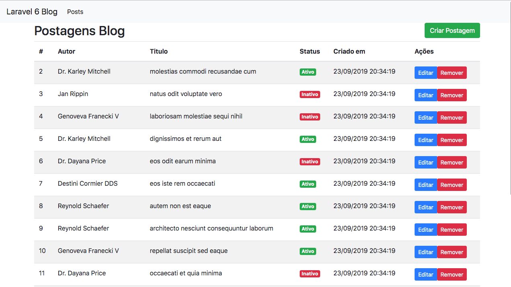
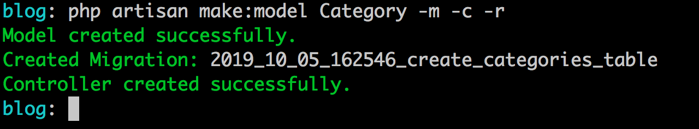

# Relacionamentos com Eloquent

Olá, tudo bem? Espero que sim!

Vamos começar agora um trecho que é necessário bastante atenção e cuidado, vamos falar sobre relacionamentos de uma base relacional (nosso banco de dados) e a representação destes relacionamentos do ponto de vista de Objetos, representadados por nossos Models junto com o Eloquent.

Como venho fazendo vamos mostrar os relacionamentos e suas nuances aplicados em nosso blog onde teremos as seguintes representações:

- Relacionamento 1:N(Um para Muitos): Autor x Postagens;
- Relacionamento N:N(Muitos para Muitos: Postagens & Categorias;
- Relacionamento 1:1 (Um para 1): Autor e Perfil.

Já temos definido na base o primeiro relacionamento da listagem acima e vamos começar por ela, para cada relacionamento restante(os dois última da lista acima) vou criar os insumos(Models, Controllers e etc) no momento que forem necessários, até para darmos uma relembrada.

Então vamos lá, vamos a obra! Quer dizer mão aos teclados!

## Relacionamento 1:N (Um para Muitos e Inverso)

Primeiramente vamos definir nossa relação entre Autor(User)  e suas Postagens(Post). Para isto precisamos definir métodos dentro de cada model que representem esta ligação.

Primeiramente vamos criar o método do ponto de vista de Post em relação ao nosso User. Veja o método abaixo adicionado ao model Post:

```
public function user()
{
    return $this->belongsTo(User::class);
}
```

Definimos o método acima para representar a ligação entre nossos models, neste caso quando precisarmos acessar dados desta relação, criar um dados por meio desta relação vamos chamar o método `user` do ponto de vista de Post.

O método `belongsTo` vêm do Eloquent e indica que o model Post pertence a(belongsTo) User, por isso passei o nome qualificado do model User no parâmetro do método `belongsTo`.

Outro ponto a ressaltar aqui é que, o Laravel vai tentar resolver o nome da referência na tabela posts por meio do nome do método, se coloquei `user` ele vai buscar dentro da tabela post, no banco de dados, pela referência `user_id`.

Se por ventura você usou um nome de coluna, que representa a referência na sua tabela, por exemplo, não usou o `user_id` mas sim `author_id`. Neste caso você precisa informar para o Eloquent o nome da coluna, veja um trecho abaixo:

```
return $this->belongsTo(User::class,  'author_id');
```

Desta forma quando o Eloquent for acessar suas tabelas e gerar as queries sql dos acessos irá buscar pela coluna `author_id`. Lembrando isso vale para você ter usado o nome da coluna que recebe a chave estrangeira que não seja `user_id`.

Agora como digo que o model User têm muitas postagens, vamos lá no model `User` e definir o método abaixo:

```
public function posts()
{
    return $this->hasMany(Post::class);
}
```

Se indiquei que o Post pertence a User por meio do método belongsTo, dentro de User eu indico que ele têm muitos(has Many) por meio do método `hasMany`. Agora toda vez que eu precisar acessar as postagens de um usuário eu irei acessar pormeio do método `posts`.

As definições do ponto de vista do Model são estas para entendermos melhor vamos realizar algumas queries para testarmos esta relação.

Vamos exibir lá na listagem de posts o autor da postagem. Para isto adicione mais uma coluna no `thead`, depois da coluna do id(#):

```
<th>Autor</th>
```

No `tbody` vamos adicionar o conteúdo para esta coluna, veja abaixo:

```
<td>{{$post->user->name}}</td>
```

Antes de vermos o resultado no browser, vamos ver na íntegra a view de posts agora, com esta alteração:

```
@extends('layouts.app')

@section('content')
    <div class="row">
        <div class="col-sm-12">
            <a href="{{route('posts.create')}}" class="btn btn-success float-right">Criar Postagem</a>
            <h2>Postagens Blog</h2>
            <div class="clearfix"></div>
        </div>
    </div>
    <table class="table table-striped">
        <thead>
            <tr>
                <th>#</th>
                <th>Autor</th>
                <th>Titulo</th>
                <th>Status</th>
                <th>Criado em</th>
                <th>Ações</th>
            </tr>
        </thead>
        <tbody>
        @forelse($posts as $post)
            <tr>
                <td>{{$post->id}}</td>
                <td>{{$post->user->name}}</td>
                <td>{{$post->title}}</td>
                <td>
                    @if($post->is_active)
                        <span class="badge badge-success">Ativo</span>
                    @else
                        <span class="badge badge-danger">Inativo</span>
                    @endif
                </td>
                <td>{{date('d/m/Y H:i:s', strtotime($post->created_at))}}</td>
                <td>
                    <div class="btn-group">
                        <a href="{{route('posts.show', ['post' => $post->id])}}" class="btn btn-sm btn-primary">
                            Editar
                        </a>
                        <form action="{{route('posts.destroy', ['post' => $post->id])}}" method="post">
                            @csrf
                            @method('DELETE')
                            <button type="submit" class="btn btn-sm btn-danger">Remover</button>
                        </form>
                    </div>
                </td>
            </tr>
        @empty
            <tr>
                <td colspan="4">Nada encontrado!</td>
            </tr>
        @endforelse
        </tbody>
    </table>

    {{$posts->links()}}
@endsection
```

Veja o resultado:



Por meio da definição do método `user` em `Post` e `posts` em `User` criamos as relações entre os objetos dos dois pontos de vistas. Acessei o auto da postagem do ponto de vista de Post, quando exibimos na tabela:

```
{{$post->user->name}}
```

Pegando a ligação que está em Post, `user`, e pegando o atributo name do usuário. Agora você pode está se perguntando, cara tu acessou `user` como se fosse um atributo mas tu definiu um método lá no model.

Vou explicar isso agora, vamos lá!

Aqui tecnicamente é bem simples, quando você acessar a ligação como se fosse o atributo da classe uma coleção é retornada ou o objeto oposto da ligação. Para simplificar:

- Como user tem muitos posts o retorno de `$user->posts` seria a coleção de posts ligadas ao usuário em questão;
- Já como uma postagem está ligada ou pertence a apenas um usuário, a chamada `$post->user` retornará o objeto User com as informações do usuário ligado a aquela postagem.

Se em algum momento você quiser recuperar as postagens de um usuário, por exemplo do usuário 2, você pode seguir o pensamento do trecho de código abaixo:

```
...
#No controller fazer a busca pelo usuário

$user = User::find(1);

#Acessar a ligação de usuário e postagens

$posts = $user->posts;
```

E na view você poderia fazer o loop, usando `@foreach` ou o `@forelse` que já utilizamos aqui.

```
@foreach($posts as $post)
   
    <h2>{{$post->title}}</h2>
   
@endforeach
```

Vamos as considerações sobre inserção de dados para esta relação!

## Inserindo Autor da Postagem

A minha intenção nesta inserção é termos o usuário logado e quando este criar a postagem nós pegamos a referência dele na sessão mas como ainda não chegamos na parte de autenticação vou colocar direto no código a criação desta relação diretamente.

No próximo capítulo vamos conhecer a parte de autenticação e lá realizaremos essa melhoria. Sem mais delongas vamos a criação do autor do post no momento da criação da postagem.

Vamos ao nosso método `store` lá no `PostController`. Faça a seguinte alteração no código, o que está assim:

```
public function store(Request $request)
{
    //Salvando com mass assignment
    $data = $request->all();
    $data['user_id'] = 1;
    $data['is_active'] = true;

    $post = new Post();

    dd($post->create($data));
}
```

Ficará assim:

```
public function store(Request $request)
{
	$data = $request->all();
	$data['is_active'] = true;
	
	$user = Post::find(1);
	
	//Continuamos a salvar com mass assignment mas por meio do usuário
	$user->posts()->create($data);
	
	return redirect()->route('posts.index');
}
```

Perceba que agora nós inserimos uma nova postagem por meio da ligação que temos com o usuário, como eu quero ter acesso aos métodos da ligação eu preciso chamar de fato o método `posts()` ao invés de chamar como atributo `posts`.

O Eloquent ao criar a postagem irá adicionar a referência do usuário que buscamos por meio do método `find` automaticamente. Como a postagem pertence ao usuário, defini ele como prioridade quando busquei pelo mesmo primeiramente e adicionei uma postagem ao seu conjunto de posts.


## ManyToMany com Eloquent: Categorias e Posts

Agora neste ponto vamos começar a parte da relação de Muitos para Muitos, a relação aqui será entre Posts e Categorias. Vamos primeiramente criar o model Category(Categoria), suas migrations e todo o CRUD deste cara. 

Podemos já começar criando nosso model com todo o aparato necessário de uma vez só, criar o model, a migration e o controller como recurso de uma vez só!

Execute na raiz do seu projeto o comando abaixo:

```
php artisan make:model Category -m -c -r
```

Veja o resultado:



Obs.: O comando irá criar o controller na pasta de Controllers normalmente, apenas mova este controller para a pasta `Admin` e corrija o namespace, de `namespace App\Http\Controllers;` para `namespace App\Http\Controllers\Admin;` e adicione o import do controller base: `use App\Http\Controllers\Controller;`.

Veja o controller na íntegra depois das observações acima:

```
<?php

namespace App\Http\Controllers\Admin;

use App\Category;
use App\Http\Controllers\Controller;
use Illuminate\Http\Request;

class CategoryController extends Controller
{
    /**
     * Display a listing of the resource.
     *
     * @return \Illuminate\Http\Response
     */
    public function index()
    {
        //
    }

    /**
     * Show the form for creating a new resource.
     *
     * @return \Illuminate\Http\Response
     */
    public function create()
    {
        //
    }

    /**
     * Store a newly created resource in storage.
     *
     * @param  \Illuminate\Http\Request  $request
     * @return \Illuminate\Http\Response
     */
    public function store(Request $request)
    {
        //
    }

    /**
     * Display the specified resource.
     *
     * @param  \App\Category  $category
     * @return \Illuminate\Http\Response
     */
    public function show(Category $category)
    {
        //
    }

    /**
     * Show the form for editing the specified resource.
     *
     * @param  \App\Category  $category
     * @return \Illuminate\Http\Response
     */
    public function edit(Category $category)
    {
        //
    }

    /**
     * Update the specified resource in storage.
     *
     * @param  \Illuminate\Http\Request  $request
     * @param  \App\Category  $category
     * @return \Illuminate\Http\Response
     */
    public function update(Request $request, Category $category)
    {
        //
    }

    /**
     * Remove the specified resource from storage.
     *
     * @param  \App\Category  $category
     * @return \Illuminate\Http\Response
     */
    public function destroy(Category $category)
    {
        //
    }
}
```

Por enquanto vamos deixá-lo assim, vamos da uma atenção lá para nossa migration, acesse a pasta de migrations e abra o arquivo: `2019_10_05_162546_create_categories_table.php`.

Adicione o seguintes campos abaixo:

```
$table->string('name');
$table->string('description')->nullable();
$table->string('slug');
```

Como você pode ver o Laravel pegou o nome do nosso model e já preparou nossa migration para o plural pela convenção já comentada aqui. Neste caso teremos a tabela `categories` com os campos:

- id;
- name;
- description;
- slug;
- created_at;
- updated_at;

Após as alterações que comentei anteriormente vamos criar uma nova migration, a migração para nossa tabela pivot para a relação de muitos para muitos. Muitos para Muitos permite que uma postagem tenha várias categorias e uma categoria tenha várias postagens. Pensando nisso precisamos de uma tabela intermediária para manter esta relação/ligação.

Para isso execute em seu terminal o comando abaixo para criação da migração para esta tabela intermediária:

```
php artisan make:migration create_table_posts_categories --create=posts_categories
```

