# Autenticação

Neste capítulo vamos criar nossa autenticação para acesso ao nosso administrativo. O mais interessante é que o Laravel já vêm todo pronto para criarmos uma autenticação de forma rápida e produtiva.

Esta dinamização e coisas prontas são o essencial para que possamos levantar nosso controle para o acesso ao nosso painel.

Então vamos lá, vamos implementar a autenticação e conhecer alguns conceitos dentro do framework, além de criarmos o perfil do usuário logado e conhecer de quebra a relação 1 para 1 (1:1).

## Começando com geração da autenticação

Primeiramente vamos instalar o pacote UI, o Laravel UI. Este pacote vai adicionar para nós a possibilidade de manipulação dos assets do frontend e também vai nos permitir a geração das views de login, resete de senha e adicionará as rotas necessárias para este processo por meio de um único comando.

Mas primeiro, para instalarmos basta executarmos:

```
composer require laravel/ui
```

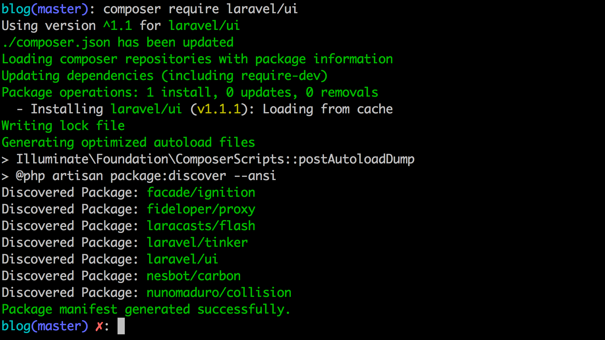


Com pacote instalado poderemos executar o comando abaixo, para gerarmos nossas views de autenticação, bem como suas rotas e ainda ambientarmos nossos assets frontend com o Twitter Bootstrap. Então execute na raiz do seu projeto o comando abaixo:

```
php artisan ui bootstrap --auth
```
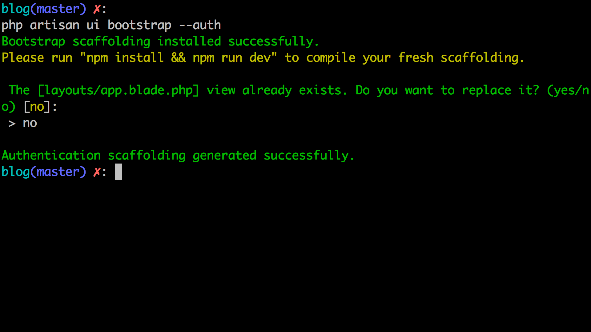

O comando acima gera para nós o `app.blade.php` dentro de uma pasta layouts em nossa pasta de views mas como já temos ele pergunta se eu quero sobsescrever, coloquei que não: `no`. Apó isso ele continua a geração das views da autenticação, que fica na pasta views dentro da pasta `auth` e adiciona também lá no nosso arquivo de rotas `web.php`  as rotas da autentição por meio do trecho:

```
\Auth::routes();
```

Ele vai adicionar também o trecho abaixo e criar o controller `HomeController`:

```
Route::get('/home', 'HomeController@index')->name('home');
```

Que você pode descartar, ambos, por hora. Não vão ser necessários para nós, tanto o trecho da rota `home` como o `HomeController`.

O comando gerou o pontos acima por conta do parâmetro `--auth` e o tipo pasando para o comando `ui`, o `bootstrap` fez com que o Laravel criasse as configurações necessárias para que possamos usar o bootstrap a partir dos assets dentro do projeto.

Você pode uma olhada nos arquivos:

- resources/css/app.scss;
- resources/sass/_variables.scss.

Além de ter adicionado as dependências dentro do `package.json`:

- bootstrap: ^4.0.0;
- jquery: ^3.2;
- popper.js: ^1.12.

Para ter estes assets prontos no projeto precisamos instalar as dependências via npm (Node Package Manager). Neste caso será necessário ter o Node.JS em sua máquina junto com o NPM.

Tendo ambos, execute na raiz do projeto o comando abaixo:

```
npm i
```

O `i` aqui é de install.

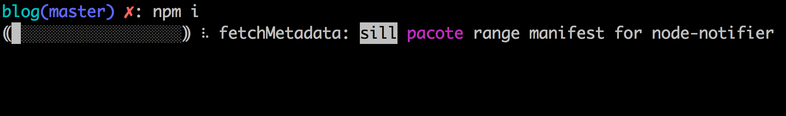

Após o termino, precisamos gerar um build com todos os assets front css e outro para o js, que serão gerados dentro das pastas css e js na pasta public do projeto. Os arquivos gerados e prontos para uso são:

- public/js/app.js;
- public/css/app.css.

Para termos este dois arquivos gerados, precisamos rodar o seguinte comando:

```
npm run dev
```

Este comando vai gerar os builds para podermos utilizar os assets instalados via npm.

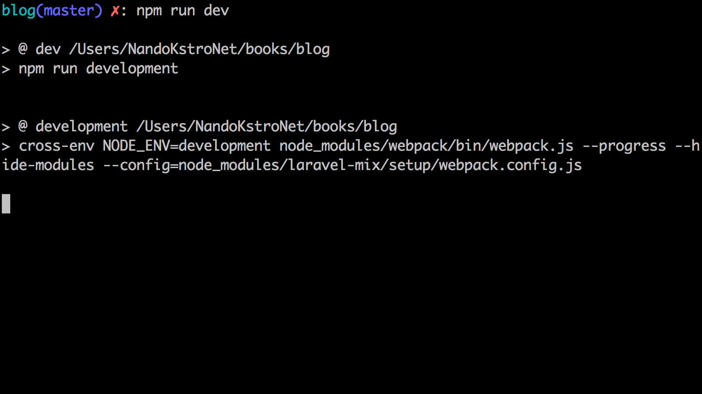

O sucesso da geração destes builds você pode ver abaixo:

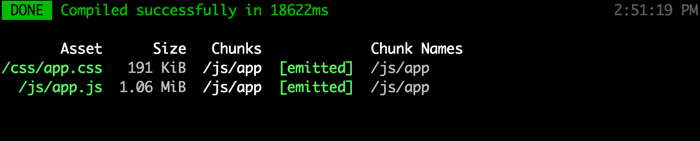

O comando acima lerá os arquivos `resources/js/app.js` e `resources/css/app.scss` e criará o build para cada um dentro do public para podermos utilizar em nosso projeto. Todo esse processo que feito pelo pacote `larave/mix` que usa o WebPack para realizar dos builds do frontend.

## As rotas de autenticação

Um dos pontos que comentei foi a adição das rotas para autenticação por meio da chamada, lá no arquivo `web.php`, do trecho abaixo:

```
\Auth::routes();
```

As rotas adicionadas são:

- `/login`: GET exibe o form e POST para submissão do login;
- `/logout`: POST para encerrar sessão;
- `/password/email`: POST envia o email para reset de senha;
- `/password/reset`: POST atualiza a senha;
- `/password/reset/{token}`: GET tela para atualização da senha e verificação do token de reset de senha.

Por exemplos se iniciarmos nosso servidor e acessarmos http://127.0.0.1:8000/login termos o resultado abaixo:

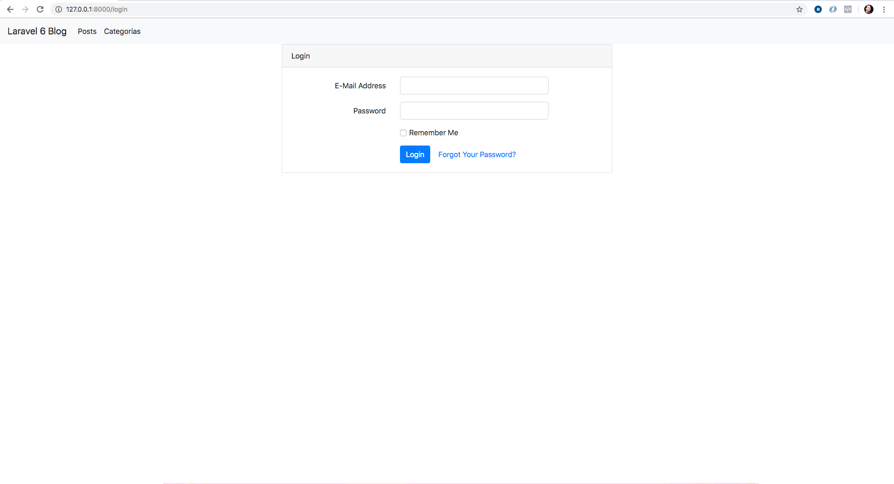

Nossas rotas ainda não estão sobre a autenticação então se tentarmos acessá-las vamos conseguir mesmo não estando logados. O que precisamos fazer para colocar nossa rota sob autenticação? 

Neste caso precisamos usar o middleware `auth` que bloqueia para nós as rotas que usarem ele para somente usuários autenticados. Tranquilo! Mas o que são middlewares?

Vamos lá!

## Middlewares

Antes de usarmos o middleware `auth` para bloquear o acesso ao nosso painel vamos entender o conceito de middlewares.

Middlewares são aplicações de controle que são executadas entre a requisição do usuário e o código especifico para aquela rota. Dentro do Laravel nós temos middlewares para a aplicação como um todo e middlewares específicos para rotas.

Como middlewares estão entre a requisição do usuário e a execução para a rota solicitada podemos realizar diversos controles como por exemplo verificar se o usuário está logado, via middleware `auth` ou até mesmo validar papéis do usuário em relação a aquele acesso. As possibilidades com middlewares são imensas e vai da necessidade de cada aplicação.

## Usando o middleware AUTH

Para colocarmos nossas rotas do admin, existentes até o momento, precisamos fazer algumas altrações em nosso arquivo de rotas web. O trecho abaixo, que está assim:

```
Route::prefix('admin')->namespace('Admin')->group(function(){

	Route::resource('posts', 'PostController');
	Route::resource('categories', 'CategoryController');

});
```

Passará a ser utilizado da seguinte maneira:

```

Route::group(['middleware' => ['auth']], function(){

    Route::prefix('admin')->namespace('Admin')->group(function(){

        Route::resource('posts', 'PostController');
        Route::resource('categories', 'CategoryController');

    });
    
});
```

Agora aplicamos o middleware `auth` para o nosso grupo de rotas do admin existentes. Perceba a chamada do método `group` e a utilização do primeiro parâmetro com o array passado, informando nossa chave middleware e dentro o array de middlewares para esta rota para o controle da nossa autenticação.

Se você tentar acessar por exemplo: 127.0.0.1/admin/posts, você será redirecionado para a tela de login e de forma bem simples adicionamos a autenticação em nosso projeto.

PS.: Para testar você pode ir no seu banco e pegar algum usuário para teste e usar a senha lá da factory: `password`, combinada com o email que você escolheu.

Se você foi redirecionado para a rota `/home` e recebeu um 404, isso é porque: Primeiro, nós removemos a rota `/home` bem como seu controller e por padrão a rota `/home` é para onde o Laravel aponta o usuário depois de logado. Vamos realizar esta pequena alteração, acesse seu arquivo `LoginController.php` lá na pasta `app/Http/Controllers/Auth` e modifique o trecho abaixo:

```
 /**
 * Where to redirect users after login.
 *
 * @var string
 */
protected $redirectTo = '/home';
```

para:

```
 /**
 * Where to redirect users after login.
 *
 * @var string
 */
protected $redirectTo = '/admin/posts';
```

Este redirect pode ser modificado ainda nos controllers responsáveis por cada operação referentes ao login: `RegisterController`, `ResetPasswordController` e ainda `VerificationController` na mesma pasta.


## Blade, controles para autenticação

Se você analisou a tela de login vai perceber que nossos menus `Posts`  e `Categorias` estão sendo exibidos no menu mesmo nós não etando autenticados. Veja:

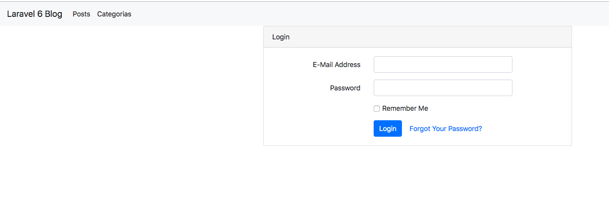

Como fazer para exibirmos estes menus apenas quando estivermos logados? O blade têm duas diretivas para isto, uma para o usuários autenticado:

```
@auth

@endauth
```

e uma para usuários não autenticados ou anônimos ou mesmo convidados:

```
@guest

@endguest
```

Ambas podem ter um senão, caso você necessite de um resultado default caso o usuário não esteja autenticado ou caso ele esteja autenticado. Veja:

```
@auth
	Usuário autenticado...
@else
    Usuário não autenticado...
@endauth
```

```
@guest
   Usuário não autenticado...
@else
	Usuário autenticado...
@endguest
```

Vamos usar o `@auth` em nosso menu, envolva o menu lá no `app.blade.php`  da pasta layouts dentro de views como abaixo:

```
 @auth
    <ul class="navbar-nav">
        <li class="nav-item active">
            <a class="nav-link" href="{{ route('posts.index') }}">Posts</a>
        </li>
        <li class="nav-item active">
            <a class="nav-link" href="{{ route('categories.index') }}">Categorias</a>
        </li>
    </ul>
@endauth
```

Se voltar a tela de login e atualizar, você perceberá que nosso menu já não aparece mais entretanto se logarmos ele estará lá!

## Recuperando o usuário autenticado

Lembra lá no controller das postagens onde nós buscamos o usuário e criarmos a referência dele diretamente e que iríamos substituir pelo usuário logado? Então, vamos realizar esta alteração e verificarmos como podemos ter acesso aos dados do usuário que está autenticado no momento.

Na verdade isso é tão simples quanto adicionar o controle do tópico anterior. Primeiramente vamos mão na massa, lá no `PostController` o que está assim: 

```
$user = User::find(1);
```
Ficará assim:

```
$user = auth()->user();
```

A função helper `auth()` retornará uma instância do gerenciados de sessão do pacote de auth do Laravel, e por meio do método `user()` teremos acesso ao objeto do usuário logado, onde poderemos acessar diversas informações do mesmo bem como as ligações e relações via model deste. Essa simples alteração já adicionará os posts criados par ao usuário autenticado.

Simples, rápido e direto!

Caso queira exibir lá na view do layout o nome do usuário autenticado é bem simples também, veja o trecho e depois a view completa e atualizada:

`resources/views/layotus/app.blade.php`: 

Trecho adicionado antes do fechamento da tag `nav`:

```
@auth
	<div class="float-right">
	    <strong>{{auth()->user()->name}}</strong>
	</div>
@endauth
```

Veja a view completa:

```
<!doctype html>
<html lang="en">
<head>
    <meta charset="UTF-8">
    <meta name="viewport"
          content="width=device-width, user-scalable=no, initial-scale=1.0, maximum-scale=1.0, minimum-scale=1.0">
    <meta http-equiv="X-UA-Compatible" content="ie=edge">
    <title>Gerenciador de Posts</title>
    <link rel="stylesheet" href="https://stackpath.bootstrapcdn.com/bootstrap/4.3.1/css/bootstrap.min.css">
</head>
<body>
    <nav class="navbar navbar-expand-lg navbar-light bg-light">
        <a class="navbar-brand" href="/">Laravel 6 Blog</a>
        <button class="navbar-toggler" type="button" data-toggle="collapse" data-target="#navbarNavDropdown" aria-controls="navbarNavDropdown" aria-expanded="false" aria-label="Toggle navigation">
            <span class="navbar-toggler-icon"></span>
        </button>
        <div class="collapse navbar-collapse" id="navbarNavDropdown">
            @auth
                <ul class="navbar-nav">
                    <li class="nav-item active">
                        <a class="nav-link" href="{{ route('posts.index') }}">Posts</a>
                    </li>
                    <li class="nav-item active">
                        <a class="nav-link" href="{{ route('categories.index') }}">Categorias</a>
                    </li>
                </ul>
            @endauth
        </div>


        @auth
            <div class="float-right">
                <strong>{{auth()->user()->name}}</strong>
            </div>
        @endauth
    </nav>
    <div class="container">
        @include("flash::message")
        @yield('content')
    </div>
</body>
</html>
```

Imagem:

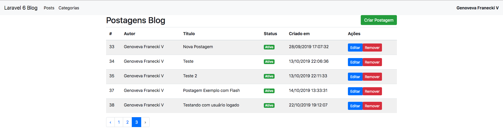


Feita estas alterações vamos ao perfil do autor e conhecer a ligação de Um para Um (OneToOne) ou 1:1. Vamos lá!

## Relação 1:1 (Autor e Perfil)

Primeramente vamos criar nosso model e todo o aparato de uma vez só! 

Execute o comando abaixo em seu terminal e na raiz do projeto:

```
php artisan make:model Profile -m -c
```
Não esqueça de mover seu controller para a pasta `Admin` e corrigir o namespace.

O arquivo do controller gerado está abaixo:

```
<?php

namespace App\Http\Controllers\Admin;

use Illuminate\Http\Request;
use App\Http\Controllers\Controller;


class ProfileController extends Controller
{
    //
}

```

Não gerei ele como recurso pois vamos precisar só do método para exibição e um para atualização do perfil.

Mas, primeiro vamos lá na nossa migration para criarmos nossa tabela. Abra o seu arquivo de migration, no meu caso `2019_10_22_193049_create_profiles_table.php`, e adicione o conteúdo do método `up` abaixo:

```
 $table->bigIncrements('id');
$table->unsignedBigInteger('user_id');

$table->string('avatar')->nullable();
$table->text('about')->nullable();

$table->string('facebook_link');
$table->string('instagram_link');
$table->string('site_link');

$table->timestamps();

$table->foreign('user_id')->references('id')->on('users');
```

Veja na íntegra toda a migration:

```
<?php

use Illuminate\Support\Facades\Schema;
use Illuminate\Database\Schema\Blueprint;
use Illuminate\Database\Migrations\Migration;

class CreateProfilesTable extends Migration
{
    /**
     * Run the migrations.
     *
     * @return void
     */
    public function up()
    {
        Schema::create('profiles', function (Blueprint $table) {

            $table->bigIncrements('id');
            $table->unsignedBigInteger('user_id');

            $table->string('avatar')->nullable();
            $table->text('about')->nullable();

            $table->string('facebook_link')->nullable();
            $table->string('instagram_link')->nullable();
            $table->string('site_link')->nullable();

            $table->timestamps();

            $table->foreign('user_id')->references('id')->on('users');
        });
    }

    /**
     * Reverse the migrations.
     *
     * @return void
     */
    public function down()
    {
        Schema::dropIfExists('profiles');
    }
}
```

Após isso, basta executar a migration com o comando já conhecido:

```
php artisan migrate
```

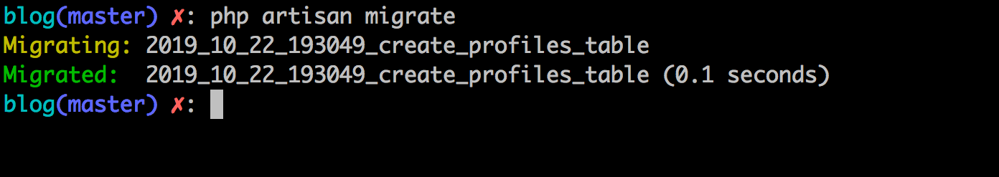

Perceba que a tabela `profiles` recebe a referência do usuário ao qual pertencerá. Coloquei praticamente todos os campos como nullable, para que o usuário possa ter o perfil sem necessitar no primeiro momento de ter as informações completas nele. Obrigatoriamente mesmo somente a referência `user_id`.

Nesta tabela também teremos a foto do usuário, além do sobre e alguns links de redes sociais. Sobre as fotos, no próximo capítulo iremos abordar a parte de upload e já incrementaremos esse profile bem como a parte de capa das postagens.

Agora vamos partir para as relações.

## Criando Relação 1:1 nos Models

O método para mapeamento da relação 1 para 1 é bem simples, o dono da relação, neste caso `User` terá a definição chamando o método `hasOne` (Têm ou Possui Um) já o inverso, `Profile`, terá o método, que já vimos, o `belongsTo` (Pertence a).


Lá no model user adicione o seguinte método:

```
public function profile()
{
    return $this->hasOne(Profile::class);
}
```

e lá no model profile, adicione:

```
public function user()
{
    return $this->belongsTo(User::class);
}
```

Agora precisamos criar nossos métodos de nosso controller e depois adicionar as rotas para acesso. Vamos ao controller primeiramente.

Nosso controller terá apenas dois métodos, um método `index` e outro `update`. O método `index` exibirá um form com os dados do usuário logado e seu perfil e o `update` será para atualizarmos o perfil deste usuário.

O método `index` é mais simples vamos primeiro a ele:

```
public function index()
{
    $user = auth()->user();

    if(!$user->profile()->count()) {
        $user->profile()->create();
    }

    return view('profile.index', compact('user'));
}
```

Recupero o usuário da sessão, como já conhecemos, verifico se ele possui um profile chamando o método da ligação e depois chamando o método `count`. Este método vai retornar o valor 0 caso o usuário não tenha um perfil criado, ao negar este zero o PHP irá comparar e retornará `true`, fazendo com que entremos na condição onde simplesmente criamos um perfil sem nehum dado, apenas a referência do usuário será adicionada pelo model e chamar o create já basta para termos um perfil para este usuário.

Logo abaixo, chamo nossa view `index.blade.php` mandando este usuário logado na sessão para ela. Veja a view:

PS.: Crie a view `index.blade.php` dentro da pastas views na pasta `profile` que também precisa ser criada.

```
@extends('layouts.app')

@section('content')
    <form action="{{route('profile.update')}}" method="post">

        @csrf

        <div class="form-group">
            <label>Nome</label>
            <input type="text" name="user[name]" class="form-control" value="{{$user->name}}">
        </div>

        <div class="form-group">
            <label>E-mail</label>
            <input type="text" name="user[email]" class="form-control" value="{{$user->email}}">
        </div>

        <div class="form-group">
            <label>Senha</label>
            <input type="password" name="user[password]" class="form-control" placeholder="Se deseja atualizar sua senha digitie aqui a senha nova...">
        </div>

        <div class="form-group">
            <label>Sobre</label>
            <textarea name="profile[about]" id="" cols="30" rows="10" class="form-control">{{$user->profile->about}}</textarea>
        </div>


        <div class="form-group">
            <label>Facebook</label>
            <input type="url" name="profile[facebook_link]" class="form-control" value="{{$user->profile->facebook_link}}">
        </div>
        <div class="form-group">
            <label>Instagram</label>
            <input type="url" name="profile[instagram_link]" class="form-control" value="{{$user->profile->instagram_link}}">
        </div>
        <div class="form-group">
            <label>Site</label>
            <input type="url" name="profile[site_link]" class="form-control" value="{{$user->profile->site_link}}">
        </div>


        <div class="form-group">
            <button class="btn btn-lg btn-success">Atualizar Meu Perfil</button>
        </div>
    </form>
@endsection

```

Temos três campos para os dados do usuário: name, email e password. E para o perfil chamo os campos: about, facebook_link, instagram_link e site_link.

Perceba que usei uma notação de array nos nomes dos inputs, colocando os campos de user, da seguinte maneira:

- user[name]
- user[email]
- user[password]

E de profile:

- profile[about]
- profile[facebook_link]
- profile[instagram_link]
- profile[site_link]

Quando eu recuperar o campo user e o campo profile lá na request terei um array com os campos informados e seus valores de forma simples e direta, no update você vai entender melhor essa necessidade.

Para o campo de senha não exibir a senha para só atualizarmos a mesma caso o usuário preecha algum valor, basta lê o atributo `placeholder` do campo de senha do formulário. Nosso formulário vai apontar para a rota de apelido `profile.update` que ainda não criamos, vamos criar jájá mas antes vamos para o método `update` lá no `ProfileController`, vamos lá.

Veja abaixo o método `update` e logo após realizo os comentários:

```
public function update(Request $request)
{
    $userData = $request->get('user');
    $profileData = $request->get('profile');

    try{

        if($userData['password']) {
            $userData['password'] = bcrypt($userData['password']);
        } else {
            unset($userData['password']);
        }

        $user = auth()->user();

        $user->update($userData);

        $user->profile()->update($profileData);

        flash('Perfil atualizado com sucesso!')->success();
  		 return redirect()->route('profile.index');

    } catch(\Exception $e) {

        $message = 'Erro ao remover categoria!';

	    if(env('APP_DEBUG')) {
		    $message = $e->getMessage();
	    }

	    flash($message)->warning();
	    return redirect()->back();

    }
}
```

Primeiramente perceba como recupero os arrays referentes aos dados do usuário e referentes ao seu perfil(profile) de forma simples e sem muito esforço por conta das notações que usei no atributo name dos input lá do form. Veja:

```
$userData = $request->get('user');
$profileData = $request->get('profile');
```

Agora entramos no bloco `try` onde verifico se o campo `password` possui algum valor, se sim, nós alteramos a senha e já encriptamos usando um método helper do Laravel chamado `bcrypt` reescrevendo o valor da chave `password` dentro do array em `$userData`, bem simples não!?

Se a senha não possui valor, ou seja, o usuário não quis mudar a senha eu simplesmente removo ela do array usando o método unset do PHP. Veja o trecho:

```
if($userData['password']) {
    $userData['password'] = bcrypt($userData['password']);
} else {
    unset($userData['password']);
}

```

Logo após isso, já recupero o usuário logado, e já chamo em seguida o método update que atualizará os dados deste usuário:

```
$user = auth()->user();

$user->update($userData);
```
Em seguida acesso a ligação `profile()` e uso o método `update` que atualizará o perfil do usuário, onde eu informo o `$profileData`. Veja:

```
$user->profile()->update($profileData);
```

O restante já conhecemos e vimos, sobre as mensagens e os redirecionamentos, do sucesso mando para a rota de apelido: `profile.index` (que ainda não existe mas será nosso próximo passo expor estas rotas). Se erro fazemos o mesmo controle retornando pro momento anterior com a mensagem do erro real se em desenvolvimento ou a mensagem genérica se em produção.

Agora para testarmos, precisamos acessar nosso arquivo web.php lá routes e adicionar as rotas abaixo:

```
Route::prefix('profile')->name('profile.')->group(function(){

    Route::get('/', 'ProfileController@index')->name('index');
    Route::post('/', 'ProfileController@update')->name('update');

});
```

Rota recebem o prefixo `profile` e o apelido base `profile.`, neste grupo temos suas rotas uma get, e outra post apontando para a chamada principal de profile e apontando para o método `index` e `update`respectivamente.

Veja as rotas do admin na íntegra agora:

```
Route::group(['middleware' => ['auth']], function(){

    Route::prefix('admin')->namespace('Admin')->group(function(){

        Route::resource('posts', 'PostController');
        Route::resource('categories', 'CategoryController');

        Route::prefix('profile')->name('profile.')->group(function(){

            Route::get('/', 'ProfileController@index')->name('index');
            Route::post('/', 'ProfileController@update')->name('update');

        });

    });
});
```

Agora podemos acessar em nosso browser o link http://127.0.0.1:8000/admin/profile e vamos chegar no formulário abaixo:

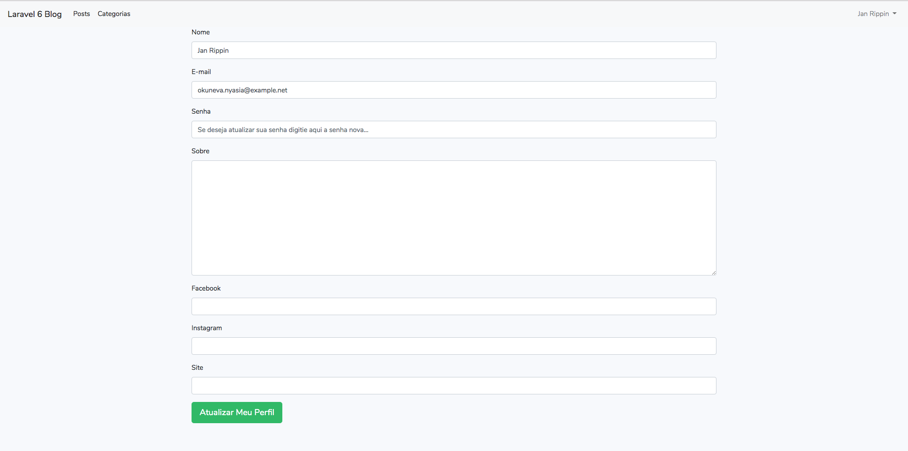

Preencha os campos e atualize os dados e submeta, veja o resltado:

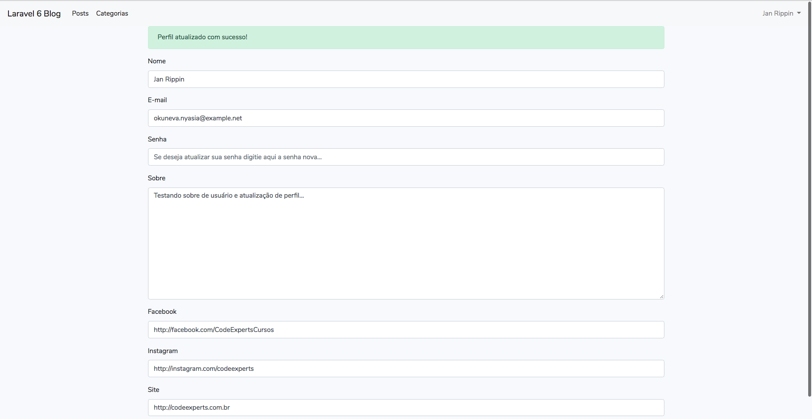

Bom, fiz algumas adições no nosso layout com respeito a parte onde exibimos o nome do usuário logado no menu. Substitua:

```
 @auth
<div class="float-right">
    <strong>{{auth()->user()->name}}</strong>
</div>
@endauth
```

Por:

```
@auth
    <ul class="navbar-nav ml-auto">
            <li class="nav-item dropdown">
                <a id="navbarDropdown" class="nav-link dropdown-toggle" href="#" role="button" data-toggle="dropdown" aria-haspopup="true" aria-expanded="false" v-pre>
                    {{auth()->user()->name}} <span class="caret"></span>
                </a>

                <div class="dropdown-menu dropdown-menu-right" aria-labelledby="navbarDropdown">
                    <a class="dropdown-item" href="{{ route('logout') }}"
                        onclick="event.preventDefault();
                                        document.getElementById('logout-form').submit();">
                        Sair
                    </a>

                    <form id="logout-form" action="{{ route('logout') }}" method="POST" style="display: none;">
                        @csrf
                    </form>

                    <a class="dropdown-item" href="{{ route('profile.index') }}">
                        Profile
                    </a>
                </div>
            </li>
    </ul>
@endauth
```

Fiz também as chamadas para os arquivos buildados no começo deste módulo, onde temos a chamada para o cdn do bootstrap assim:

```
    <link rel="stylesheet" href="https://stackpath.bootstrapcdn.com/bootstrap/4.3.1/css/bootstrap.min.css">
```

Coloque desta maneira:

```
<link rel="stylesheet" href="{{asset('css/app.css')}}">
```

E adicione a chamada para o javascript buildado também antes do fechamento da tag body:

```
<script src="{{asset('js/app.js')}}"></script>
```
Para que o dropdown onde temos os links de sair e de profile funcionarem. O resultado da mudança do nome do usuário para ao dropdown é:

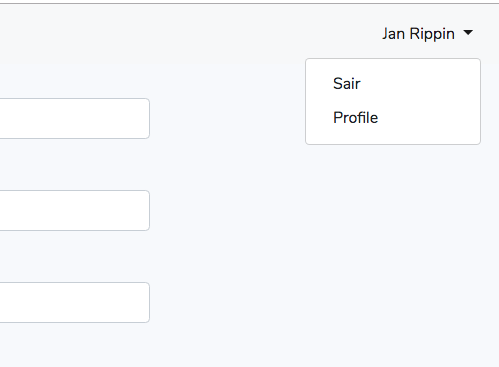

PS.: O link de sair possui um detalhe importante a ser comentado, vamos falar sobre ele então. Veja o trecho dele:

```
<a class="dropdown-item" href="{{ route('logout') }}"
                        onclick="event.preventDefault();
                        document.getElementById('logout-form').submit();">
        Sair
    </a>

    <form id="logout-form" action="{{ route('logout') }}" method="POST" style="display: none;">
        @csrf
    </form>
    
```

Como o link de logout só funciona com POST precisamos enviar por meio do link esta requisição, por isso que temos a propriedade `onclick` com o conteúdo:


```
onclick="event.preventDefault();
         document.getElementById('logout-form').submit();"

```
Primeiramente ele previne o comportamento padrão do link e depois procura pelo elemento de id `logout-form` e submete ele com o método `submit()`. O elemento que possui o id procurado é justamente um form que está logo abaixo do link, esse form que envia a requisição post para logout e encrra nossa sessão. Veja o form:

```
<form id="logout-form" action="{{ route('logout') }}" method="POST" style="display: none;">
    @csrf
</form>
```

O form está com display none, por isso não aparece mas é executado quando clicamos no link Sair.

Podemos melhorar ainda o visual do nosso navbar antes de concluirmos nosso capítulo. Procure o elemento nav e altere as classes `bg-light` e `navbar-light` por `navbar-dark` e `bg-dark`. Adicione o trecho abaixo, logo após a chamada do css no `head` para darmos um espaço do navbar para o conteúdo das páginas:

```
 <style>
    .navbar {
        margin-bottom: 40px;
    }
</style>
```

Veja o resultado:

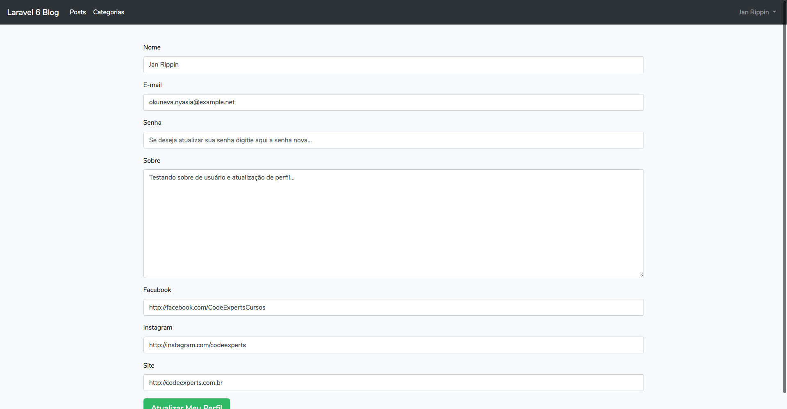

Segue nosso `app.blade.php` alterado até o momento, veja:

```
<!doctype html>
<html lang="en">
<head>
    <meta charset="UTF-8">
    <meta name="viewport"
          content="width=device-width, user-scalable=no, initial-scale=1.0, maximum-scale=1.0, minimum-scale=1.0">
    <meta http-equiv="X-UA-Compatible" content="ie=edge">
    <title>Gerenciador de Posts</title>
    <link rel="stylesheet" href="{{asset('css/app.css')}}">
    <style>
        .navbar {
            margin-bottom: 40px;
        }
    </style>
</head>
<body>
    <nav class="navbar navbar-expand-lg navbar-dark bg-dark">
        <a class="navbar-brand" href="/">Laravel 6 Blog</a>
        <button class="navbar-toggler" type="button" data-toggle="collapse" data-target="#navbarNavDropdown" aria-controls="navbarNavDropdown" aria-expanded="false" aria-label="Toggle navigation">
            <span class="navbar-toggler-icon"></span>
        </button>
        <div class="collapse navbar-collapse" id="navbarNavDropdown">
            @auth
                <ul class="navbar-nav">
                    <li class="nav-item active">
                        <a class="nav-link" href="{{ route('posts.index') }}">Posts</a>
                    </li>
                    <li class="nav-item active">
                        <a class="nav-link" href="{{ route('categories.index') }}">Categorias</a>
                    </li>
                </ul>
            @endauth
        </div>


        @auth
            <ul class="navbar-nav ml-auto">
                    <li class="nav-item dropdown">
                        <a id="navbarDropdown" class="nav-link dropdown-toggle" href="#" role="button" data-toggle="dropdown" aria-haspopup="true" aria-expanded="false" v-pre>
                            {{auth()->user()->name}} <span class="caret"></span>
                        </a>

                        <div class="dropdown-menu dropdown-menu-right" aria-labelledby="navbarDropdown">
                            <a class="dropdown-item" href="{{ route('logout') }}"
                                onclick="event.preventDefault();
                                                document.getElementById('logout-form').submit();">
                                Sair
                            </a>

                            <form id="logout-form" action="{{ route('logout') }}" method="POST" style="display: none;">
                                @csrf
                            </form>

                            <a class="dropdown-item" href="{{ route('profile.index') }}">
                                Profile
                            </a>
                        </div>
                    </li>
            </ul>
        @endauth
    </nav>
    <div class="container">
        @include("flash::message")
        @yield('content')
    </div>

    <script src="{{asset('js/app.js')}}"></script>
</body>
</html>
```

## Conclusões

Bom, era isso que queria aprensentar neste módulo. A simplicidade de criarmos e manipularmos autenticação em nossos projetos e ainda entedermos como trabalhar com o usuário logado onde realizamos a criação do seu perfil bem como suas relações com o model User, na chamada de 1 para 1.

Você deve ter sentido, ou não, falta do campo avatar no perfil do usuário mas não se preocupe que no próximo capítulo irei abordar uplaod de arquivos dentro do Laravel e veremos como adicionar um foto de capa para uma postagem e também um avatar para o perfil do usuário.

Este capítulo foi mais um capítulo puxado e espero que esteja te ajudando nesta jornada, vamos ficando por aqui mas já partindo para nossa próximo jornada, uplaods! 

Até lá!


