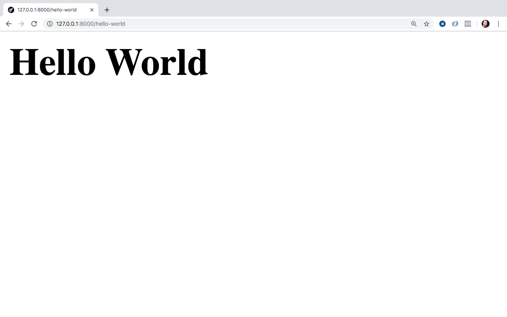

# Hello World com Laravel

Este capítulo vai nos ajudar a vermos o Laravel de uma forma geral, o que definirá nosso fluxo de trabalho durante todo o desenvolvimento. Gosto muito de tomar uma abordagem prática, por isso, vamos trabalhar todos os conceitos envolvendo o framework em cim de um projeto prático e direto ao ponto.

O projeto escolhido e que nos traz todo o aparato para entedermos cada parte de um framework fullstack será a criação de um blog com gerenciamento de posts e autores, além do sistema de comentários. Então vamos lá colocara mão na massa e da inicio de fato aos conhecimento por meio do nosso primeiro Hello World com o framework.

## MVC

Antes de continuarmos precisamos conhecer um pouco do modelo base utilizado no mapeamento das classes dentro do nosso projeto Laravel, esse modelo ou padrão é o famoso MVC, ou, Model-View-Controller.

A maioria dos frameworks atuais utilizam esta estrutura para organização de seus componentes, além de termos um `Front Controller` que recebe as requisições enviadas para nossa aplicação e entrega para quem vai resolver aquela requisição. Geralmente este `Front Controller` se encontra na pasta public(Directory Root da aplicação) no index.php dos frameworks, como o é no Laravel.

O modelo MVC possui três camadas base, as que comentei acima, o Model, Controller e View vamos entender o que é cada parte da nossa aplicação.

### Model

A camada do Model ou Modelo é a camada que conterá nossas regras de negócios, geralmente possuem as entidades que representam nossas tabelas no banco de dados, podem conter classes que contêm regras de negócio especificas e até podem conter classes que realizam algum determinado serviço.

Dentro do Laravel nossos models serão as classes que representam alguma tabela no banco de dados com poderes de manipulação referentes a esse tratamento com o banco. Você pode encontrar, por default, as classes model dentro da pasta `app` em sua raiz.

### Controller

A camada do Controller ou Controlador é a camada mais fina digamos assim, ele recebe a requisição e demanda para o models em questão, caso necessário, e dada a resposta do model entrega o resultado para a view ou carrega diretamente um view caso não necessitemos de operações na camada do Model.

A ideia pro controller é que ele seja o mais simples possivel, portanto, evite adicionar regras e complexidade em seus Controllers. Dentro do Laravel estes controllers encontram-se na pasta `app/Http/Controllers`.

### View

A camada de view ou visualização é a camada de interação do usuário. Onde nossos templates vão existir, com as telas do nosso sistema e as páginas de nossos sites. Nesta camada, também, não é recomendado colocar regra de negócios, consultas ao banco ou coisas deste tipo. Esta camada é exclusivamente para exibição de resultados e input de dados apenas via formulários, além de interações Javascripts e outros já esperados para melhor aproveitamente do usuário.

No Laravel nos armazenaremos nossas views na pasta `resources/views/` e utilizaremos o template engine, que falarei sobre ele mais a frente, chamado de Blade.

## Roteiro para nosso primeiro Hello World


Para criamos nosso hello world, precisaremos seguir os passos abaixo para este momento:

- Criar nossa rota para chamada e acesso em nosso browser;
- Criar um controller para execução ao chamarmos nossa rota em questão;
- Criar uma view para envio da nossa string: `Hello World` a ser exibida como resultado do acesso.

A priore passos bem simples e que vão nos da um panorama inicial do framework para a partir daí prosseguirmos com os conceitos individualmente conhecendo melhor o framework!

## Iniciando Hello World

Acesse o projeto iniciado no capítulo passado pelo seu terminal ou cmd no Windows. Na certeza de está na raiz do seu projeto execute o seguinte comando abaixo:

`php artisan make:controller HelloWorldController`

Ao executar o comando acima teremos o seguinte resultado pro sucesso da criação do nosso primeiro controller exibido em nosso terminal ou cmd: `Controller created successfully.`

Após isso teremos o nosso controller criado dentro da pasta do nosso projeto, especificamente: `app/Http/Controllers` e o arquivo `HelloWorldController.php`. Não esqueça de acessar o projeto em editor ou IDE de código, de sua escolha.

O código do nosso controller encontra-se abaixo:

```
<?php

namespace App\Http\Controllers;

use Illuminate\Http\Request;

class HelloWorldController extends Controller
{
    //
}

```

O resultado acima é a classe do nosso controller que estende do Controller base e já traz um import para nós, do nosso Request que também conheceremos ele no decorrer do nosso livro.

Vamos criar nosso primeiro método para execução posterior ao acessarmos nossa rota, ainda não criada. Abaixo segue o conteúdo do nosso primeiro método:

```
public function index()
{
	$helloWorld = 'Hello World';

	return view('hello_world.index', compact('helloWorld'));
}
```

Do método acima temos um ponto bem interessante, o retorno da função helper chamada `view` que recebe como primeiro parâmetro a view desejada e o segundo parâmetro um array associativo com os valores a serem enviados para esta view.

Antes de entedermos como criaremos a view com base no primeiro parâmetro preciso te falar que a função compact é uma função do PHP que pegar as variaveis informadas e joga dentro de um array associativo sendo a chave o nome da variável e seu valor o valor contido na variável, foi o que fizemos para enviar `$helloWorld` para nossa view.

Agora como podemos criar nossa view de forma que o primeiro parâmetro da função helper `view` seja satisfeito? Vamos entender!

Temos o seguinte valor: `hello_world.index`. A última parte da string apresentada pós `.` será o nome da nossa view que deve respeitar o seguinte nome de arquivo, se depois do ponto tenho `index` precisarei criar uma view chamada `index.blade.php`, só que antes do ponto temos o valor `hello_world` que neste caso será a pasta onde nosso `index.blade.php` estará, então, no fim das contas precisaremos criar lá dentro da pasta `resources/views` uma pasta chamada `hello_world` e dentro desta pasta nosso arquivo `index.blade.php` chegando ao caminho completo e o arquivo: `resources/views/hello_world/index.blade.php`.

PS.: Se você quiser chamar uma view diretamente que esteja dentro da pasta de views, basta informas apenas o nome da views em questão. Se você tiver mais niveis em questão de pastas até chegar na view, é necessário informa-los até o arquivo da view em questão. Tanto o caminho base até a pasta `views` quanto a extensão o proprio Laravel adciona automáticamente para nós.

Com isso crie o arquivo `index.blade.php` bem como sua pasta lá dentro da pasta `views`. Com o seguinte conteúdo abaixo:

```
<h1>{{$helloWorld}}</h1>
```

Acima temos, dentro do elemento `h1`, o nosso primeiro contato com o template engine Blade. Usamos acima a notação de print, abre `{{` fecha `}}`, dentro da nossa view e pegamos a nossa variável `$helloWorld` vinda lá do nosso controller e exibimos seu valor dentro do elemento html.
 
Agora, que já seguimos os dois passos do nosso roteiro precisamos permitir o acesso e execução deste método, método index do nosso controller HelloWorldController, por conta dos nossos usuários e a liberação de uma url para acesso.

Como faremos isso? Simples, no momento, vamos criar uma rota que apontará para o método do nosso controller! Vamos lá que vou te mostrar!

Abra seu arquivo `web.php` que se encontra na pasta `routes`. Teremos o seguinte conteúdo:

```
<?php

/*
|--------------------------------------------------------------------------
| Web Routes
|--------------------------------------------------------------------------
|
| Here is where you can register web routes for your application. These
| routes are loaded by the RouteServiceProvider within a group which
| contains the "web" middleware group. Now create something great!
|
*/

Route::get('/', function () {
    return view('welcome');
});
```

Este arquivo web.php conterá todas as rotas da nossa aplicação que trabalhem com a exibição de htmls com resultados em nosso projeto. Tudo que for UI ou User Interface(Interface do Usuário) terá suas rotas definidas neste arquivo.

De cara já vemos a primeira definição de rota a rota principal `/` que exibe a view `welcome.blade.php` que está lá dentro da pasta de views. Esta rota é a rota executado ao acessarmos a página principal de uma aplicação Laravel recém instalada. Agora vamos definir nossa rota de hello world.

Adicione o código abaixo, após a definição da rota principal que já existe:

```
Route::get('hello-world', 'HelloWorldController@index');
```

Acima temos nossa primeira rota definida, a rota escolhida foi `hello-world` que executará o método index do controller HelloWorldController, blz, como isto está definido? Vamos lá!

O segundo parâmetro da função `get` do `Route` é o executavél para esta rota que pode ser uma função anônima como vimos na definição da rota principal já existentes ou uma string que respeite `Controller@método` e foi como definimos `HelloWorldController@index`.

O Laravel vai chamar o namespace base até o nosso controller e trabalhar em cima da string dada separando o controller do método, criando a instância deste controller e efetuando a chamada do método informado.

Com isso podemos iniciar nosso webserver, na raiz do projeto com:

```
php artisan serve
```

E acessando em nosso browser `http://127.0.0.1:8000/hello-world` teremos o resultado abaixo:



E teremos nosso Hello World em nossa tela!

## Conclusões

Neste módulo vimos diretamente o processo de expor uma rota para acesso, a execução de nosso controller através do método index, bem como, a exibição do resultado em uma view onde mostramos o nosso primeiro Hello World com o framework!

É claro que cada etapa destas carece de um pouco mais de informações e também é claro que cada etapa destas contêm diversos detalhes que será necessário que conheçamos para termos um melhor proveito do framework.

A partir de agora iremos debsravar a fundo toda estas opções e outros que não foram diretamente mostradas aqui.

Este capítulo serviu para te mostrar um panorama geral que será utilizado no decorrer de sua caminhada com o framework durante o desenvolvimento de suas aplicações.

Então vamos lá, vamos continuar nossa jornada!