# Laravel 6

Laravel é um fullstack framework criado por Taylor Otwell. O Laravel foi criado em Junho de 2011 e de lá pra cá vêm ganhando muita notoriedade por meio de suas features e facilidades quando tratamos da criação de aplicações web e diversos serviços e softwares.

O Laravel foi fortemente inspirado pelo Rails, em sua forma de trabalho e gerações dentro da sua estrutura quando estamos no processo de desenvolvimento. O Laravel hoje chega em sua versão 6 e conta com um ecossistema em constante crescimento envolvendo diversos projetos e componenetes.

Conheceremos diversas funcionalidades do framework e veremos como ele traz essa simplicidade tão aclamada pela comunidade de desenvolvedores PHP.

## Obtendo o Laravel

Podemos iniciar um projeto Laravel de duas maneira, a primeira é utilizando o Laravel Installer obtido através do composer. A outra é utilizando o proprio composer diretamente através do comando create-project.

Vamos conhecer ambas as formas, relambrando que para ambas precisamos ter o composer em nossa máquina. Para isso instale o mesmo através do site [getcomposer.org](https://getcomposer.org).

### Requirimentos

Para termos sucesso na utilização do Laravel verique se seu PHP respeita as seguintes configurações:

- PHP maior ou igual ao 7.2;
- Extensão BCMath 
- Extensão Ctype
- Extensão JSON
- Extensão Mbstring
- Extensão OpenSSL
- Extensão PDO
- Extensão Tokenizer
- Extensão XML

Para verificar sua versão do PHP de forma rápida basta acessar seu terminal ou cmd(tenha certeza que o PHP está no PATH do Windows) e execute o comando abaixo:

`php -v` 

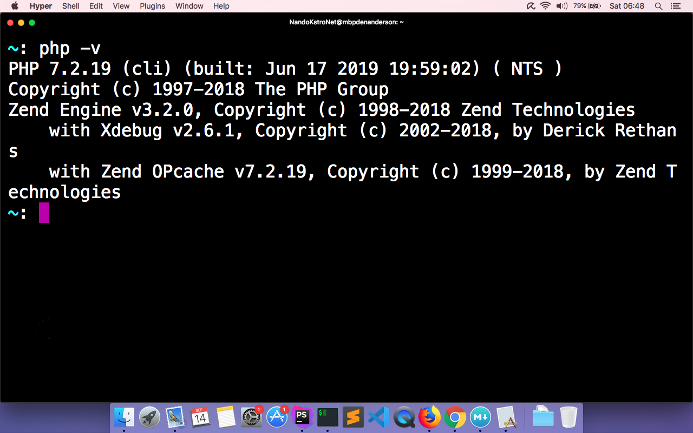

Para visualizar suas extensões execute em seu terminal o comand abaixo:

`php -m`

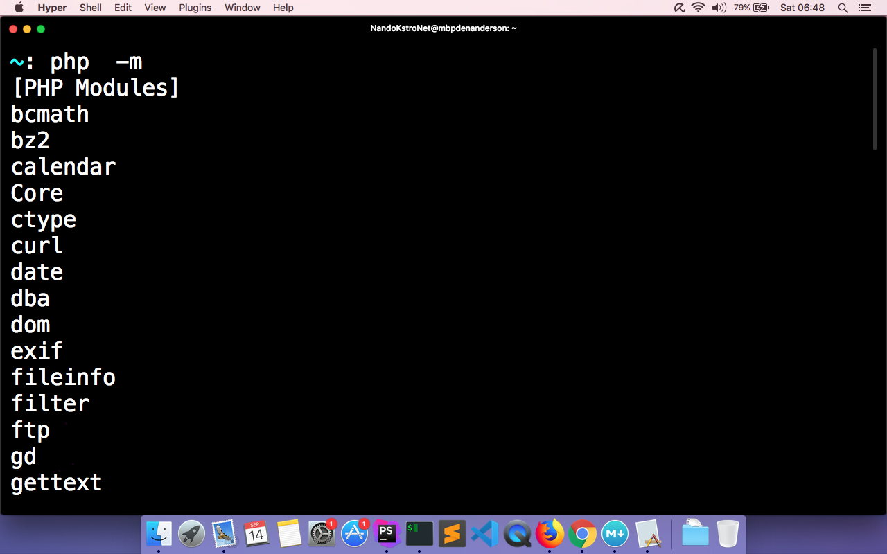

### Laravel Installer (Windows)

Com o composer em sua máquina Windows, vamos instalar o nosso utilitário, o Laravel Installer. Primeiramente abra seu prompt de comando, basta utilizar a combinação de teclas CTRL + R e na janelinha que aparecer digitar: cmd.

Após isso pressione ENTER para abrir o prompt.

Com o prompt aberto, digite e execute o comando abaixo:

    composer global require "laravel/installer"

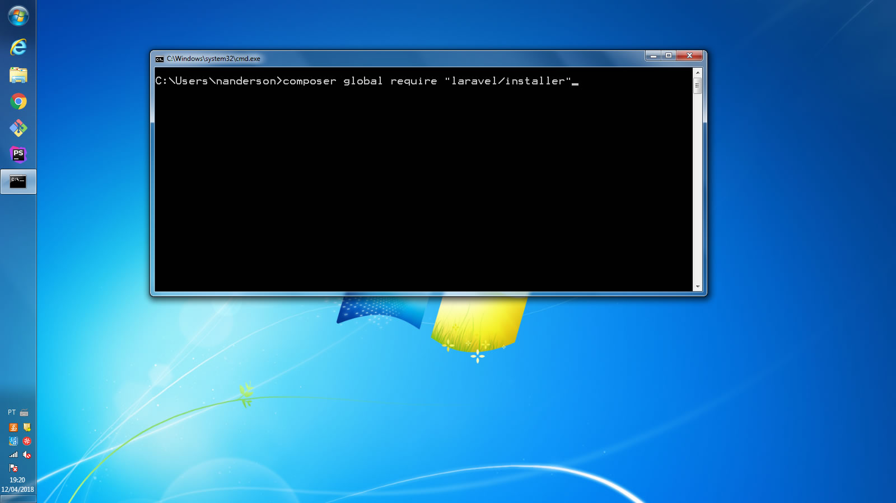

Com isso o composer vai baixar o pacote laravel/installer e jogar na pasta abaixo, dentro de vendor & também dentro de bin, que está dentro de vendor, ambas estão no caminho abaixo:

    C:/Users/<seu_nome_de_usuario>/AppData/Roaming/Composer/

Veja o resultado da instalação abaixo:

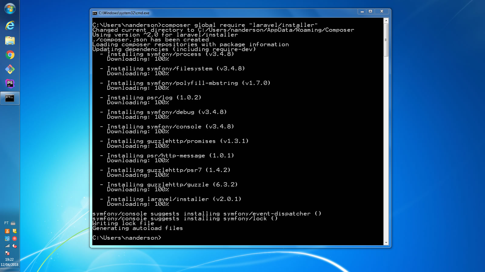

Feito isso, precisamos adicionar o caminho dos binários globais do composer no PATH do Windows. Primeiramente acesse o menu propriedades do Meu Computador, como mostrado abaixo:

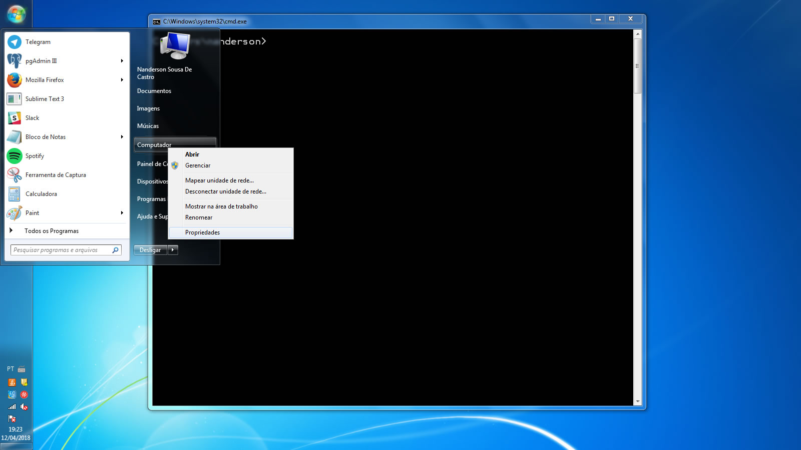

Após isso, acesse o menu Configurações Avançadas do Sistema, no menu lateral esquerdo da sua tela. Veja abaixo:

Na tela que aparecer, na parte inferior, acesse o menu Variáveis de Ambiente*.

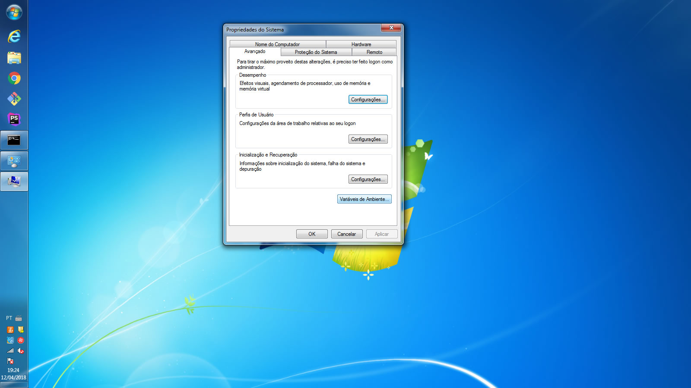

Se você está em um ambiente com Windows 10, pode ser que a tela a seguir mude um pouco. Na verdade fica mais simples de adicionar um caminho ao PATH do Windows 8 pra frente.

Na janela de Variáveis de Ambiente, na parte inferior, procure por Path e clique em editar. Como mostro abaixo:

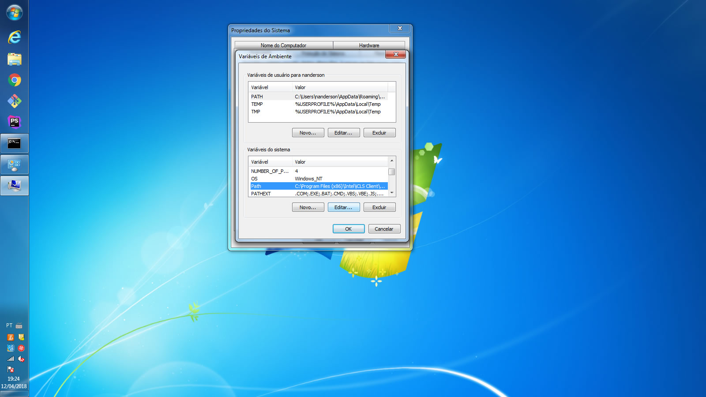

Na janelinha que aparecer, modifique o valor da variável. Neste caso apenas adicione ao final da linha o caminho abaixo substituindo o <seu_nome_de_usuario> por seu nome de usuário no sistema:

    %USERPROFILE%/AppData/Roaming/Composer/vendor/bin;

Obs.: Verifique se ao fim da linha existe um ;(ponto-e-virgula), caso não exista adicione um e depois coloque o caminho indicado acima. Tome cuidado para não remover o conteúdo da variável Path, apenas adicione o caminho a mais.

PS.: O ponto-e-virgula que você vê ao fim do caminho acima é o separador de paths no Windows, para a variavel PATH do sistema. Por isso é importante verificar se ao fim do valor que já existe, há um ponto-e-virgula.

Após isso, dê OK até sair de todas as janelas. Se seu prompt continuou aberto durante o processo, feche e abra novamente.

Para verificar se o laravel installer é reconhecido, execute em seu cmd o comando: laravel e obtenha o resultado abaixo:

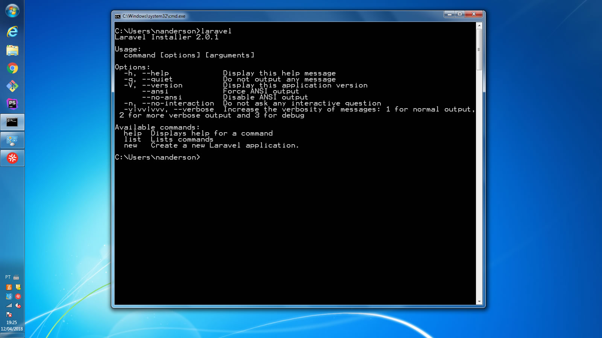

Agora estamos aptos a iniciarmos um projeto Laravel por meio do Laravel Installer em nosso CMD.

### Laravel Installer (MacOS ou Linux / Unix Like)

Tendo a certeza que o Composer está em sua máquina, execute o comando abaixo em seu terminal:

    composer global require "laravel/installer"

Após a instalação do pacote precisamos linkar ele no PATH do nosso sistema. Se você usa o bash em seu terminal o arquivo para que você possa configurar o PATH será o .bash_profile, caso utilize o zsh o arquivo a ser alterado será o .zshrc. Ambos os arquivos encontram-se na pasta do seu usuário. Pelo terminal você pode digitar `cd ~` e dá um enter que cairá na pasta do seu usuário pelo seu terminal.

Ao abrir o arquivo correspondente, adicione a seguinte linha ao final do arquivo:

`PATH="$HOME/.composer/vendor/bin:$PATH"`

Após isso reinicie seu terminal e execute o comando laravel, e obtenha o resultado abaixo:

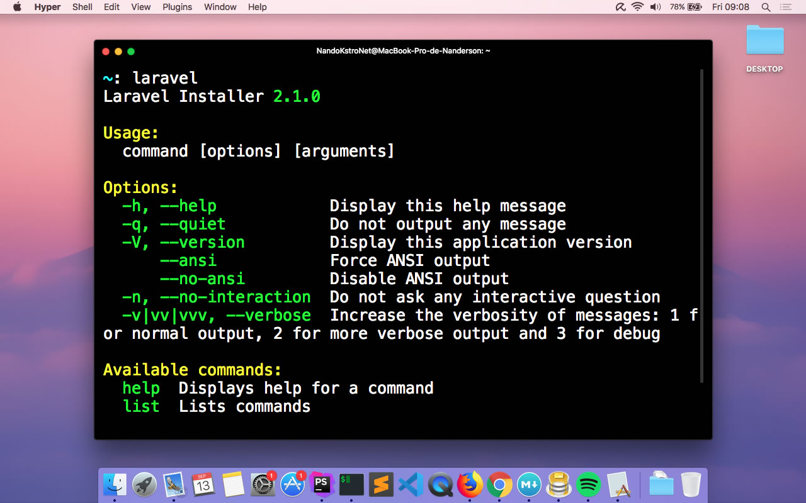

## Iniciando Primeiro Projeto

### Iniciando projeto com Composer Create Project

Podemos iniciar um projeto laravel por meio do comando `create-project` do composer sem necessariamente usar o laravel installer.

Para isso, para iniciar um projeto laravel por meio deste comando basta executa-lo como mostro abaixo, na pasta da sua escolha:

`composer create-project --prefer-dist laravel/laravel blog`

Com isso o instaldor baixará todo o skeleton do Laravel e instalará as dependâncias do nosso projeto automaticamente e jogará dentro da pasta `blog`.

### Iniciando projeto com Laravel Installer

Podemos iniciar nosso projeto por meio do laravel installer também então para isso basta acessarmos a pasta de escolha pelo terminal e executarmos o comando abaixo:

`laravel new blog`

Com isso o instaldor baixará todo o skeleton do Laravel e instalará as dependências do nosso projeto automaticamente e jogará dentro da pasta `blog`.

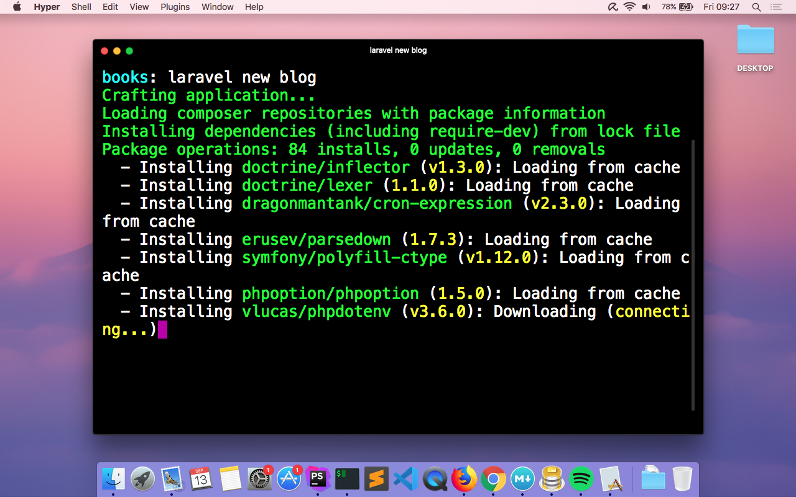

## Conhecendo a estrutura do Laravel

Vamos conhecer as pastas e os arquivos que fazem parte da estrutura do nosso projeto:

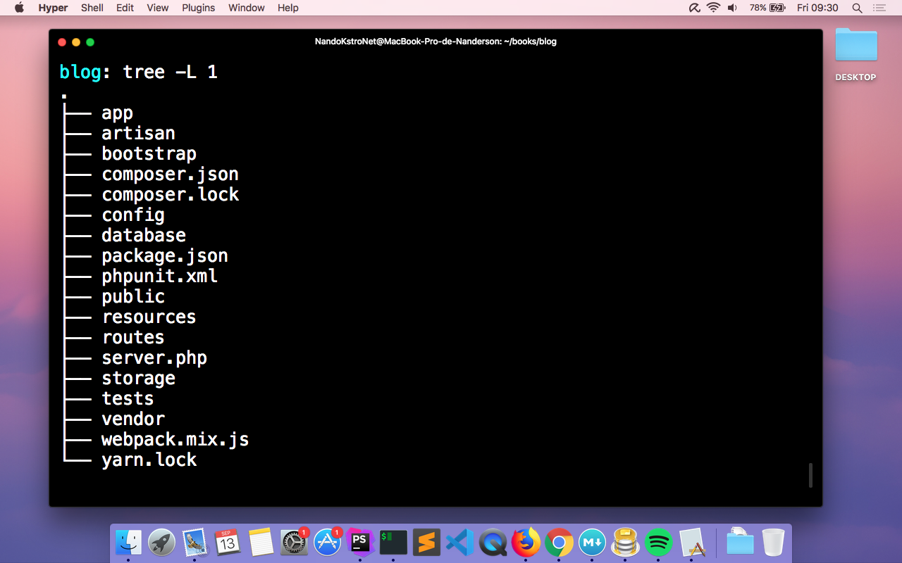

O Laravel possui algumas pastas base como a pasta `app`, `bootstrap`, `database`, `config`, `public`, `resources`, `storage`, `routes`, `tests` e a `vendor`. Vamos ver o que cada pasta destas representa ou aramazena em sua estrutura.

#### app

A pasta app conterá todo o conteúdo do nosso projeto como os models, controllers, serviços, providers, middlewares e outros. Nela que concetraremos diretamente nossos esforços durante a criação do nosso projeto.

#### config

Os arquivos de configurações do nosso projeto laravel encontram-se nesta pasta. Configurações de conexões com bando, onde estão os drivers para armazenamento de arquivos, configurações de autenticação, mailers, seviços, sessions e outros.

#### resources

Nesta pasta temos algumas subpastas que são: `views`, `js`, `lang` & `sass`. A priore esta pasta salva os assets referentes as nossas views e também nossas views ou templates.

#### storage

Nesta pasta salvamos arquivos como sessions, caches, logs e também é utilizada para armazenar arquivos mediante upload em nosso projeto.

#### routes

Nesta pasta vamos encontrar os arquivos para o mapeamento das rotas de nosso projeto. Rotas estas que permitirão o nosso usuário acessar determinada url e ter o conteúdo processado e esperado. Mais a frente vamo conhecer melhor essas rotas mas as mesmas são divididas em rotas de api, as rotas padrões no arquivo web, temos ainda rotas para channels e console.

#### tests

Nesta pasta teremos as classes para teste de nossa aplicação. Testes Unitários, Funcionais e outros.

#### database

Aqui teremos os arquivos de migração de nossas tabelas, vamos conhecer eles mais a frente também, teremos os arquivos para os seeds e também as factories estes para criação de dados para popularmos nossas tabelas enquanto estamos desenvolvendo.

#### bootstrap

Na pasta bootstrap teremos os arquivos responsáveis por inicializar os participantes do framework Laravel, ecaminhando as coisas a serem executadas.

#### public

Esta é nossa pasta principal, a que fica exposta para a web e que contêm nosso front controller. Por meio desta pasta é que recebemos nossas requisições, especificamente no index.php, e a partir daí que o laravel direciona as requisições e começa a executar as coisas.

#### vendor

A vendo como conhecemos, é onde ficam os pacotes de terceiros dentro de nossa aplicação mapeados pelo composer.

### Outros arquivos da raiz do projeto

Temos ainda alguns arquivos na raiz do nosso projeto, como o `composer.json` e o `composer.lock` onde estão definidas as nossas dependêncas e as versões baixadas respectivamente.

Temos também o `package.json` que contêm algumas definições de dependências do frontend. Temos também os arquivos de configuração para o webpack, pacote responsável por criar os builds do frontend.

Temos ainda também o `server.php` que nos permite emular o mod_rewrite do apache.

Temos também o `phpunit.xml` que contêm as configurações para nossa execução dos testes unitários, funcionais e etc em nossa aplicação.

Deixe por último o arquivo `.env` que contêm as variavéis de ambiente para cada configuração de nossa aplicação como os parâmetros para conexão com o banco e também o aplication key hash único para nossa aplicação e outras configurações a mais além destas.

Este arquivo e essas configurações são providas pelo pacote DotEnv do Vance Lucas.

## Laravel: Artisan CLI

O Laravel possui uma interface de comandos ou command line interface (CLI) chamada de `artisan`. Por meio dela podemos melhorar bastante nossa produtividade enquanto desenvolvemos como por exemplo: Gerar models, controllers, gerar a interface de autenticação e muitas outras opções que conheceremos ao longo do livro. Para conhecer todos os comando disponíveis no Artisan, basta executar na raiz do seu projeto o seguinte comando:

`php artisan`

Veja o resultado, a lista de comandos e opções disponíveis no cli:

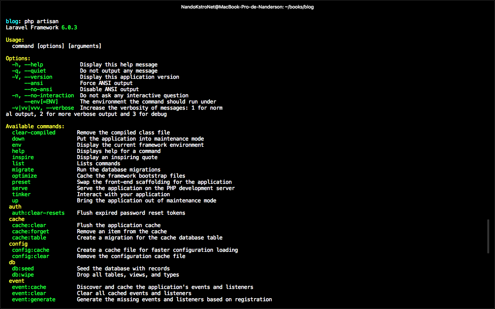

## Executando a Aplicação

Para concluirmos nosso primeiro capítulo, vamos iniciar nossa aplicação e testá-la em nosso browser. Para isso acesse o seu projeto via terminal ou cmd no Windows e na raiz execute o comando abaixo:

`php artisan serve`

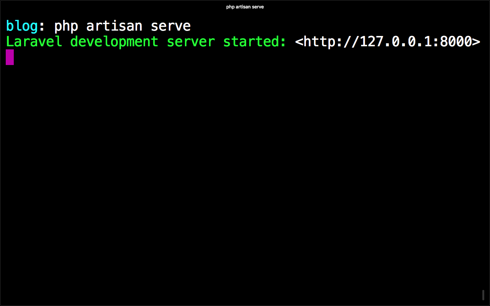

O comando acima levantará sua aplicação em seu ip local `127.0.0.1` e disponibilizará a porta `8000` para que você possa acessar sua aplicação no browser. Agora vamos acessar em nosso browser o seguinte link: `http://127.0.0.1:8000`:

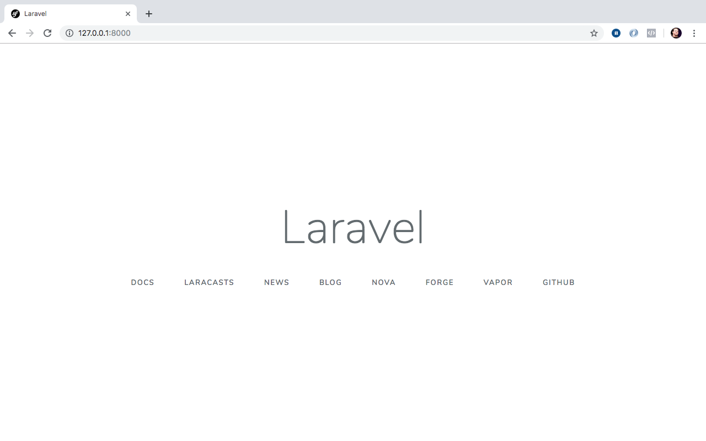

Se tudo estiver corretamente configurado teremos o resultado acima, a tela inicial do nosso projeto Laravel, e sua página inicial default.

## Conclusões

Bom neste módulos concluimos aqui as configurações e realizamos o inicio do nosso primeiro projeto utilizando o framework. Agora vamos continuar para o próximo capítulo e começar a entender a estrutura geral do framework por meio da criação do nosso Hello World utilizando o framework.

